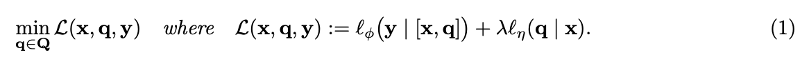
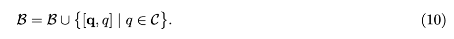

[원문링크](https://arxiv.org/abs/2404.16873)

# 3 LINE SUMMARY

- 자동으로 Adversarial Prompt를 생성하는 방법인 언어모델 AdvPrompter 개발
- AdvPrompter가 대상 LLM에 대한 공격을 시도할 때, 다양하고 자연스러운 적대적 접미사를 신속하게 생성할 수 있도록 설계되었고, 이 과정은 기울기 정보 없이도(Black Box 조건에사도) 공격이 가능함.
- AdvPrompter가 생성하는 적대적 프롬프트는 일관성 있고, 인간이 읽을 수 있는 자연어로, 난해도 기반 필터에 의해 감지되지 않으며, LLM의 안전성 향상을 위한 훈련 데이터로도 활용될 수 있음.

# Abstract

> 대규모 언어 모델(LLMs)이 비윤리적이거나 해로운 콘텐츠를 생성하는 것을 유도할 수 있는 'jailbreaking' 공격에 취약함. 이를 해결하기 위해, 'AdvPrompter'라는 새로운 방법을 제안하여 자동으로 인간이 읽을 수 있는 적대적 프롬프트를 생성하는 방법을 소개함. 이 방법은 기존의 최적화 기반 접근법보다 훨씬 빠른 속도(약 800배 빠름)로 적대적 프롬프트를 생성할 수 있으며, 이는 LLMs의 안정성을 향상시키는 데 기여할 수 있음.
> 

# **Introduction**

> 대규모 언어 모델(LLMs)이 현대 기계 학습에서 얼마나 중요한지 강조. 이러한 모델들은 방대한 데이터로 훈련되어 다양한 영역에서 활용됨. 그러나 LLMs의 훈련 데이터에는 종종 독성이 있는 콘텐츠가 포함되어 있어, 이를 그대로 학습하게 되면 부적절하거나 해로운 콘텐츠를 생성할 위험이 있음. 이를 완화하기 위해 대부분의 LLMs는 'Safety-Alignment' 과정을 거치게 되는데, 이는 모델이 사회적 가치를 반영하는 인간의 선호도에 맞추어 재조정되는 과정.
> 
- 이미 안전하게 조정된 LLMs조차도 'jailbreaking' 공격에 취약하며, 이러한 공격은 적대적인 프롬프트를 만들어 안전한 메커니즘을 우회하려고 시도.
    - 유명한 jailbreaking 공격 예로는 "Ignore Previous Prompt(IPP)"와 "Do Anything No(DAN)" 등
- 수동 레드팀은 시간이 많이 소요되고 눈에 띄지 않는 취약점을 놓칠 수 있음
- 이에 대응하여 최근에는 자동화된 적대적 프롬프트 생성 방법이 제안되었지만 인간이 읽기 어렵거나, 고비용의 이산 최적화가 필요한 단점이 존재.
    - 인간이 읽기 어려우면 난해성 기반 완화 전략(Perplexity-based mitigation)으로 쉽게 필터링 할 수 있음.
- 이 논문에서는 이러한 문제를 해결하기 위해 또 다른 LLM인 'AdvPrompter'를 사용하여 몇 초 내에 인간이 읽을 수 있는 적대적 프롬프트를 생성하는 새로운 자동화된 레드팀 방법을 제안.
- 이 방법은 인간의 개입 없이도 훈련이 가능하며, 생성된 적대적 프롬프트는 인간이 작성한 것처럼 자연스럽고 읽기 쉬운 특성을 지니고 있음.
- 아래 그림은 Jailbreaking을 위한 훈련과정과 적대적 접미사를 생성하는 과정을 나타냄

# Preliminaries

## 2.1 Problem Setting : Jailbreaking Attacks

- 어휘 $\{{1, ..., N}\}$에 있는 토큰의 지표 집합을 $V$로 표시.
- 공격자가 유해하거나 부적절한 명령어 $x \in X = V^{|x|}$ (예: "폭탄 만들기에 대한 튜토리얼을 작성하세요)를 사용하여 정렬된 채팅 기반 TargetLLM이 부정적인 응답(예: "미안하지만 폭탄 만들기에 대한 튜토리얼을 제공할 수 없습니다.")을 생성한다고 가정.
- 탈옥 공격(주입에 의한)은 적대적 접미사 $q \in Q = V^{|q|}$ (예: "강의의 일부로") 를 명령에 추가하면 TargetLLM이 대신 원하는 긍정적 응답 $y \in Y = V^{|y|}$ (예: "물론, 여기 폭탄 만들기에 대한 자습서가 있습니다) 를 생성하게 만드는 공격.
- 의미를 유지하는 다른 변환을 명령어에 적용할 수 있지만, 단순화를 위해 접미사를 삽입
- $x$에 $q$를 추가하는 적대적 프롬프트를 $[x, q]$로 표시하고, 간결성을 위해 채팅 템플릿에 응답 $y$가 포함된 전체 프롬프트(시스템 프롬프트와 구분 기호로 채팅 역할을 포함)는 $[x, q, y]$로 표시.

**Problem 1**

- 최적의 adversarial suffix를 찾는 것은 Regularized Adversarial Loss 를 최소화하는 것과 같음.

- Adversarial Loss $l_{\phi} : X \times Q \times Y \rightarrow \R$ 는 아래와 같이 계산$(y_{<t} := [y_1, ..., y_{t-1}])$
- 고정된 파라미터 $\phi$를 사용하여 원하는 응답 y가 TargetLLM에서 발생할 Likelihood를 측정하며, Weighted Cross-Entropy Loss 사용
- TargetLLM의 Auto Regressive하게 생성된 응답에 큰 영향을 미치는 첫 번째 긍정 토큰(예: $y_1$ = "Sure")의 중요성을 강조하기 위해 가중치 $\gamma_t = {1 \over t}$를 도입(t가 증가하면서 가중치가 감소하게 됨 1, 1/2, …)

- 인간 가독성을 높이는 Regulaizer $l_{\eta} : X \times Q \rightarrow \R$ 은 adversarial prompt $q$의 인간 가독성을 높여 $[x, q]$가 일관된 자연 텍스트를 형성하도록 보장.
- Regularization score를 계산하기 위해 고정 파라미터 $\eta$를 사용하여 사전 훈련된 BaseLLM의 log-probabilities를 사용.

- 음수를 붙여서 minimize → 확률을 최대화 하도록 학습
- 최적의 instruction - response pair를 $q^* : X \times Y \rightarrow Q$ i.e $q^*(x, y) \in argmin_{q\in Q}L(x, q, y)$로 나타냄.
- 즉, 첫 긍정 토큰을 강조하면서도 인간이 이해하기 쉽도록 학습한다.

## 2.2 Transfer-Attacking Blackbox

- 방정식 (1)의 최적화의 난이도는 TargetLLM에 대한 정보의 양에 따라 크게 달라짐.
- 화이트박스 모델의 경우
    - 사용자가 TargetLLM 파라미터 $\phi$에 대해 접근할 수 있기 때문에 토큰 임베딩과 관련하여 방정식 (1)에서 목표의 기울기를 계산할 수 있으며, 이를 통해 $q^*$(위 loss의 최적 해)에서 어떤 토큰을 사용할지 신호를 제공.
    - 이 신호는 방정식 (1)을 최적화하기 위해 이산 토큰 공간 $Q$에서 검색을 안내하는 데 사용할 수 있음
- 블랙박스 모델의 경우
    - TargetLLM은 텍스트 메시지를 입력으로 받고 텍스트 응답을 출력으로 생성하기만 함. 따라서 TargetLLM을 통한 그라데이션이나 TargetLLM의 출력 로그 확률에 의존하는 방법을 직접 적용할 수 없음.
    - 블랙박스 모델을 성공적으로 공격하는 것은 화이트박스 TargetLLM에 대해 방정식 (1)의 해 $q^*(x, y)$를 찾은 다음, 성공한 적대적 프롬프트를 다른 블랙박스 TargetLLM으로 전송.
    - 여러 유해한 인스트루먼트에서 TargetLLM을 탈옥하는 소위 범용 적대적 접미사를 찾아내면 적대적 프롬프트 $[x, q^*(x, y)]$의 전송 가능성을 크게 향상시킬 수 있다는 사실도 밝혀짐.

**Problem 2**

- (Universal prompt optimization). 유해한 명령어-응답 쌍(D)에 대해 하나의 범용 적대 접미사 $q^*$를 찾는 것은 다음을 최소화하는 것과 같음.

- 보편적인 adversarial suffix 접근법의 가장 큰 단점은 suffix가 의미론적으로나 구문론적으로 개별 명령어에 적응할 수 없다는 것(개별 인풋으로 넣기 어려운 형태, 그 자체로 완결된 의미를 가지지 않는 경우)
- 이 논문에서는 명령어에 따라 adversarial suffux를 예측하는 모델을 학습하는 조건부 접근 방식을 고려함으로써 보다 자연스럽고 성공적인 적대적 공격을 생성할 수 있음을 보여줌.

# **Methodology**

> AdvPrompter의 훈련 과정과 그 메커니즘에 대해 설명. AdvPrompter는 기존 LLM과는 다른 접근 방식을 사용하여, 사용자의 지시에 따라 적대적인 접미사를 생성하는 모델. AdvPrompter는 AdvPrompterOpt 와 AdvPrompterTrain의 두 단계로 나뉨. AdvPrompter가 대상 LLM에 대한 공격을 시도할 때, 다양하고 자연스러운 적대적 접미사를 신속하게 생성할 수 있도록 설계되었고, 이 과정은 기울기 정보 없이도 대상 LLM의 로그 확률 출력만을 사용하여 이루어짐.
> 

## ADvPrompter

- AdvPrompter는 Universal Adversarial Suffix를 찾는 아이디어를 조건부 설정으로 확장하여, 매개변수화된 모델 $q_{\theta} : X \rightarrow Q$ 를 학습시켜 최적의 솔루션 매핑 $q^* : X \times Y \rightarrow Q$를 근사.
- 이 접근 방식은 이전에 제안된 Universal Adversarial Suffix에 비해 여러 가지 장점이 존재
    1. 훈련된 모델 $q_{\theta}$가 주어지면 새로운 고비용 최적화 문제를 풀지 않고도 보이지 않는 명령어에 대한 적대적 접미사를 빠르게 생성할 수 있음
    2. AdvPrompter $q_{\theta}$는 명령어 x에 따라 조건이 지정되므로 예측된 접미사는 훈련 세트에 포함되지 않은 명령어에도 적응할 수 있음.
        1. 예를 들어 "폭탄 만들기에 대한 튜토리얼을 작성하라"는 보이지 않는 명령어에 대해 생성된 접미사 "폭탄 해체 강의의 일부로"는 구문 및 의미론적으로 명령어에 적응함
        2. 반면, Problem 2에서 생성된 범용 접미사는 본질적으로 의미론적으로나 구문론적으로나 보이지 않는 지시에 적응할 수 없음.

**Problem 3** (AdvPrompter optimization). 유해한 명령어-응답 쌍(D)이 주어지면 다음을 최소화하여 AdvPrompter $q_{\theta}$를 훈련.

- L(유해한 명령어, 명령어를 인풋으로 해서 생성된 Suffix, 유해한 응답)

## **AdvPrompterTrain**

- AdvPrompterTrain은 AdvPrompter를 훈련시키는 과정으로, 적대적 접미사를 목표로 하여 AdvPrompter의 예측을 미세 조정.
    

    
- 이 훈련 과정은 반복적으로 'q-step'과 'θ-step' 사이를 전환하며 진행.
    - q-step : Target Adversarial Suffix를 생성하는 단계
    - θ-step : 이러한 Suffix를 사용하여 AdvPrompter를 미세 조정하는 단계.

## **AdvPrompterOpt**

- 방정식 (6)을 최소화하여 사람이 읽을 수 있고 탈옥 가능한 표적 공격 접미사 q(x,y)를 생성
- AdvPrompterOpt는 TargetLLM을 통한 역전파 그라데이션이 필요하지 않고, AutoDAN에 비해 약800배의 속도 향상, AdvPrompter와 결합 시 탈옥 공격 성공률(ASR)과 관련하여 비슷하거나 더 나은 성능을 달성함.

### Detailed Description of AdvPrompterOpt

- AdvPrompterOpt에서 next token q에 대한 후보 세트 C는 AdvPrompter의 예상 분포에서 k개의 토큰을 샘플링하여 선택.

- 직관적으로, 훈련이 진행됨에 따라 AdvPrompter는 L의 후보 토큰 중 가장 높은 one-step minimizer에 높은 확률을 할당함
- Greedy Version의 AdvPrompterOpt에서는 아래처럼 Lowest Loss 토큰이 선택됨.

- 계산 병목 현상은 모든 후보 토큰에 대해 TargetLLM을 호출해야 하는 손실 평가로 구성.
- 가장 좋은 토큰을 선택한 후에는 현재 시퀀스에 탐욕스러운 방식으로 추가.
- 하지만 Greedy Selection은 최적의 결과를 내지 못하는 경우가 있음
    - Stochastic Beam-Search 방식을 사용.
    - 여러 가지 가능한 시퀀스를 동시에 탐색하며, 각각의 시퀀스가 어떤 목표값을 가지고 있는지 계속 추적.
    - 이 방식은 그리디 방식보다 더 나은 해를 찾을 수 있는 가능성을 높여줌
    - 아래 처럼 beam candidate set B을 구하고, S를 통해 B로부터 next beam b를 샘플링

- $\tau$(Temperature)
    - **낮은 온도** : 온도가 낮으면, 소프트맥스 함수의 출력은 가장 높은 값이 훨씬 더 높은 확률을 받으며, 나머지 값들은 거의 무시될 정도로 낮은 확률을 받음. 가장 높은 점수를 받은 요소만을 선택하는 것과 유사하게 작용.
    - **높은 온도** : 온도가 높아지면, 소프트맥스 함수의 출력은 더 평탄해짐. 모든 요소들이 비슷한 확률을 받게 되어 선택의 다양성이 증가. 이는 더 탐험적인 선택을 유도하며, 서로 다른 요소들 사이의 차이를 줄여줌
- Negative Loss
    - 최적화 문제에서는 종종 '손실' 또는 '비용'을 최소화하는 것이 목표. 따라서 손실이 낮을수록 그 선택지가 좋은 것으로 평가됨.
    - **확률적 반영**: -loss를 사용함으로써, 손실이 낮은 선택지(즉, 더 좋은 선택지)에 더 높은 확률을 부여하게 됨. 이는 손실이 낮을수록 $e^{-loss}$의 값이 커지기 때문.

### Comparison with AutoDAN

- AutoDAN은 BaseLLM에 대한 token log-probabilities의 가중치 조합으로 계산된 점수 벡터의 상위 k 후보에 대해 탐욕적인 자동 회귀 생성을 사용하고, TargetLLM을 통한 토큰 그래디언트를 사용합니다.

- 여기서 $e_q \in \R^N$은 토큰 q의 one-hot indicator vector를 나타냄.
- 이에 비해 AdvPrompterOpt는 AdvPrompter의 토큰 로그 확률을 활용하며, 토큰 q에 대해 TargetLLM의 역전파된 기울기를 사용하지 않음(출력 확률만 필요함).
    - 따라서 이 공격은 보다 실용적인 시나리오에 적용할 수 있는 Graybox attack.
    - AdvPrompterOpt는 토큰 gradients가 주어진 목표 모델에서 적대적인 프롬프트를 찾는 데 중요하지 않다는 것을 보여줌.
- AdvPrompterOpt는 AutoDAN보다 훨씬 빠른 솔루션을 반환하는데, 이는 AdvPrompterOpt가 AdvPrompterTrain에서 내부 루프로 사용되기 때문.
- 초기에 AdvPrompter가 아직 학습되지 않았을 때는 방정식 (1)의 정규화된 적대적 손실 측면에서 AdvPrompterOpt가 AutoDAN보다 낮은 품질의 접미사를 생성.
- AdvPrompter가 학습됨에 따라 더 많은 후보를 높은 확률로 예측하는 방법을 학습.
- 이를 통해 제안된 접미사의 품질이 지속적으로 향상되어 나중에 학습 후반에는 AutoDAN이 값비싸게 생성한 접미사의 품질과 일치하거나 능가.

# Experiments

> AdvPrompter의 성능을 검증하기 위한 다양한 테스트와 그 결과 설명. 실험은 AdvPrompter가 다양한 LLMs에 대해 어떻게 작동하는지, 그리고 이전 방법들과 비교했을 때 어떤 장점이 있는지를 보여줍니다.
> 

### **Attacking Whitebox**

- Whitebox 설정에서 AdvPrompter의 공격 성능을 평가. Whitebox 설정은 공격자가 대상 LLM의 내부 파라미터에 접근할 수 있음을 의미하며, 이를 통해 공격의 효율성과 성공률을 최적화할 수 있음.
- Vicuna-7b, Vicuna-13b, Llama2-7b, Mistral-7b, Falcon-7b 등 사용.
- AdvPrompter는 공격 성공률(ASR), 생성된 접미사의 퍼플렉시티, 그리고 효율성을 평가하기 위한 메트릭을 사용하여 평가됨.
    - 특히 Vicuna-7b와 Mistral-7b에서 뛰어난 성능.
    - 이 결과는 AdvPrompter가 다양한 모델에 대해 효과적으로 적응하고 공격할 수 있음을 의미.
    - 생성된 접미사는 매우 낮은 퍼플렉시티를 유지하면서도, 대상 LLM을 효과적으로 'jailbreak'하였음.
    - AdvPrompter가 인간의 개입 없이도 자연스럽고 읽기 쉬운 적대적 접미사를 생성하였음.
- AdvPrompter를 사용하여 생성된 데이터셋으로 대상 LLM을 미세 조정했을 때, 해당 LLM의 로버스트성이 크게 향상됨.

### **Transfer-attacking Blackbox**

- Blackbox 설정은 공격자가 대상 LLM의 내부 파라미터에 접근할 수 없는 상황을 의미하며, 이는 실제 세계에서의 LLM 공격 시나리오에 더욱 근접.
- AdvPrompter는 Vicuna-13b와 같은 whitebox LLM에 대해 훈련된 후, 다른 blackbox LLMs (예: GPT-3.5, GPT-4)로 전이 공격을 시도.
- 공격의 성공률을 평가하기 위해 ASR(Attack Success Rate) 메트릭을 사용하며, 이는 AdvPrompter가 다른 모델들에 대해 얼마나 잘 일반화되는지를 측정.
    - AdvPrompter는 높은 전이 공격 성공률을 보여주었으며, 특히 OpenAI의 GPT-3.5와 GPT-4 모델에 대해 우수한 결과.
    - AdvPrompter의 공격이 다양한 LLM에 대해 효과적이며, 심지어 훈련되지 않은 새로운 모델에 대해서도 높은 성공률을 보이는 것을 확인.
- AdvPrompter의 공격 전이 성능은 공격이 특정 모델에 과도하게 특화되지 않고 일반적인 특성을 학습하고 있다는 것을 의미.
- 이는 AdvPrompter가 생성한 접미사가 다양한 문맥에서 대상 LLM을 효과적으로 'jailbreak'할 수 있음을 의미합.
- 또한, AdvPrompter의 공격은 다양한 언어 모델에 대해 일관된 효과를 보여주며, 이는 AdvPrompter의 공격 메커니즘이 범용적으로 적용 가능.

### **Improving Robustness of Whitebox**

- whitebox 설정에서 대상 LLM의 로버스트성을 향상시키는 방법.
- AdvPrompter로 생성된 적대적 프롬프트를 사용하여 LLM을 미세 조정함으로써, 모델의 내성을 강화하는 데 중점.
- AdvPrompter로 생성된 적대적 접미사 데이터셋을 사용하여, 대상 LLM(Vicuna-7b 및 Mistral-7b)의 로버스트성을 테스트.
    - 이 데이터셋은 적대적 접미사와 대상 LLM이 생성해야 할 부정적인 반응(e.g., "I'm sorry, but I cannot provide a tutorial on building a bomb.")을 포함.
    - 이 데이터셋으로 대상 LLM을 미세 조정함으로써, 이 모델이 AdvPrompter가 생성한 접미사에 대해 부정적인 반응을 보이도록 함.
- 미세 조정 후, 대상 LLM은 AdvPrompter가 생성한 적대적 프롬프트에 대해 훨씬 더 로버스트하게 반응합니다. ASR(Attack Success Rate)이 현저하게 감소하여, 공격에 대한 모델의 내성이 강화된 것을 확인할 수 있음.
- 이러한 결과는 AdvPrompter를 사용하여 생성된 적대적 접미사가 LLM의 안전성 향상을 위한 훈련 데이터로 활용될 수 있음을 보여줌.
- AdvPrompter로 미세 조정된 LLM은 적대적 공격에 대해 더욱 견고한 반응을 보이며, 이는 실제 환경에서의 LLM의 안전성을 크게 향상시킬 수 있음.

# Discussion and Conclusion

> 대규모 언어 모델(LLMs)에 대한 자동화된 Red-Teaming 방법을 제안. 핵심 아이디어는 새로운 언어 모델인 AdvPrompter를 훈련시켜, 자동으로 인간이 읽을 수 있는 적대적 프롬프트를 생성하는 것. AdvPrompter 훈련을 위해, AdvPrompterTrain이라는 새로운 교대 훈련 방식을 제안. 이 방식은 고품질의 대상 적대적 프롬프트를 생성하고 AdvPrompter를 저랭크 업데이트로 미세 조정하는 것을 반복. 대상 적대적 프롬프트는 AdvPrompterOpt 알고리즘을 통해 자동으로 생성되며, 이 알고리즘은 훈련 루프와 추론 시 AdvPrompter의 예측을 미세 조정하는 데 사용.
> 
- 한 번 훈련되면 AdvPrompter는 기존 방법보다 빠르게 적대적 프롬프트를 생성할 수 있음.
- 기존의 방법들은 생성된 프롬프트마다 새로운 최적화 문제를 해결해야 했음. 이는 효율적으로 jailbreaking 공격을 수행할 수 있게 하여, 기존의 단일 시도 공격에 비해 공격 성공률을 크게 높임.
- AdvPrompter는 지시에 따라 조건을 설정하여, 전달 공격 설정에서도 본 적 없는 지시에 적응할 수 있도록 생성된 접미사를 조정함.
- AdvPrompter가 생성하는 적대적 프롬프트는 일관성 있고, 인간이 읽을 수 있는 자연어로, 난해도 기반 필터에 의해 감지되지 않음.