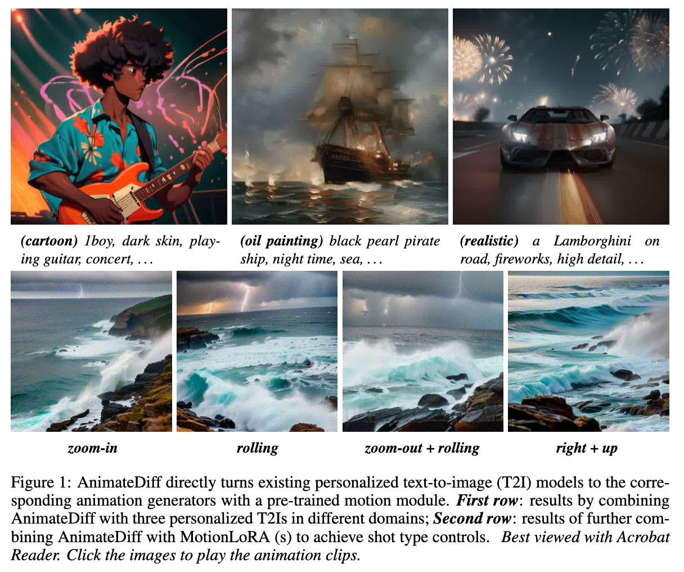
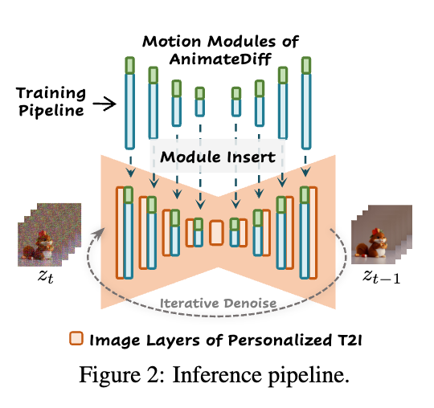
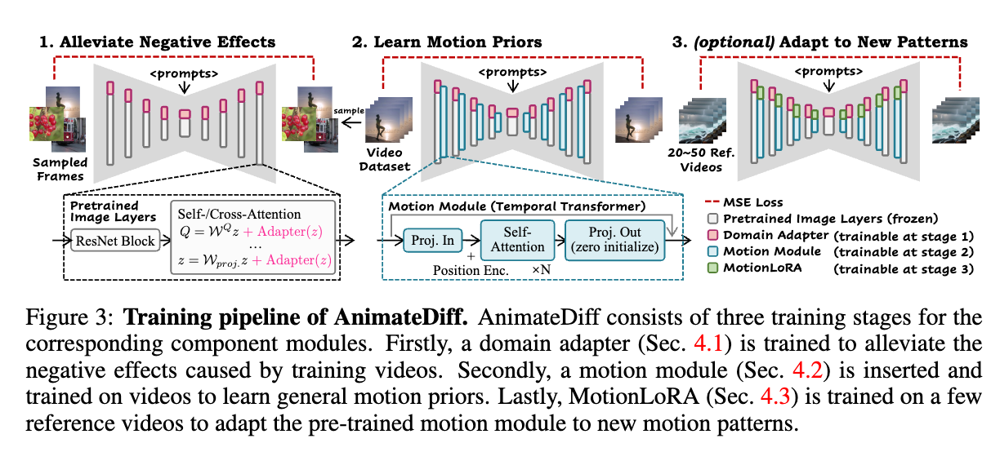
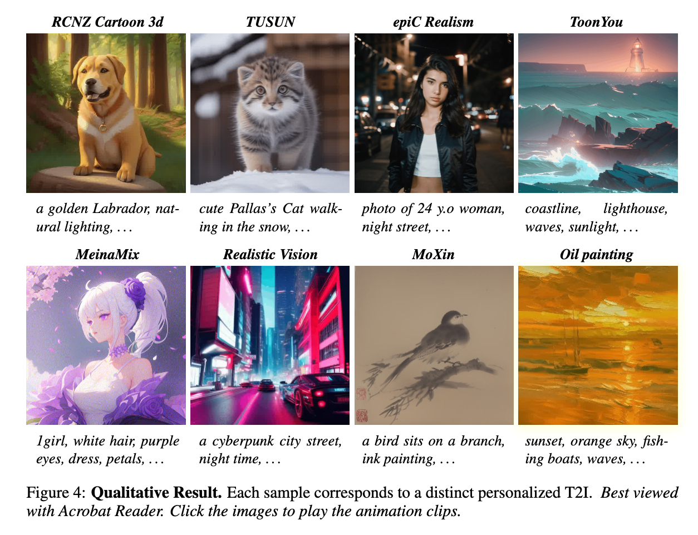
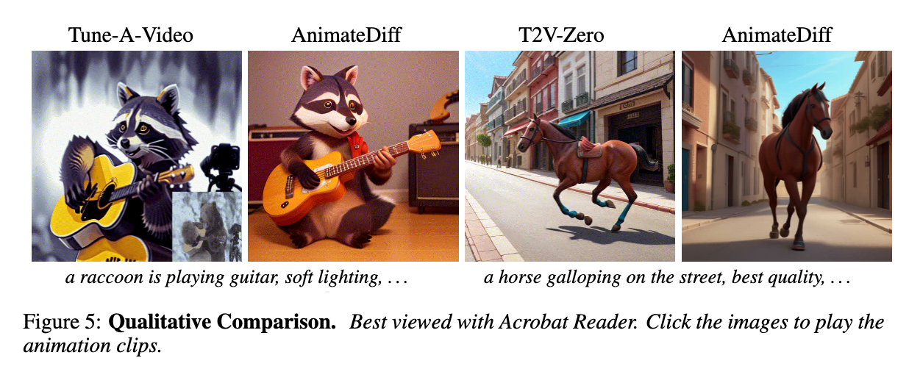
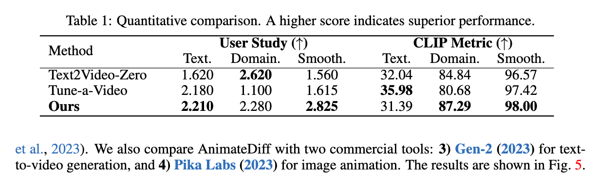
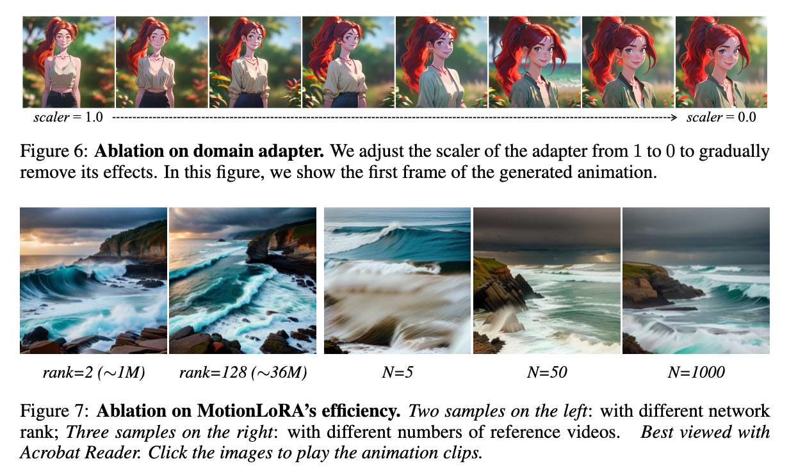
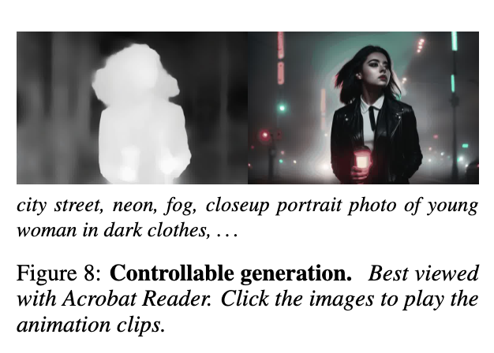

[ANIMATEDIFF: ANIMATE YOUR PERSONALIZED TEXT-TO-IMAGE DIFFUSION MODELS WITHOUT SPECIFIC TUNING](https://arxiv.org/pdf/2307.04725)

# 3 LINE SUMMARY

- DreamBooth와 LoRA 같은 개인화 기술은 적은 데이터로도 사용자 정의 모델을 만들 수 있게 하지만, 이러한 모델들은 이미지에만 한정되어 있음.
- Animate Diff는 훈련 중 비디오 데이터셋과 이미지 데이터셋의 시각적 품질 차이를 줄여주는 Domain adapter, 일반화된 Motion Prior를 학습하여 T2I 모델이 매끄러운 애니메이션을 생성하도록 하는 Motion module, 소수의 참조 비디오로 Motion Module을 미세조정하는 Motion lora로 구성됨.
- Transformer 기반 motion Module이 1D Convolution보다 더 효과적이었으며, 작은 파라미터와 적은 수의 참조 비디오(예: N=50)로도 원하는 모션 패턴을 효과적으로 학습할 수 있음. 사전 훈련된 모션 모듈은 다른 맞춤형 T2I 모델에 통합되어 자연스럽고 일관된 모션을 가진 애니메이션을 생성할 수 있음.

# **Abstract**

> AnimateDiff는 특정 튜닝 없이 맞춤형 Text-to-Image(T2I) 확산 모델을 애니메이션 생성기로 변환하는 실용적인 프레임워크를 제시. 핵심은 한 번 훈련된 플러그 앤 플레이 방식의 모션 모듈로, 이는 기존 맞춤형 T2I 모델에 통합되어 자연스럽고 일관된 모션을 가진 애니메이션을 생성할 수 있음. 추가적으로, MotionLoRA라는 경량화된 파인튜닝 기법을 도입하여 소량의 학습 데이터와 적은 훈련 비용으로 새로운 모션 패턴에 적응할 수 있음. AnimateDiff와 MotionLoRA는 다양한 맞춤형 T2I 모델에서 시각적 품질과 모션 다양성을 유지하면서 매끄러운 애니메이션 클립을 생성하는 데 유용하다는 것이 입증되었음. 코드는 GitHub에서 제공됨.
> 
- AnimateDiff는 T2I 모델에 동작을 추가하여 애니메이션을 생성할 수 있게 하는 프레임워크
- Model Specific Tuning 없이 동작을 추가할 수 있음
- 한 번 훈련하면 다양한 개인화된 T2I 모델에 원활하게 통합될 수 있는 모듈
- 실제 비디오 데이터로부터 전이 가능한 동작 사전(움직임 패턴)을 효과적으로 학습함

# **Introduction**

> Text-to-Image(T2I) 확산 모델은 아티스트와 아마추어가 텍스트 프롬프트를 사용하여 시각 콘텐츠를 생성할 수 있게 해줌. DreamBooth와 LoRA 같은 개인화 기술은 적은 데이터로도 사용자 정의 모델을 만들 수 있게 해주어 큰 인기를 끌고 있음. 그러나 이러한 모델들은 `정적 이미지 생성에만 한정`되어 있고, 애니메이션을 생성하는 것은 여전히 어려운 문제. AnimateDiff는 이러한 문제를 해결하기 위해 맞춤형 T2I 모델을 애니메이션 생성기로 변환하는 실용적인 프레임워크를 제안.
> 
- DreamBooth와 LoRA는 적은 양의 데이터로도 소비재 하드웨어(예: RTX3080을 탑재한 노트북)로 모델을 개인화 할 수 있게 해줌.
- Civitai나 Hugging Face와 같은 모델 공유 플랫폼에 많은 개인화된 모델이 기여되고 있음.
- 실세계 제작, 영화 및 만화 산업에서 애니메이션 생성 기능은 매우 중요하며, 고품질의 개인화된 T2I 모델을 애니메이션 생성기로 변환하는 것은 여전히 해결되지 않은 문제.

- AnimateDiff는 애니메이션 생성을 위한 실제적인 프레임워크로, 특정 모델 튜닝 없이도 기존의 개인화된 T2I 모델을 애니메이션 생성기로 변환함.
- **Plug And Play Motion Module**
    - WebVid-10M 데이터셋을 활용하여 모션을 학습함
    - 다양한 도메인의 개인화된 T2I 모델과 통합되어 매끄러운 애니메이션 생성 가능
- **Train Stage**
    - Domain Adapter Fine tuning : 시각적 분포를 Target Video Dataset에 맞추는 단계
    - 모션 모듈이 훈련 비디오에서 `픽셀 레벨의 디테일보다는 Motion Prior를 학습하는데 집중하도록 보장함`
- **기본 T2I와 도메인 어댑터 확장 및 모션 모델링**
    - 도메인 어댑터와 기본 T2I 가중치를 고정시킨 채 새롭게 초기화된 모션 모듈을 소개해 비디오에 최적화.
    - `모션 모듈은 일반화된 Motion Prior를 학습함으로 다른 개인화된 T2I 모델이 매끄럽고 매력적인 애니메이션을 생성하도록 할 수 있음.`
- **MotionLoRA**
    - Low-Rank Adaptation (LoRA)의 도움으로 소수의 참고 비디오와 훈련 반복을 통해 모션 모듈을 미세 조정.
    - `새로운 모션 패턴에 적응하는 데 50개의 참고 비디오만 필요하며, MotionLoRA 모델은 약 30MB의 추가 저장 공간만 필요함.` 이는 모델 공유 효율성을 크게 향상시킴.
- 이 프레임워크는 모델별 튜닝 없이 모션 모듈을 통합하여 매끄러운 애니메이션을 생성할 수 있음.
- 또한 MotionLoRA라는 경량화된 파인튜닝 기법을 통해 새로운 모션 패턴에 적응할 수 있도록 설계되었음.
- AnimateDiff는 다양한 개인화된 T2I 모델을 평가하여 그 효과를 입증하였음.

# **Preliminary**

1. **Stable Diffusion**:
    - Stable Diffusion(SD)은 오픈 소스 기반의 텍스트-이미지(T2I) 모델로, 고품질의 개인화된 T2I 모델이 다수 존재하여 평가에 적합.
    - SD는 사전 훈련된 오토인코더의 잠재 공간에서 확산 과정을 수행하여 효율성을 높임.
    - SD의 디노이징 네트워크는 추가된 노이즈를 예측하는 과정을 통해 이미지를 생성함.

- 사전 훈련된 Auto Encoder $\mathcal{E}(\cdot)$와 $\mathcal{D}(\cdot)$의 잠재 공간 내에서 디퓨전 진행
- $𝑧_0=\mathcal{E}(𝑥_0)$은 다음과 같이 표현됨

$$
𝑧_𝑡=\sqrt{\bar{𝛼}_t}𝑧_0+\sqrt{1−\bar{𝛼}_𝑡}𝜖,𝜖∼𝑁(0,𝐼),

$$

- $\bar{\alpha_t}$는 step $t$에서의 노이즈 강도를 결정.
- 디노이징 네트워크 $\epsilon_{\theta}(\cdot)$는 MSE Loss를 사용해서 노이즈 예측을 학습함.

$$
𝐿=\mathbb{E}_{\mathcal{E}(𝑥0),𝑦,𝜖∼𝑁(0,𝐼),𝑡}[||𝜖−𝜖_𝜃(𝑧_𝑡,𝑡,𝜏_𝜃(𝑦))||^2_2],
$$

- $y$는 이미지 $x_0$에 해당하는 텍스트 프롬프트
- $\tau_{\theta}(\cdot)$은 `프롬프트를 벡터 시퀀스로 매핑해주는 텍스트 인코더`
- $\epsilon_{\theta}(\cdot)$은 `UNet`으로 실행되며, 4개 해상도 레벨의 down/up 샘플 블럭으로 구성

1. **Low-Rank Adaptation (LoRA)**:
    - LoRA는 대형 모델의 파인튜닝을 가속화하는 방법으로, 처음에는 언어 모델 적응을 위해 제안되었음.
    - 모델의 모든 매개변수를 다시 훈련하는 대신, Rank-Decomposition Matrix 쌍을 추가하여 새로운 가중치를 최적화.
    - 이는 원래 가중치를 고정한 채 훈련 가능 매개변수를 제한하여, 훈련 비용을 절감하고 기존 모델의 성능 저하를 방지함.
    - LoRA의 weight는 다음과 같음.

$$
\mathcal{W}' = \mathcal{W}+\Delta \mathcal{W} = \mathcal{W} + AB^T
$$

- $A \in \mathbb{R}^{m \times r}, B \in \mathbb{R}^{n \times r}$는 Rank-Decomposition Matrix 쌍이며, $r$은 하이퍼파라미터로, LoRA layer의 랭크.
- LoRA는 오직 attention layer에만 적용하여 모델 파인튜닝의 코스트를 줄일 수 있음

# **AnimateDiff**

> AnimateDiff는 Text-to-Image(T2I) 모델에 모션 모듈을 삽입하여 애니메이션을 생성함. 세 가지 주요 컴포넌트(Domain Adapter, Motion Module, MotionLoRA)를 훈련하여 Motion Prior(이동성)를 학습.
> 
- **`Domain Adapter`**
    - 비디오 데이터셋의 시각적 품질 저하를 완화하기 위해 도메인 어댑터를 사용.
    - 도메인 어댑터는 T2I 모델의 시각적 지식 손실을 최소화하며, 훈련 중에만 사용되고 추론 시 제거됨.
- **`Motion Module`**
    - T2I 모델을 2D에서 3D로 확장하여 비디오 데이터를 처리함.
    - 모션 모듈은 Transformer 아키텍처를 기반으로 하여 시간 축을 따라 Motion Prior를 학습.
    - Sinusoidal 위치 인코딩을 사용하여 각 프레임의 위치 정보를 유지.
- **`MotionLoRA`**
    - MotionLoRA는 사전 훈련된 모션 모듈을 새로운 모션 패턴에 적응시키는 경량화된 파인튜닝 기법.
    - 소량의 참조 비디오와 적은 훈련 비용으로도 새로운 카메라 모션(줌인, 줌아웃 등)에 적응할 수 있음.
    - 파라미터 효율성과 데이터 효율성을 갖추고 있어 모델 공유와 튜닝에 용이함.

- Motion Module(blue), MotionLORA(green)

## **Alleviate Negative Effects from Training Data with Domain Adapter**

- `비디오 훈련 데이터셋은 이미지 데이터셋에 비해 시각적 품질이 낮아, 모션 모듈이 이를 학습하면 T2I 모델의 시각적 품질이 저하될 수 있음.`
- 도메인 어댑터는 훈련 중에 이 도메인 격차(이미지와 비디오 품질 차이)를 줄여주기 위해 사용됨.
    - WebVid는 실세계 녹화, LAION-Aesthetic는 예술적 그림과 전문 사진 포함.
    - 프레임별로 모션 블러, 압축 아티팩트, 워터마크 등 품질 문제가 발생함.
    - 이러한 문제는 애니메이션 생성을 방해할 수 있음.
- 모션 모듈이 비디오 데이터의 품질 저하 요소를 학습하는 것을 방지하고, 기본 T2I 모델의 지식을 보존.
- `도메인 어댑터는 LoRA 계층을 사용`하여 T2I 모델의 self-/cross-attention 계층에 삽입됨.
- 도메인 어댑터 계층은 훈련 중에만 사용되며, 추론 시에는 제거.
- 어댑터 계층의 internal feature z는 다음과 같이 변환됨(여기서 α는 스칼라 값)

$$
Q = \mathcal{W}^Qz + \text{AdapterLayer}(z) = \mathcal{W}^Qz + α \cdot AB^T z
$$

- 𝑄: Projection 후의 Internal Feature.
- $𝑊^𝑄$: Internal Feature에 대한 가중치 행렬.
- AdapterLayer(𝑧): 도메인 어댑터 층을 거친 .
- 𝛼: 스칼라 값으로, 추론 시 다른 값으로 조정할 수 있음 (추론 시 0으로 설정해 도메인 어댑터 효과를 완전히 제거 가능).

## **Learn Motion Priors with Motion Module**

- 사전 훈련된 텍스트-이미지(T2I) 모델에 모션 동작을 학습시키기 위해 모션 모듈을 사용합니다.

- **Network Inflation**
    - 기존 2D 확산 모델을 3D 비디오 데이터 처리로 확장.
    - 이를 위해 모델을 수정하여 5차원 비디오 텐서($𝑥∈𝑅^{𝑏×𝑐×𝑓×ℎ×𝑤}$)를 입력으로 받음.
    - b는 배치 크기, c는 채널 수, f는 프레임 수, h는 높이, w는 너비를 나타냄.
    - 내부 feature map이 이미지 레이어를 통과할 때, 시간 축𝑓를  𝑏축으로 합쳐 프레임을 독립적으로 처리한 후 다시 5D 텐서로 reshape.

- **Module Design**
    - 모션 모듈은 Transformer 아키텍처를 기반으로 하여 시간 축을 따라 동작을 모델링함.
    - 시간 축을 따라 여러 self-attention 블록과 위치 인코딩을 사용하여 각 프레임의 위치 정보를 유지
    - 모션 모듈은 특징 맵을 시간 축으로 나누어 벡터 시퀀스로 처리하고, self-attention 메커니즘을 통해 프레임 간 정보를 통합.

- 모션 모듈은 비디오 데이터셋을 사용해 훈련되며, 픽셀 수준의 디테일이 아닌 Motion Prior를 학습.
- 모듈의 출력 프로젝션 레이어는 제로 초기화되어 훈련 초기에 모듈이 신원 매핑을 유지하도록 합니다.

- **Temporal Transformer**: 시간 축을 따라 동작하도록 약간의 수정이 가해진 Transformer 아키텍처.
- **Self-Attention 블록**: 시간 축을 따라 각 프레임의 위치 정보를 유지하기 위해 사인 코딩(sinusoidal position encoding)을 사용.
- 프레임을 $𝑧_𝑖$ 형태의 벡터 시퀀스로 변환 $(z_i \in \mathbb{R}^{(𝑏×ℎ×𝑤)×𝑐})$
- **Attention 메커니즘**:
    
    $$
    𝑧_{𝑜𝑢𝑡}=Attention(𝑄,𝐾,𝑉)=Softmax({𝑄𝐾^T \over \sqrt{𝑐}})⋅𝑉
    
    $$
    
    - $𝑄=𝑊^𝑄𝑧$
    - $𝐾=𝑊^𝐾𝑧$
    - $𝑉=𝑊^𝑉𝑧$
    

## **Adapt to New Motion Patterns with MotionLoRA**

- 사전 훈련된 모션 모듈이 일반적인 모션 패턴은 잘 포착하지만, 새로운 모션 패턴(예: 카메라 줌인, 줌아웃, 팬닝 등)에 효과적으로 적응시키는것은 도전적인 과제.
- **MotionLoRA**
    - MotionLoRA는 모션 모듈의 self-attention 레이어에 LoRA 계층을 추가하여 새로운 모션 패턴에 맞게 훈련.
    - 적은 수의 참조 비디오와 훈련 반복 횟수로도 효과적으로 모션 패턴을 학습할 수 있음.

- 참조 비디오는 데이터 증강을 통해 얻을 수 있음.
- `MotionLoRA는 20~50개의 참조 비디오와 2000번의 훈련 반복(약 1~2시간)으로 원하는 모션 패턴을 학습할 수 있음.`
- 약 30MB의 추가 저장 공간만 필요하여 모델 튜닝과 공유가 효율적임.

- MotionLoRA는 파라미터 효율성과 데이터 효율성을 갖추고 있어, 적은 자원으로도 고품질의 모션 패턴을 학습할 수 있음.
- 각 모션 패턴에 대해 개별적으로 훈련된 MotionLoRA 모델을 조합하여 복합적인 모션 효과를 구현할 수 있음.

## **AnimateDiff in Practice**

- AnimateDiff는 세 가지 컴포넌트 모듈(Domain Adapter, Motion Module, MotionLoRA)을 통해 Motion Prior를 학습.
- Domain Adapter는 원래의 target을 사용하여 훈련되며, Motion Module과 MotionLoRA는 비디오 데이터를 처리할 수 있도록 수정된 target을 사용함.
- **비디오 데이터 배치($𝑥^{1:𝑓}_0∈\mathbb{R}^{𝑏×𝑐×𝑓×ℎ×𝑤}$)**:
    - 이는 사전 훈련된 오토 인코더를 통해 프레임 단위로 잠재 코드($𝑧^{1:𝑓}_0$)로 인코딩됩니다.
    - 그런 다음 정의된 순방향 확산 일정에 따라 잠재 코드가 노이즈가 추가됩니다:
    
    $$
    z^{1:f}_{t} = \sqrt{\bar{\alpha}_t} z^{1:f}_{0} + \sqrt{1 - \bar{\alpha}_t} \epsilon^{1:f}
    $$
    
- 훈련 목표는 모션 모듈이 추가된 노이즈를 예측하는 것.
    
    $$
    \mathcal{L} = \mathbb{E}_{\mathcal{E}(x_0^{1:f}), y, \epsilon^{1:f} \sim N(0, I), t} \left[ || \epsilon - \epsilon_\theta(z^{1:f}_{t}, t, \tau_\theta(y)) ||_2^2 \right]
    $$
    
    - $𝑧^{1:𝑓}_0$ : 원본 잠재 코드
    - 𝑦 : 텍스트 프롬프트
    - $𝜖^{1:𝑓}$ : 노이즈
    - $𝑧^{1:𝑓}_𝑡$ : 노이즈가 추가된 잠재 코드
    - $𝜖_𝜃$: 모델이 예측한 노이즈
    - 𝑡: 시간 단계
    - $𝜏_𝜃(𝑦)$: 텍스트 프롬프트에 따른 임베딩

- 추론 시, 개인화된 T2I 모델은 모션 모듈을 삽입하여 일반적인 애니메이션을 생성하고, MotionLoRA를 사용하여 개인화된 모션을 생성할 수 있음.
- 도메인 어댑터는 추론 시 완전히 제거하지 않고, α 값을 조정하여 기여도를 조절할 수 있음.
- 최종 애니메이션 프레임은 역 확산 과정을 통해 잠재 코드를 디코딩하여 얻게 됨.

# **Experiments**

## **Qualitative Results (정성적 결과)**:

- Civitai에서 수집한 맞춤형 T2I 모델을 사용하여 실험을 진행했고, 다양한 도메인을 포괄하는 종합적인 벤치마크를 구성.
- 각 모델은 특정 "트리거 단어"에 반응하도록 설계되었음.
- 다양한 도메인에서 AnimateDiff의 애니메이션 생성 결과(Figure 4)

**Comparison with Baselines (기준 모델과의 비교)**:

- 맞춤형 T2I 모델을 애니메이션화하는 기존 방법이 거의 없어, 최근 비디오 생성 연구와 비교 진행.
- Text2Video-Zero, Tune-a-Video와의 비교 결과(Figure 5)

## **Quantitative Comparison**

- 사용자 연구와 CLIP 메트릭을 통해 정량적 비교를 수행.
- 텍스트 정렬, 도메인 유사성, 모션 매끄러움을 평가하는 세 가지 측면에 중점.
- 특히 모션 매끄러움 항목에서 우수한 성능을 보였습니다.
- AnimateDiff는 대부분의 측면에서 다른 방법보다 우수한 성능(Table 1)

# **Ablative Study**

- **Domain adapter**
    - 도메인 어댑터의 효과를 평가하기 위해 추론 시 어댑터 계층의 기여도를 조절하는 실험을 수행.
    - Figure 6에서 어댑터의 스케일러 값을 1(완전 적용)에서 0(완전 제거)까지 조절하면서 생성된 애니메이션 프레임을 비교.
    - 어댑터의 스케일러 값을 줄이면 시각적 품질이 향상되고, 비디오 데이터셋에서 학습된 시각적 콘텐츠 분포(예: 워터마크)가 감소하는 것을 확인.
    - 도메인 어댑터는 훈련 중 시각적 품질 저하를 완화하는 데 성공적임을 입증했습니다.

- **Motion module design**
    - Temporal Transformer 기반 모션 모듈과 1D 시간적 컨볼루션 기반 모션 모듈을 비교했습니다.
    - 두 모델의 파라미터 수를 유사하게 맞춘 후 성능을 평가했습니다.
    - 컨볼루션 모션 모듈은 모든 프레임을 동일하게 정렬하지만, Temporal Transformer 아키텍처는 모션을 포함하는 데 더 적합하다는 것을 확인.
    - Temporal Transformer 기반 모션 모듈이 모션 동작을 더 효과적으로 모델링함을 보여주었음.

- **Efficiency of MotionLoRA**
    - 다양한 파라미터 스케일과 참조 비디오 수를 사용하여 여러 MotionLoRA 모델을 훈련.
    - Figure 7의 세 번째, 네 번째, 다섯 번째 샘플은 각각 5, 50, 1000개의 참조 비디오를 사용하여 학습된 결과를 보여줌.
    - `작은 파라미터 스케일과 적은 수의 참조 비디오(예: N=50)로도 원하는 모션 패턴을 효과적으로 학습`할 수 있음을 확인.
    - 그러나 참조 비디오 수가 너무 적을 경우(예: N=5), 품질이 저하되어 공통 모션 패턴 학습에 어려움을 겪는 것을 관찰.

## **Controllable Generation**

- AnimateDiff와 ControlNet을 결합하여 컨트롤 가능한 애니메이션 생성을 시연.
- Figure 8에서 깊이 맵 시퀀스를 사용한 컨트롤 가능한 생성 결과를 보여줌.
- AnimateDiff의 모션 프라이어와 시각적 콘텐츠 학습을 분리하여 제어 가능한 애니메이션을 생성하는 것
    - AnimateDiff와 ControlNet을 결합하여 컨트롤 가능한 애니메이션 생성을 시도.
- ControlNet과 결합한 AnimateDiff의 생성 결과(Figure 8).
    

    
- 세밀한 모션 디테일(예: 머리카락과 얼굴 표정)과 높은 시각적 품질을 갖춘 애니메이션을 시연.
- 기존의 비디오 편집 기술과 달리, 무작위로 샘플링된 노이즈에서 애니메이션을 생성할 수 있음을 확인.
- 기존의 비디오 편집 기술(예: DDIM inversion)을 사용하는 접근 방식과는 다르게, AnimateDiff는 추가 훈련 없이 제어 가능한 생성이 가능함.

# **Conclusion**

- AnimateDiff는 특정 튜닝 없이 맞춤형 텍스트-이미지(T2I) 모델을 애니메이션 생성기로 변환하는 실용적인 파이프라인을 제공.
- 세 가지 구성 요소(도메인 어댑터, 모션 모듈, MotionLoRA)를 설계하여 의미 있는 모션 프라이어를 학습하고 시각적 품질 저하를 최소화.
- MotionLoRA는 경량화된 파인튜닝 기술로, 적은 데이터와 훈련 비용으로 모션 개인화를 가능하게 함.
- 사전 훈련된 모션 모듈은 다른 맞춤형 T2I 모델에 통합되어 자연스럽고 일관된 모션을 가진 애니메이션을 생성할 수 있음.
- 다양한 맞춤형 T2I 모델을 통해 AnimateDiff와 MotionLoRA의 효과와 일반성을 입증함.
- 추가 훈련 없이 제어 가능한 애니메이션 생성이 가능.