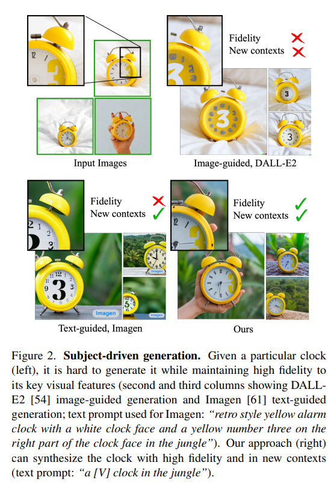
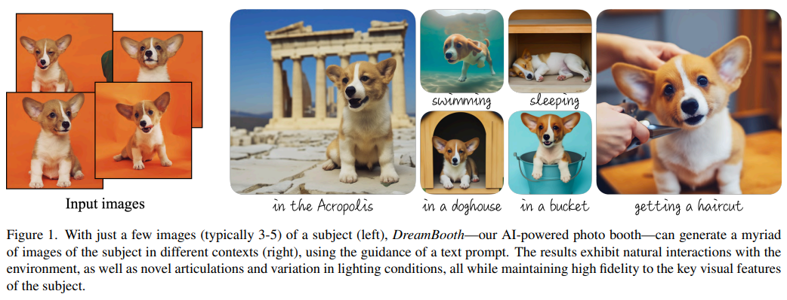
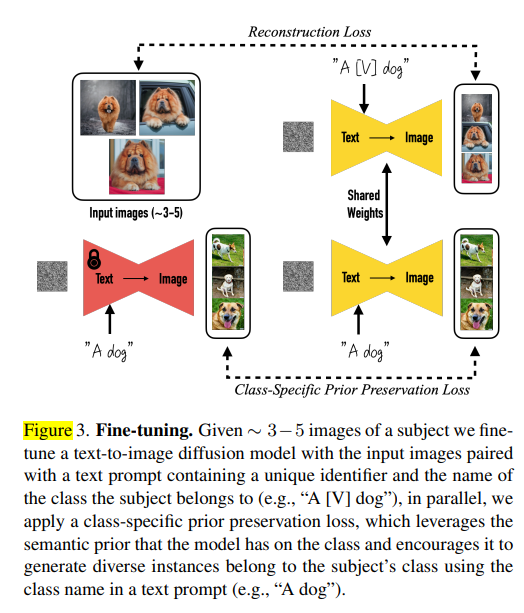
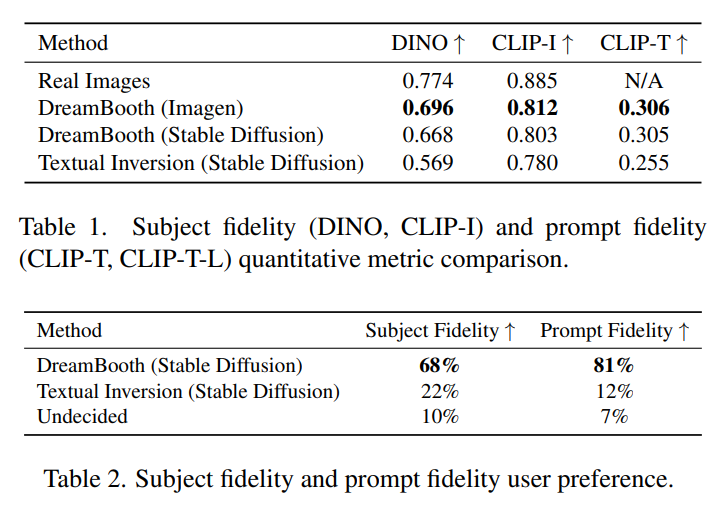
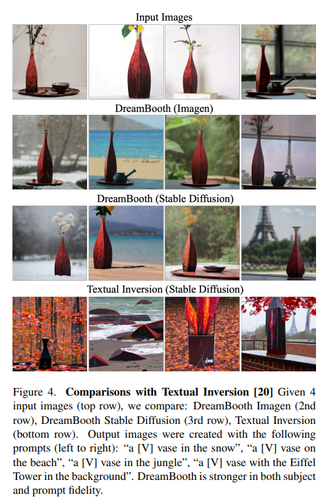
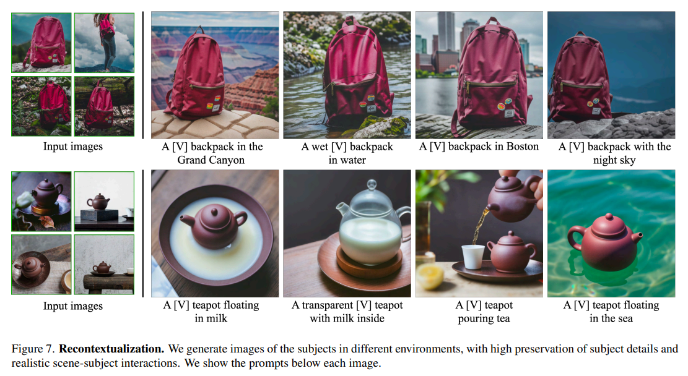
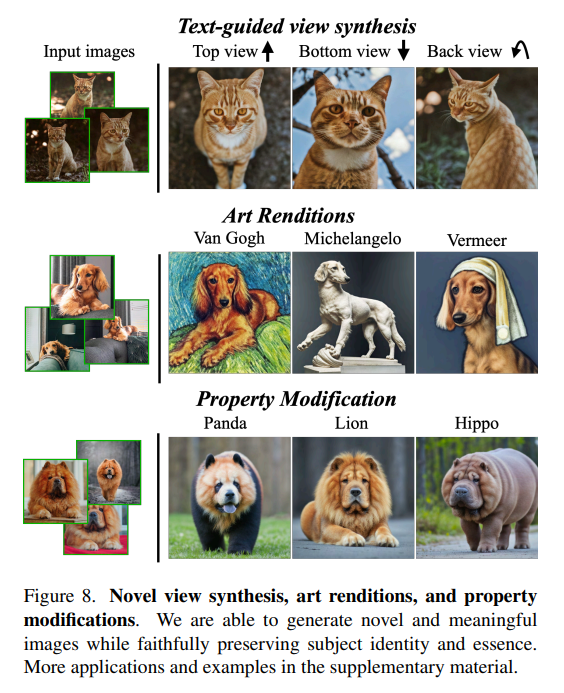
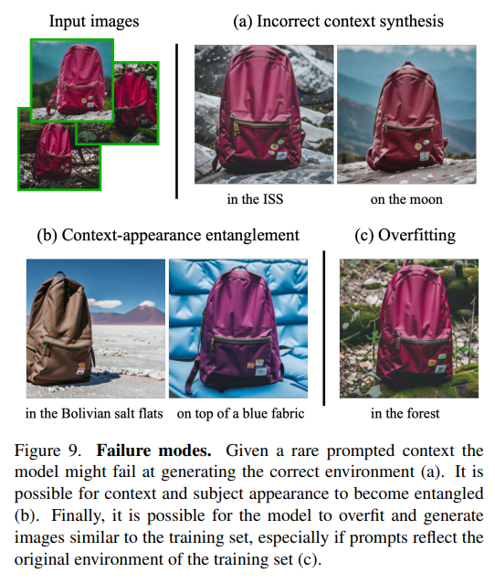

# Abstract

> 대형 Text to Image 모델은 주어진 텍스트 프롬프트로부터 고품질의 다양한 이미지를 합성하는 데 있어서 AI의 진화를 획기적으로 도약시킴. 그러나 이러한 모델은 주어진 참조 세트의 피사체 외관을 모방하고 이를 다양한 맥락에서 새로운 형태로 합성하는 능력이 부족함. 이 연구에서는 텍스트-이미지 확산 모델의 "개인화"를 위한 새로운 접근 방식을 제안. 피사체의 몇 장의 이미지만 입력으로 주어지면, 사전 학습된 텍스트-이미지 모델을 미세 조정하여 특정 피사체와 고유 식별자를 결합하도록 학습.
> 
- 피사체가 모델의 출력 도메인에 포함되면, 고유 식별자를 사용하여 다양한 장면에서 피사체의 새로운 현실적인 이미지를 합성
- 모델에 내장된 Sementic Prior(사전지식)과 새로운 자가 Autogenous Class-Specific Prior Preservation Loss를 활용하여, 참조 이미지에 나타나지 않는 다양한 장면, 포즈, 뷰 및 조명 조건에서 피사체를 합성할 수 있게 됨.
- 우리는 이 기술을 사용하여 피사체 재맥락화, 텍스트 안내 뷰 합성, 예술적 렌더링 등 이전에는 불가능했던 여러 작업을 수행하며, 피사체의 주요 특징을 보존합니다. 또한 피사체 기반 생성의 새로운 작업을 위한 새로운 데이터셋과 평가 프로토콜을 제공함

# **Introduction**

> 최근에 개발된 대규모 Text-to-Image 모델은 자연어로 작성된 텍스트 프롬프트를 기반으로 고품질의 다양한 이미지를 생성할 수 있는 전례 없는 능력을 보여줌 . 이러한 모델의 주요 장점 중 하나는 대규모 이미지-캡션 쌍 컬렉션에서 학습된 강력한 사전 지식(semantic prior)
> 
- 예를 들어, 이러한 사전은 "개"라는 단어를 다양한 포즈와 맥락에서 나타날 수 있는 다양한 개의 인스턴스와 연결하는 법을 배움.
- 그러나 이러한 모델의 생성 능력은 전례 없지만, 특정 참조 세트에서 피사체의 외관을 모방하고 동일한 피사체의 새로운 렌더링을 다양한 맥락에서 합성하는 능력은 부족함.
- 주요 이유는 출력 도메인의 표현력이 제한되어 있다는 점. 심지어 객체에 대한 가장 상세한 텍스트 설명조차도 다양한 외관의 인스턴스를 생성할 수 있음 (그림 2)

- 이 연구의 목적은 몇 장의 주제 이미지를 입력으로 제공받아 사전 학습된 텍스트-이미지 모델을 미세 조정하여 특정 피사체를 고유 식별자와 연결하는 방법을 학습하는 것.
- 모델의 출력 도메인에 주제가 내장되면, Unique Identifier를 사용하여 다양한 장면에서 사진 실감 나는 주제의 이미지를 합성할 수 있음. 이 기술은 모델의 사전 지식(Sementic Prior)을 활용하여 참조 이미지에 나타나지 않는 다양한 장면, 포즈, 관점 및 조명 조건에서 피사체를 합성할 수 있게 함.
- 우리의 접근 방식은 피사체 재맥락화, 텍스트 안내 뷰 합성, 예술적 렌더링 등 여러 어려운 작업을 수행할 수 있으며, 주제의 주요 특징을 유지하면서 새로운 이미지를 생성할 수 있음.
    - 피사체의 이미지를 몇 장 찍으면 간단하고 직관적인 텍스트 안내에 따라 다양한 조건과 장면에서 피사체의 사진을 생성하는 '마법의 사진 부스'와 같은 효과를 얻을 수 있음(그림 1).

# **Related work**

### **Image Composition**

- 이미지 합성 기술은 주어진 주제를 새로운 배경에 클로닝하여 주제가 장면에 자연스럽게 녹아들도록 하는 것.
- 새로운 포즈에서 합성을 고려하려면 일반적으로 더 많은 뷰가 필요한 3D 재구성 기술을 적용할 수 있음.
- 장면 통합(조명, 그림자, 접촉)과 새로운 장면 생성 불가능과 같은 단점이 존재. 반면, 우리의 접근 방식은 새로운 포즈와 새로운 맥락에서 주제를 생성할 수 있게 함.

### **Text-to-Image Editing and Synthesis**

- GANs 를 사용한 텍스트 기반 이미지 조작이 상당한 진전이 있었지만 이 방법들은 구조화된 시나리오(예: 인간 얼굴 편집)에서는 잘 작동하지만, 다양한 데이터셋에서는 어려움이 있음.
- Crowson 등은 VQ-GAN을 사용하여 더 다양한 데이터를 학습함으로써 이 문제를 완화하고자 했음. 다른 연구들은 최신 확산 모델을 활용하여 매우 다양한 데이터셋에서 최고 수준의 생성 품질을 달성함.
- 이러한 방법들은 대부분 전역 편집에만 제한되지만, Bar-Tal 등은 마스크를 사용하지 않고 텍스트 기반 로컬 편집 기술을 제안하여 인상적인 결과를 보였음. 이러한 편집 접근 방식은 주어진 이미지의 전역 속성 수정 또는 로컬 편집을 허용하지만, 새로운 맥락에서 주제의 새로운 렌더링을 생성하는 것은 불가능함.

### **Controllable Generative Models**

- 생성 모델을 제어하는 다양한 접근 방식이 있으며, 일부는 주제 기반 프롬프트 유도 이미지 합성을 위한 유망한 방향일 수 있음. Liu 등은 참조 이미지 또는 텍스트에 의해 가이드된 이미지 변형을 허용하는 확산 기반 기술을 제안했음.
- 주제 수정을 극복하기 위해 일부 연구에서는 사용자 제공 마스크를 가정하여 수정 영역을 제한함. Inversion을 사용하여 주제를 보존하면서 맥락을 수정할 수 있습니다. Prompt-to-prompt는 입력 마스크 없이 로컬 및 글로벌 편집을 허용합니다. 이러한 방법들은 대상의 신원을 보존하는 새로운 샘플 생성에 실패.
- Pivotal Tuning은 모델을 미세 조정하여 실제 이미지 편집을 가능하게 하며, Nitzan 등은 얼굴 도메인에 제한된 개인화된 사전 학습을 위해 얼굴에 GAN 미세 조정을 확장함.
- Casanova 등은 인스턴스 조건부 GAN을 제안하여 인스턴스의 변형을 생성할 수 있지만, 고유한 주제에서는 어려움을 겪고 모든 주제 세부 사항을 보존하지 못함.

# **Method**

> 특정 주제의 몇 장의 이미지만을 가지고, 텍스트 프롬프트를 통해 주제의 새로운 이미지를 생성하는 방법을 소개. 주제의 위치를 변경하거나, 주제의 속성(예: 색상 또는 모양)을 변경하거나, 주제의 포즈, 시점, 기타 의미적 수정을 포함한 다양한 변형을 생성할 수 있음. 입력 이미지 캡처 설정에 대한 제한은 없음.
> 

### **Text-to-Image Diffusion Models**

- 확산 모델은 가우시안 분포에서 샘플링된 변수를 점진적으로 디노이징하여 데이터 분포를 학습하는 확률적 생성 모델.
- 초기 노이즈 맵 $\epsilon \sim \mathcal{N}(0, 1)$와 텍스트 인코더 $\Gamma$, 텍스트 프롬프트 $P$를 사용해 생성된 조건 벡터 $c = \Gamma(P)$를 기반으로 $x_{gen}=\hat{x}_{\theta}(\epsilon, c)$ 이미지를 생성하는 사전 학습된 Text-to-Image Diffusion Model $\hat{x}_{\theta}$
- 이 모델은 변동이 심한 노이즈가 있는 이미지 또는 잠재 코드 $z_t := \alpha_tx+\sigma_t\epsilon$을 디노이즈하기 위해 제곱 오차 손실을 사용하여 훈련됨

$$
\mathbb{E}_{x, c, \epsilon, t}[x_t || \hat{x}_{\theta}(\alpha_tx+\sigma_t\epsilon,c)-x||^2_2]
$$

- 여기서 $x$는 실제 이미지 $c$는 텍스트 프롬프트에서 얻은 조건 벡터, $\alpha_t, \sigma_t, w_t$는 노이즈 스케줄 및 샘플 품질을 제어하는 용어이며, diffusion process time $t \sim \mathcal{U}([0, 1])$의 함수.

### **Personalization of Text-to-Image Models**

- 첫 번째 Task는 피사체 인스턴스를 모델의 출력 도메인에 삽입하여 피사체의 다양한 새로운 이미지를 쿼리할 수 있도록 하는 것.
- GAN의 경우 소수의 데이터셋으로 생성 모델을 미세 조정할 때 과적합 및 Mode Collapse를 방지하는 데 신중해야 함.
- 이를 피하기 위한 연구들이 있었지만, 우리 연구와는 달리 이러한 연구들은 주제 보존 요구 없이 목표 분포를 닮은 이미지를 생성하는 데 중점을 둠.
- Diffusion Loss를 사용하여, 우리는 큰 텍스트-이미지 확산 모델이 사전 지식을 잊지 않고 새로운 정보를 통합하는 데 뛰어나다는 것을 발견.

### Designing Prompts for Few-Shot Personalization

- 우리의 목표는 새로운 (고유 식별자, 피사체) 쌍을 확산 모델의 "Dictionary"에 삽입하는 것.
- 이미지를 자세히 설명하는 오버헤드를 피하기 위해, 우리는 모든 입력 이미지를 "a [identifier] [class noun]"로 라벨링하는 간단한 접근 방식을 사용.
- 여기서 [identifier]는 주제와 연결된 고유 식별자이고, [class noun]은 피사체의 클래스 기술자입니다(예: 고양이, 개, 시계 등)
- 클래스 기술자는 사용자 제공이거나 분류기를 사용해 얻을 수 있습니다. 잘못된 클래스 기술자를 사용하거나 클래스 기술자를 사용하지 않으면 훈련 시간이 길어지고 성능이 저하됩니다.

### Rare-token Identifiers

- 기존 영어 단어(예: “unique”, “special”)는 모델이 원래 의미와 분리해야 하므로 서브옵티멀하다는 것을 발견
- 언어 모델과 확산 모델 모두에서 약한 사전 확률을 가지는 식별자를 사용하여 해결
- 영어의 무작위 문자를 선택하고 이를 연결하여 희귀 식별자(예: "xxy5syt00")를 생성하는 것은 위험함.
    - 토크나이저가 각 문자를 별도로 토큰화할 수 있으며, 이 문자들에 대한 확산 모델의 사전 확률이 강하기 때문.
    - 이러한 토큰들이 일반 영어 단어를 사용하는 것과 유사한 약점을 초래한다는 것을 발견.

- 희귀 토큰을 먼저 찾고, 그것을 우리가 정의한 문자로 매핑시키는 접근
    - 식별자가 강한 사전 확률을 가질 가능성을 최소화. 우리는 어휘에서 희귀 토큰을 조회하여 $f(\hat{V})$의 희귀 토큰 식별자 시퀀스를 얻습니다.
    - $f$는 문자 시퀀스를 토큰으로 매핑하는 토크나이저 함수이고, $\hat{V}$ 는 토큰 $f(\hat{V})$에서 비롯된 디코딩된 텍스트.
    - 시퀀스는 가변 길이 k를 가질 수 있으며, k = {1, ..., 3}의 상대적으로 짧은 시퀀스가 잘 작동한다는 것을 발견.
    - 그런 다음 $f(\hat{V})$에 대해 디토크나이저를 사용하여 어휘를 반전시킴으로써 고유 식별자 $\hat{V}$ 를 정의하는 문자 시퀀스를 얻음.

### **Class-specific Prior Preservation Loss**

- 최상의 주제 충실도를 달성하려면 모델의 모든 레이어를 미세 조정하는 것이 가장 좋음. 여기에는 텍스트 임베딩에 조건부로 지정된 레이어를 미세 조정하는 것을 포함하며, 이는 Language Drift 문제를 야기할 수 있음.
    - Language Draft : 모델이 미세 조정 중에서 원래 학습한 언어 특성이나 의미를 잃어버리는 것
    - 의미 변화, 일관성 저하, 컨텍스트 상실 등
    - Diffusion Model에서도 유사한 현상을 처음 발견함. 이를 해결하기 위해, 우리는 자가 생성 클래스 특정 사전 보존 손실을 제안합니다. 이는 주제의 새로운 포즈와 관점을 생성할 수 있도록 다양성을 장려함.
- 출력 다양성이 감소할 가능성.
    - Text-to-Image Diffusion Model은 본래 높은 출력 다양성을 가지고 있음.
    - 소량의 이미지 세트를 통해 미세 조정할 때, 새로운 시점, 포즈, 관절로 대상을 생성할 수 있기를 원함.
    - 그러나 출력 포즈와 시점의 다양성이 감소할 위험이 있습니다 (예: 몇 장의 이미지에 고정되는 것). 우리는 모델이 너무 오래 훈련되었을 때 이러한 현상이 종종 발생한다는 것을 관찰했습니다.
- 구체적으로, 우리는 동결된 사전 학습 확산 모델에서 초기 노이즈 $z_{t_1} \sim \mathcal{N}(0, 1)$와 조건 벡터 $c_{pr} := \Gamma(f("a [class \ \ noun]")$ 를 사용하여 샘플 $x_{pr} = \hat{x}(z_{t_1}, c_{pr})$을 생성
- 손실은 다음과 같이 정의됨

$$
\mathbb{E}_{x, c, \epsilon, \epsilon', t}[w_t || \hat{x}_{\theta}(\alpha_tx+\sigma_t\epsilon, c) - x||_2^2 + \\\lambda w_{t'}||\hat{x}_{\theta}(\alpha_{t'}x_{pr}+\sigma_{t'}\epsilon',c_{pr})-x_{pr}||^2_2]
$$

- 두 번째 항은 모델이 자체 생성 이미지를 통해 지도하는 사전 보존 항
- 이 손실은 출력 다양성을 장려하고 언어 드리프트를 극복하는 데 효과적

# **Experiments**

### **Dataset and Evaluation**

- 우리는 고유한 객체와 반려동물(배낭, 봉제 인형, 개, 고양이, 선글라스, 만화 캐릭터 등)을 포함한 30개의 주제 데이터셋을 수집.
    - 각 피사체는 객체와 살아있는 피사체/반려동물 두 가지 카테고리로 나뉩니다. 30개 피사체 중 21개는 객체, 9개는 살아있는 피사체/반려동물입니다 .
- 각 피사체와 프롬프트 당 4개의 이미지를 생성하여 총 3,000개의 이미지를 생성.
- 이를 통해 방법의 성능과 일반화 능력을 견고하게 측정할 수 있음.
- 향후 피사체 기반 생성 평가에 사용할 수 있도록 데이터셋과 평가 프로토콜을 프로젝트 웹페이지에 공개 .

### **Evaluation Metric**

- 주제 충실도(subject fidelity) : 생성된 이미지에서 주제의 세부 사항을 보존하는 정도
    - CLIP-I : 생성된 이미지와 실제 이미지의 CLIP 임베딩 간의 평균 코사인 유사도. 동일한 텍스트 설명을 가진 다양한 피사체를 구별하는 데 적합하지 않음.
    - DINO : 생성된 이미지와 실제 이미지의 ViT-S/16 DINO 임베딩 간의 평균 코사인 유사도. DINO는 자가 지도 학습 목표 덕분에 주제 또는 이미지의 고유한 특징을 구별하도록 장려됨 .
- 프롬프트 충실도(prompt fidelity) : 프롬프트와 이미지 CLIP 임베딩 간의 평균 코사인 유사도로 측정됨. CLIP-T로 표시 .

### **Comparisons**

- Textual Inversion과 최근 동시 연구를 비교. DreamBooth를 사용한 이미지 생성은 Imagen과 Stable Diffusion을 사용했으며, Textual Inversion은 Stable Diffusion을 사용.
- 주제 충실도 지표인 DINO와 CLIP-I, 프롬프트 충실도 지표인 CLIP-T를 계산.
- Table 1에서는 DreamBooth가 Textual Inversion보다 주제와 프롬프트 충실도 지표에서 상당한 격차를 보이는 것을 확인함.
- DreamBooth(Imagen)는 DreamBooth(Stable Diffusion)보다 높은 점수를 기록했으며, 이는 Imagen의 더 큰 표현력과 높은 출력 품질 때문이라고 생각됨.

- 사용자 연구에서는 주제 충실도를 평가하기 위해 72명의 사용자에게 25개의 비교 질문을 제시
    - 각 질문은 주제의 실제 이미지 세트를 보여주고, 각 방법으로 생성된 주제의 이미지를 하나씩 보여줌
    - 사용자는 "두 이미지 중 어느 것이 참조 항목의 정체성(예: 항목 유형 및 세부 사항)을 더 잘 재현하는가?"라는 질문에 답하도록 요청받음 .
    - 프롬프트 충실도에 대해서도 유사하게 "참조 텍스트에 가장 잘 묘사된 이미지는 무엇입니까?"라는 질문을 합니다. 우리는 다수결 투표를 사용하여 결과를 평균내어 표 2에 제시합니다.
    - 주제 충실도와 프롬프트 충실도 모두에서 DreamBooth에 대한 압도적인 선호를 발견. 이는  DINO 차이 약 0.1과 CLIP-T 차이 0.05가 사용자 선호도 측면에서 중요함을 보여줌.
    - 정성적 비교를 보여줍니다. 우리는 DreamBooth가 주제 정체성을 더 잘 보존하고, 프롬프트에 더 충실함을 관찰함(그림 4)

### **Ablation Studies**

**Prior Preservation Loss Ablation**

- 사전 보존 손실(PPL)을 사용하여 Imagen을 15개의 주제로 미세 조정.
- 사전 보존 손실은 언어 드리프트를 방지하고 사전을 보존하는 데 도움이 됩니다. 사전 보존 메트릭(PRES)은 생성된 이미지와 실제 이미지의 평균 DINO 임베딩으로 계산됨.
- 이 메트릭이 높을수록 주제의 다양성을 유지하면서 고유한 주제를 더 잘 생성할 수 있음을 나타냄.
- Table 3에서 PPL을 사용한 모델이 더 높은 다양성과 주제 충실도를 달성하는 것을 확인할 수 있습니다.

**Class-Prior Ablation**

- Imagen을 5개의 주제로 미세 조정하면서 클래스 명사 없이, 잘못된 클래스 명사로, 올바른 클래스 명사로 각각 실험을 진행함.
- 올바른 클래스 명사로 학습할 때 주제를 더 잘 학습하고 다양한 맥락에서 주제를 생성할 수 있음을 확인함.
- 잘못된 클래스 명사로 학습할 경우 주제와 클래스 간의 충돌이 발생할 수 있습니다. 클래스 명사 없이 학습할 경우 모델이 주제를 학습하고 수렴하는 데 어려움을 겪으며 오류가 발생할 수 있음.

### **Applications**

**Recontextualization**

- **주제와 맥락**: 특정 주제를 다양한 맥락에서 새롭게 생성 가능(그림 7)
- **프롬프트 형식**: “a [V] [class noun] [context description]” 형태의 설명적인 프롬프트 사용.
- **주제의 새로운 표현**: 새로운 포즈와 움직임, 이전에 본 적 없는 장면 구조 포함.
- **현실적인 통합**: 접촉, 그림자, 반사 등 주제를 장면에 자연스럽게 융합.

**Art Renditions**

- **프롬프트 형식**:
    - “a painting of a [V] [class noun] in the style of [famous painter]”
    - “a statue of a [V] [class noun] in the style of [famous sculptor]”
- **주제의 예술적 재현**: 주제를 유명 화가나 조각가의 스타일로 재현 가능.
- **스타일 변환과의 차이**: 원본 구조를 그대로 유지하는 대신, 주제의 정체성을 유지하면서 예술적 스타일에 맞춘 새로운 변형 생성.
- **예시**: “Michelangelo” 스타일의 경우, 입력 이미지에서 보지 못한 새로운 포즈 생성.

**Novel View Synthesis**

- **새로운 시점**: 주제를 다양한 새로운 시점에서 렌더링 가능.
- **예시**:
    - 그림 8에서는 고양이를 새로운 시점(뒤쪽, 아래쪽, 위쪽)에서 생성.
    - 복잡한 털 무늬를 일관되게 유지.
- **모델의 학습 능력**:
    - 모델은 특정 고양이를 다양한 시점에서 본 적이 없지만, 클래스 사전 지식을 통해 새로운 시점을 추론하여 생성.
    - 단 4개의 정면 이미지만으로 새로운 시점을 생성.

**Property Modification**

- **속성 수정 가능**: 주제의 다양한 속성을 수정할 수 있음.
- **교배 예시**: 특정 개와 다른 동물 종의 교배 (그림 8 하단 행).
    - 프롬프트: “a cross of a [V] dog and a [target species]”.
    - 개의 독특한 얼굴 특징이 잘 보존되고 대상 종과 융합됨.
- **소재 변경 예시**:
    - "a transparent [V] teapot" (그림 7).
- **난이도**: 일부 속성 수정은 다른 것보다 어려울 수 있으며, 이는 모델의 사전 지식에 따라 달라짐.

