# 3 LINE SUMMARY

- 지시문으로 구성된 Instruction 데이터셋을 사용해서 작업 수 확장, 모델 크기 확장, 학습 데이터에 CoT 데이터 추가하는 방법을 통해 언어 모델을 미세조정.
- CoT 데이터로 Instruction Fine-Tuning을 하면 모델이 Few-Shot Example 없이 Zero-Shot CoT 추론을 수행할 수 있게됨. 또한 CoT 데이터를 포함하지 않은 Instruction Fine-Tuning은 오히려 추론 능력을 저하시킴
- 다양한 데이터셋에서 전반적으로 Instruction Fine-Tuning은 사전 학습된 언어 모델의 성능과 사용성을 향상시키는 일반적인 방법임을 보여줌.

# Abstract

> Instruction으로 구성된 데이터셋을 사용하여 언어 모델을 미세 조정(instruction finetuning)하는 방법을 탐구. 특히, (1) 작업 수의 확장, (2) 모델 크기의 확장, (3) 연쇄적 사고(chain-of-thought) 데이터를 사용한 미세 조정을 중점적으로 다룸. 연구 결과, 이러한 방식으로 미세 조정된 모델은 다양한 모델 클래스(PaLM, T5, U-PaLM), 프롬프트 설정(Zero-Shot, Few-Shot, CoT), 평가 벤치마크(MMLU, BBH, TyDiQA, MGSM, open-ended generation, RealToxicityPrompts)에서 성능이 크게 향상되었음.
> 
- 예를 들어, 1,800개의 작업으로 Instruction Fine-Tuning된 Flan-PaLM 540B는 PaLM 540B보다 평균 9.4% 높은 성능을 보였음.
- Flan-PaLM 540B는 여러 벤치마크에서 최첨단 성능을 달성했으며, Flan-T5 체크포인트를 공개하여 큰 모델과 비교했을 때도 강력한 퓨샷 성능을 보였음.
- 전반적으로 Instruction Fine-Tuning은 사전 학습된 언어 모델의 성능과 사용성을 향상시키는 일반적인 방법임을 보여줌.

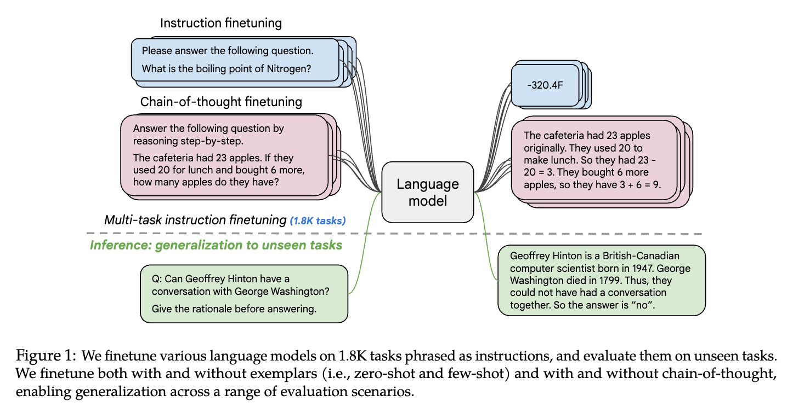

# Introduction

> 인공지능의 중요한 목표 중 하나는 보지 못한 새로운 작업에 일반화할 수 있는 모델을 개발하는 것. 자연어 처리(NLP) 분야에서는 사전 훈련된 언어 모델이 이러한 목표를 달성하는 데 상당한 진전을 이루었으며, 자연어 설명만으로도 작업을 수행할 수 있게 되었음. 이 논문에서는 지시문으로 구성된 여러 작업들에 대해 언어 모델을 미세 조정(instruction finetuning)하는 방법을 연구.
> 
1. Instruction Fine-Tuning이 Task 수와 Model Size 모두에서 잘 확장된다는 것을 보여줌. 이는 향후 연구에서 작업 수와 모델 크기를 더 확장해야 함을 시사.
2. 이전의 Instruction Fine-Tuning방법들이 연쇄적 사고(chain-of-thought, CoT) 데이터 없이 수행될 경우 CoT 평가에서 성능이 저하되지만, `CoT 데이터를 포함하면 모든 평가에서 성능이 향상된다는 것을 보여줌.`
- 이 연구를 기반으로, 5400억 개의 매개변수를 가진 Flan-PaLM 모델을 훈련하였으며, 작업 수를 1,800개로 늘리고 CoT 데이터를 포함시킴.
- Flan-PaLM은 여러 벤치마크에서 PaLM을 능가하는 성능을 보였으며, 다양한 언어에서의 성능도 개선되었음.
- Flan-PaLM은 MMLU(Massive Multi-task Language Understanding)에서 75.2%의 정확도를 달성.
- 또한 인간 평가자들로부터 개방형 생성 질문에서 높은 평가를 받았으며, 책임감 있는 인공지능 평가 벤치마크에서도 성능이 향상되었음.

### 2. Flan Finetuning 요약

> 다양한 데이터 소스를 사용하여 언어 모델을 지시문으로 미세 조정하는 방법을 다룹니다. 이를 "Flan"이라고 하며, 미세 조정된 모델의 이름 앞에 "Flan"을 붙입니다(e.g., Flan-PaLM). Flan은 여러 모델 크기와 아키텍처에 걸쳐 효과가 있음을 보여줌.
> 

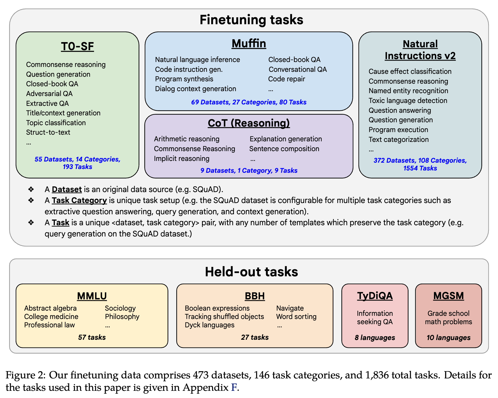

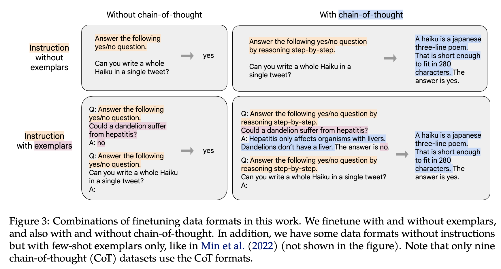

## 2.1 Finetuning Data

- **Task Mixtures**
    - 기존 연구는 Instruction Fine-Tuning 작업의 수를 늘리면 보지 못한 작업에 대한 일반화가 향상된다고 밝혔음.
    - 본 연구에서는 Muffin, T0-SF, NIV2, CoT의 네 가지 혼합물을 결합하여 1,836개의 미세 조정 작업으로 확장.
    - Muffin은 80개의 작업으로 구성되며, 여기에는 대화 데이터와 프로그램 합성 데이터가 포함됨.
- **Chain-of-thougnt finetuning mixture**
    - CoT 주석을 사용하여 CoT 주석이 보이지 않는 추론 작업 성능을 향상시키는지 탐구.
    - 이전 작업에서 나온 9개의 데이터셋 포함.
    - 사람 평가자들이 훈련 데이터에 대해 CoT 주석을 수동으로 작성.
    - 이 9개의 데이터셋에는 산술적 추론(Cobbe et al., 2021), 여러 단계의 추론(Geva et al., 2021), 자연어 추론(Camburu et al., 2020) 등이 포함.
- **Templates and formatting**
    - **Muffin, T0-SF, NIV2의 템플릿 :** 각 작업의 작성자가 제공한 템플릿 사용.
    - **CoT 템플릿 :** 9개 데이터셋을 위한 약 10개의 수작업 템플릿 작성.
    - **Few-shot 템플릿 : 다양한 구분자 사용:** "Q:"/"A:" 같은 구분자를 다양하게 작성하고 예제 레벨에서 무작위 적용.
    - **포맷팅 예제 제공 :** 예제가 포함된 데이터와 포함되지 않은 데이터 모두 포맷팅 예시 제공.

## 2.2 Finetuning Procedure

- T5, PaLM, U-PaLM 등 여러 모델 계열에 대해 Instruction Fine-Tuning을 적용.
- 모델 크기는 Flan-T5-small (80M 매개변수)부터 PaLM 및 U-PaLM (540B 매개변수)까지.
- 모든 모델에 동일한 훈련 절차를 적용하되, 학습률, 배치 크기, 드롭아웃, 미세 조정 단계와 같은 몇 가지 하이퍼파라미터만 다름.
- Adafactor 최적화 알고리즘을 사용하여 파인 튜닝 진행
- Packing 기법을 사용.
    - 여러 훈련 예제를 단일 시퀀스로 결합
    - 입력과 출력을 End-of-Sequence 토큰으로 분리
- 미세 조정 단계의 최적 스텝은 주기적인 평가를 통해 선택되며, 미세 조정에 사용된 컴퓨팅 자원은 사전 훈련에 비해 매우 적음(540B의 사전 훈련 계산량의 0.2%)
- 이를 통해 Flan 모델은 다양한 평가 벤치마크에서 성능을 크게 향상시켰으며, 특히 추론 능력이 필요한 작업에서 두드러진 성과를 보였음.

## 2.3 Evaluation Protocol

> 미세 조정 데이터에 포함되지 않은 Held-Out task(모델 훈련 시 사용하지 않은 데이터셋이나 태스크)에 대한 성능을 평가. 주된 목표는 Flan-PaLM의 세계 지식과 추론 작업에 대한 전반적인 능력을 평가하는 것. 따라서 다양한 벤치마크(다국어 포함)에서 모델을 평가.
> 

### **MMLU (Massive Multi-task Language Understanding)**

- 수학, 역사, 법률, 의학 등 57개의 작업을 포함하는 시험 질문으로 구성.
- 다양한 학문 영역에서 모델의 지식 평가

### **BBH (BIG-Bench Hard)**

- 23개의 어려운 작업을 포함하며, PaLM이 평균 인간 평가자보다 낮은 성능을 보이는 작업들로 구성.

### **TyDiQA**

- 8개의 유형학적으로 다양한 언어에 걸쳐 있는 질문-응답 벤치마크.
- 모델의 다국어 질문 응답 능력 평가

### **MGSM (Multilingual Grade School Math)**

- 수학 문제를 10개 언어로 번역한 다국어 벤치마크.

- **평가 방법 및 메트릭**: MMLU와 BBH의 경우, 모델이 직접 정답을 예측하는 직접 프롬프트 방식과 추론 사슬(Chain-of-Thought, CoT) 프롬프트 방식을 모두 사용하여 평가.
- **정규화된 평균 메트릭**: 모델 성능을 통합적으로 평가하기 위해 정규화된 평균 메트릭을 사용. 이는 MMLU-Direct, MMLU-CoT, BBH-Direct, BBH-CoT, TyDiQA-Direct, MGSM-CoT의 6개 점수의 Macro-Average.

# 3. Scaling to 540B Parameters and 1.8K Tasks

> 모델의 크기와 미세 조정 작업의 수를 확장시키면서 모델 성능에 미치는 영향을 분석. 세 가지 PaLM 모델 크기(8B, 62B, 540B)를 대상으로 실험을 수행하고, 적은 수의 작업부터 많은 수의 작업(CoT, Muffin, T0-SF, NIV2)까지 순차적으로 추가하여 작업 수를 확장.
> 

1. **모델 크기와 작업 수의 확장**:
    - 모든 크기의 모델에서 다중 작업 지시문 미세 조정이 성능을 크게 향상시킴. 성능 향상은 9.4%에서 15.5%까지 다양합니다.
    - 작업 수를 늘리면 성능이 향상되지만, 282개의 작업까지만 대부분의 향상이 이루어집니다. 추가적인 작업은 모델에 새로운 지식을 제공하지 않거나, 모델이 이미 사전 훈련에서 습득한 지식을 더 잘 표현하도록 학습하는 데서 대부분의 성능 향상이 이루어진다고 설명됨.
2. **모델 크기의 증가**:
    - `모델 크기를 한 단계(예: 8B에서 62B, 62B에서 540B)씩 확장하면, 미세 조정된 모델과 미세 조정되지 않은 모델 모두에서 성능이 크게 향상됨.`
    - 예를 들어, 8B 모델에서 15.5%의 절대적인 성능 향상이 있었지만, 540B 모델에서는 9.4%의 성능 향상이 있었습니다. 그러나 오류율의 상대적 감소는 540B 모델에서 더 크게 나타났습니다(540B 모델의 18.4% 대 8B 모델의 16.6%).

### 향후 연구 제안

- 모델 크기와 미세 조정 작업 수를 더욱 확장하면 성능이 계속해서 향상될 것으로 예상됨.
- `모델 크기를 한 단계 더 확장하는 것은 상당한 성능 향상을 가져올 수 있으며, 미세 조정 작업 수를 확장하는 것도 성능을 더욱 향상시킬 수 있음.`

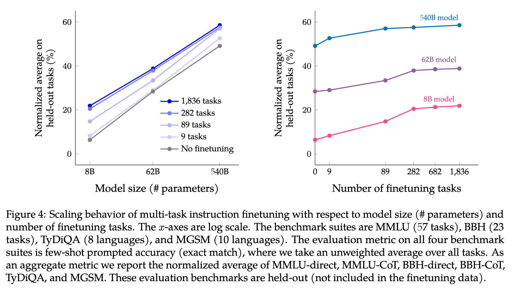

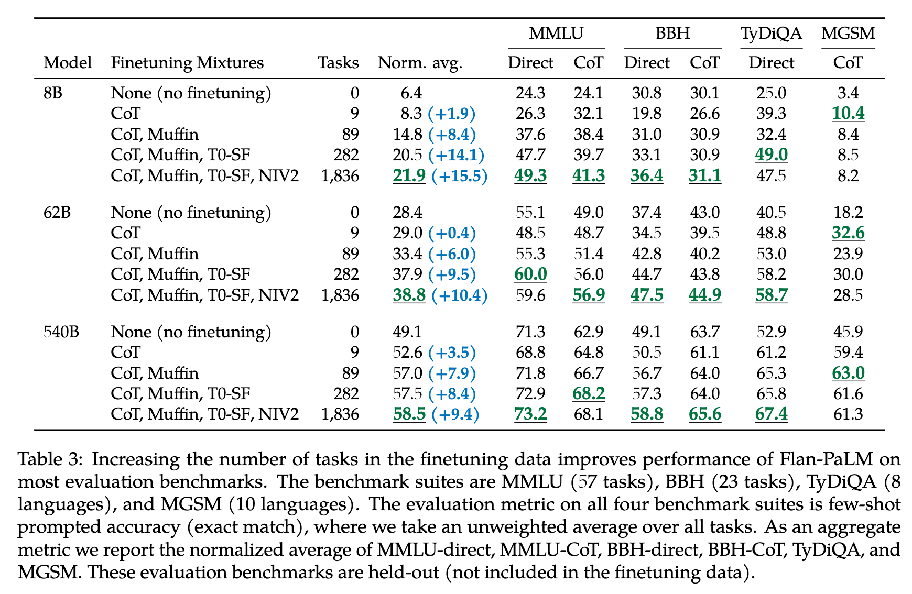

- Self-Consistency : 여러 번의 독립적인 시도 후 가장 빈번한 답을 선택하는 방법

# 4. Finetuning with Chain-of-Thought Annotations

> Chain-of-Thought 데이터를 포함하여 지시문 미세 조정의 효과를 탐구. CoT 데이터는 모델이 단계별 추론을 수행하는 능력을 향상시키는 데 중요함.
> 

## Finetuning on chain-of-thought improves reasoning on held-out tasks

- CoT 데이터를 포함하면 모델의 추론 능력이 크게 향상됨. Flan-PaLM은 CoT 데이터 없이 수행된 이전 모델들보다 여러 벤치마크에서 뛰어난 성능을 보였음.
- `CoT 데이터를 포함하지 않은 Instruction Fine-Tuning은 오히려 추론 능력을 저하시킴.` 그러나 단 9개의 CoT 데이터셋을 포함하면 모든 평가에서 성능이 향상됨.

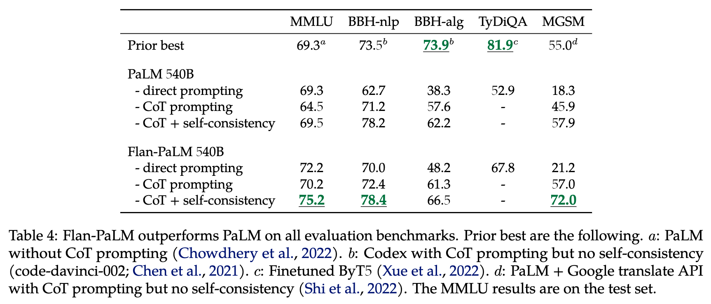

- Flan-PaLM 540B 모델은 MMLU 벤치마크에서 75.2%를 달성하여 이전 모델들보다 큰 성능 향상을 이루었습니다. 이는 PaLM의 69.3%보다 높은 수치임.
- MGSM 벤치마크에서도 Flan-PaLM은 Bengali와 같은 저자원 언어에서 높은 성능을 보였음. 예를 들어, Bengali에서는 69.6%를 달성함.
- GSM8K 벤치마크에서는 83.9%로 새로운 최고 성능을 기록.
- CoT 데이터를 포함하면 복잡한 BIG-Bench 작업에서 "let's think step-by-step"과 같은 문구를 통해 제로샷 추론을 활성화할 수 있음.
- CoT 데이터가 포함된 모델은 CoT 데이터 없이 미세 조정된 모델보다 모든 평가에서 더 나은 성능을 보임.

## Some chain-of-thought data is needed to maintain reasoning ability

- CoT(Chain of Thought) 데이터 세트 9개를 포함한 미세 조정(instruction finetuning)의 효과를 분석함.
- CoT 기준으로 평가한 벤치마크(MMLU, BBH, MGSM)와 Non-CoT 기준으로 평가한 벤치마크(MMLU, BBH, TyDiQA).
- `Non-CoT와 CoT 데이터를 모두 포함한 미세 조정이 CoT 데이터만을 포함한 것보다 성능이 높음(Figure 5 left)`
- `Non-CoT와 CoT 데이터를 함께 미세 조정하는 것이 Non-CoT만으로 미세 조정했을 때의 성능을 떨어뜨리지 않음(Figure 5 right)`
- **CoT 데이터 포함**:
    - 일부 CoT 데이터를 포함하여 모델을 미세 조정하면 모든 평가에서 성능이 향상됨.
    - CoT와 비-CoT 데이터를 함께 사용하면 CoT 데이터가 포함된 평가와 비-CoT 데이터가 포함된 평가 모두에서 향상된 성능을 보임.
- **non-CoT 데이터만 사용**:
    - 비-CoT 데이터만 사용하여 모델을 미세 조정하면 CoT 데이터를 포함한 평가에서 성능이 크게 저하됨.
    - 이는 CoT와 비-CoT 데이터가 서로 다른 프롬프트 패러다임을 가지고 있어, 두 유형의 데이터 모두를 포함해야 모델이 모든 유형의 평가에서 좋은 성능을 보인다는 것을 시사함.
- **기존 연구와의 비교**:
    - 이전 연구들은 주로 보유되지 않은 NLP 작업만을 평가하였음.
    - 이전 모델들은 CoT 추론을 성공적으로 수행하기에는 너무 작았음.
- **요약**:
    - 모델이 새로운 작업을 잘 수행하려면 훈련 작업과 동일한 프롬프트 패러다임을 따르는 작업일 때만 성능이 향상됨.
    - 따라서 모델 능력을 극대화하려면 CoT 데이터와 Non-CoT 데이터가 모두 필요함.

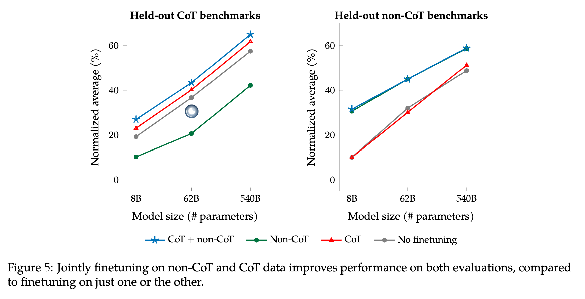

## 4.3 Unlocking zero-shot reasoning

- `CoT 데이터로 지시 미세조정을 하면 모델이 Zero-Shot CoT 추론을 수행할 수 있게됨.`
- Zero-Shot setting은 모델이 Few-Shot Example없이 독자적인 추론 능력을 보여줄 수 있는지를 평가.
- CoT 데이터로 모델을 미세조정하면 'let’s think step-by-step'이라는 문구를 통해 CoT 추론 능력이 활성화됨. 이에 비해 미세 조정이 없는 PaLM은 이러한 문제를 해결할 수 있는 CoT를 생성하지 않음(Figure 6)

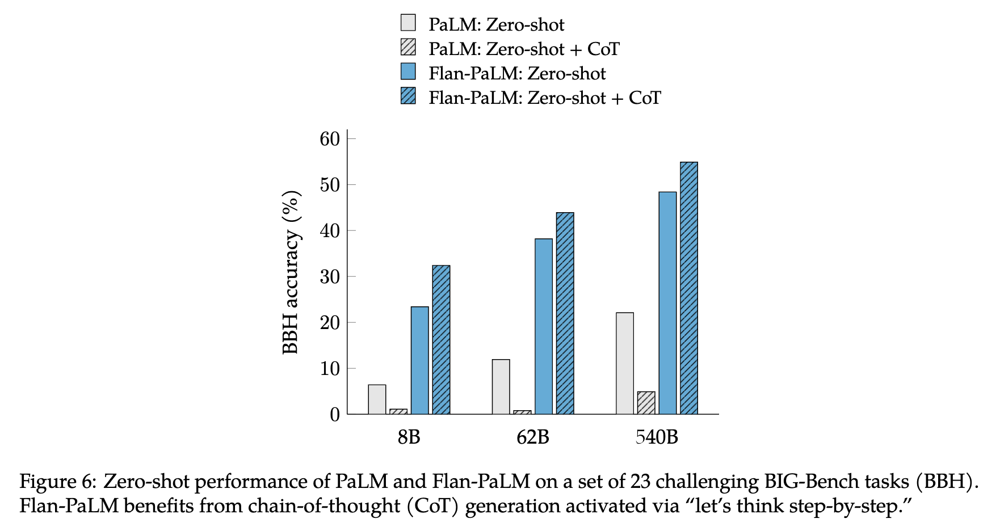

- 이 방법은 23개의 어려운 BIG-Bench(BBH) 작업에서 Flan-PaLM 모델의 성능을 향상시킴.
- 미세조정을 하지 않은 PaLM은 CoT을 생성하여 문제를 해결하지 못했음.
- 미세조정을 하지 않은 PaLM의 Zero-Shot CoT의 성능이 좋은 분야는 수학 단어 문제에 국한되었음. 이는 BBH 작업과 크게 다름.

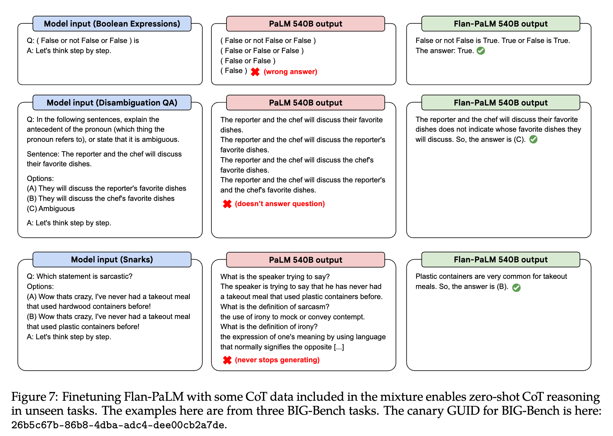

# 5. Putting It All Together

- PaLM 계열의 모델 외에도 인코더-디코더 아키텍처를 가진 T5 모델에 Instruction FIne-Tuning 적용.
- **모델 예시**:
    - **PaLM 모델군**: 기본적으로 decoder-only 아키텍처.
    - **T5 모델**: encoder-decoder 아키텍처.
    - **cont-PaLM**: PaLM-62B 모델에서 추가로 500B 토큰으로 사전 학습한 모델.
    - **U-PaLM**: 540B PaLM 모델을 UL2 목표로 추가 학습한 모델.
- PaLM 62B 모델의 확장 버전인 cont-PaLM과 UL2 목표로 20k 추가 단계를 사전 훈련한 U-PaLM 모델도 포함.
- 지시문 미세 조정은 상대적으로 적은 양의 컴퓨팅 자원으로 모델 성능을 향상시킴.
- PaLM 540B의 경우 지시문 미세 조정은 사전 훈련 컴퓨팅의 0.2%만 사용하지만 평가 벤치마크에서 정상화된 평균 성능을 9.4% 향상시킴.
- Flan-T5-XL은 3B 파라미터를 가지지만 MMLU 점수가 GPT-3 175B 보다 높음
- 지시문 미세 조정을 사용하면 더 작은 모델이 더 큰 모델보다 성능이 더 나을 수 있음.

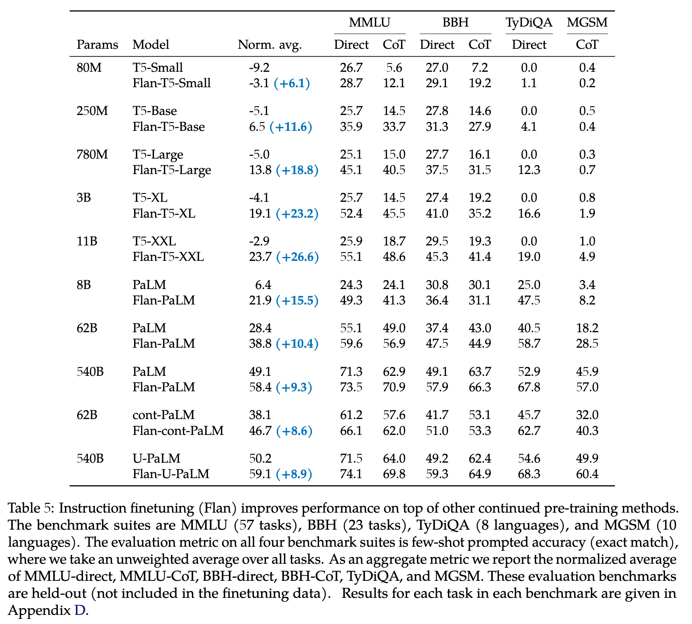

# 6. Usability Evaluation of Open-Ended Generation

> Instruction Fine-Tuning이 모델의 개방형 질문에 대한 응답 능력에 미치는 영향을 평가. NLP 벤치마크와 자동 평가 메트릭은 인간의 선호도를 측정하는 데 충분하지 않기 때문에, 수동 평가를 통해 모델의 개방형 응답을 조사함.
> 
- Flan-PaLM 540B와 PaLM 540B 모델의 성능을 평가하기 위해, 두 모델 각각의 응답을 생성하고 비교.
- 총 190개의 평가 예제 활용. 이 예제는 다섯 가지 범주(창의성, 맥락 추론, 복잡한 추론, 계획, 설명)의 20문제로 구성.
- 60개의 예제에서 CoT 유발 구문(예: "단계별로 생각해보자") 사용하여 추가적인 평가 수행.
- 각 모델은 온도 샘플링(temperature sampling, 𝜏=0.7)을 사용해 5개의 응답을 무작위로 생성 및 Log Probability Score로 순위 매김.
- 두 모델의 응답을 인간 평가자들에게 제시, 더 선호하는 응답을 선택하도록 요청.

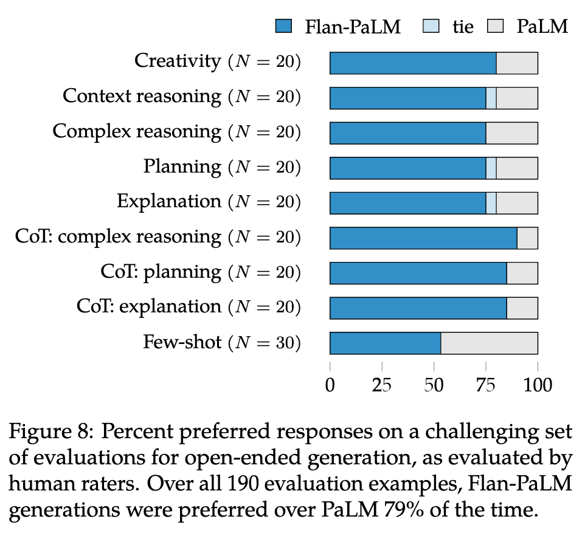

- `전체 190개의 평가 예제 중 Flan-PaLM 생성물은 79%의 경우에서 PaLM보다 선호되었음.`
- 모든 Zero-Shot Setting에서 Flan-PaLM은 큰 차이로 선호되었으며, CoT 트리거 문구를 사용한 입력의 경우, Flan-PaLM에 대한 선호도가 약 10% 증가함.
- Few-Shot Input에 대해서도 성능 저하는 없었음.
- Flan-PaLM은 창의성, 맥락에 대한 추론, 복잡한 추론, 계획, 설명 등의 카테고리에서 PaLM보다 더 나은 응답을 생성.
- Instruction Fine-Tuning이 모델의 개방형 질문 응답 능력을 향상시킨다는 것을 보여줌.

# 7. Discussion

> Instruction Finetuning을 확장하여 모델의 성능을 향상시키는 방법을 탐구했습니다. 이를 위해 **미세 조정 작업의 수 확장,** **모델 크기의 확장, Chain-of-Thought, CoT 데이터로 미세 조정 등을 수행함.**
> 

- `모델의 크기와 미세 조정 작업의 수를 확장하면 성능이 향상된다는 것을 확인`함. 특히, 모델 크기와 작업 수 모두의 확장은 성능 개선에 기여.
- `작업 수 확장은 성능에 긍정적인 영향을 주지만, 작업 수가 많아질수록 개선 효과가 감소하는 경향이 존재.` 그럼에도 불구하고 추가적인 작업은 여전히 성능 향상에 기여함.
- Instruction Fine-Tuning이 없는 모델과 비교할 때, 지시문 미세 조정이 된 모델의 성능 개선 폭은 줄어들지 않았으며, 이는 미래의 더 큰 모델에서도 지시문 미세 조정이 유효할 것임을 시사.

- 본 연구에서 개발한 Flan-PaLM 모델은 다양한 평가 벤치마크에서 성능을 크게 향상시킴. 예를 들어, MMLU, BBH, TyDiQA, MGSM 등의 벤치마크에서 뛰어난 성능을 보임.
- 특히, CoT 데이터를 포함한 지시문 미세 조정은 복잡한 추론 작업에서 두드러진 성능 향상을 가져옴.

- Flan-PaLM 모델은 개방형 생성 질문에서 인간 평가자들로부터 높은 평가를 받았으며, 독성 언어 평가에서도 성능이 개선되었음.
- Instruction Fine-Tuning된 모델은 더 작은 모델이 더 큰 모델보다 나은 성능을 보일 수 있음을 보여주었음.
- 향후 연구는 모델 크기와 작업 수를 더욱 확장하여 성능을 지속적으로 향상시키는 것이 필요. 또한, 지시문 미세 조정이 다양한 모델, 프롬프트 설정 및 평가 작업에 걸쳐 성능을 향상시키는 일반적인 방법임을 확인.

# Conclusions

- 540B 매개변수 언어 모델로 확장
- 1.8K 미세 조정 작업으로 확장
- CoT 데이터를 포함

- **모델 크기와 작업 수 확장**: 모델 성능이 크게 향상되었음. 이전 지시문 미세 조정 방법은 CoT 작업에서 성능이 저하되었지만, CoT 데이터를 함께 미세 조정하면 모든 평가에서 성능이 개선되었음.
- **Flan-PaLM 성능**: 여러 벤치마크에서 최고 성능을 기록. 예를 들어, MMLU에서 75.2%를 달성.
- **사용성 향상**: 지시문 미세 조정은 제로샷 추론을 가능하게 하여 프롬프트 엔지니어링이나 퓨샷 예제를 필요로 하지 않음. 또한, 지시문 미세 조정은 다양한 모델 크기, 아키텍처 및 사전 훈련 목표에 호환됨.
- **Flan-T5 모델 공개**: Flan-T5 모델을 공개하여 T5 기본 모델보다 훨씬 높은 성능을 보였습니다.