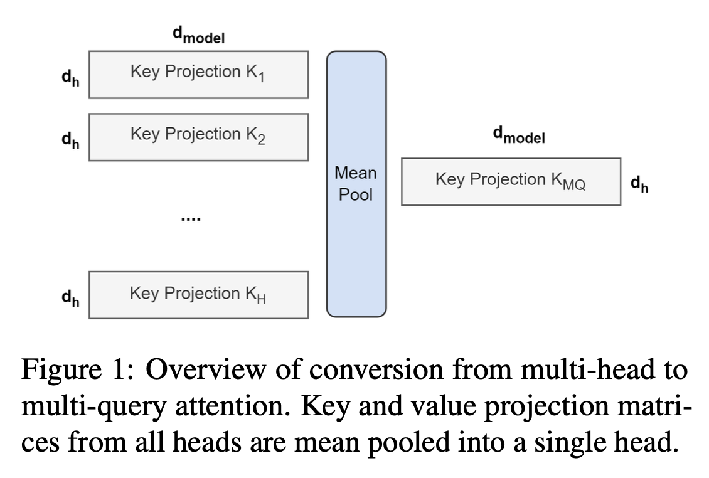
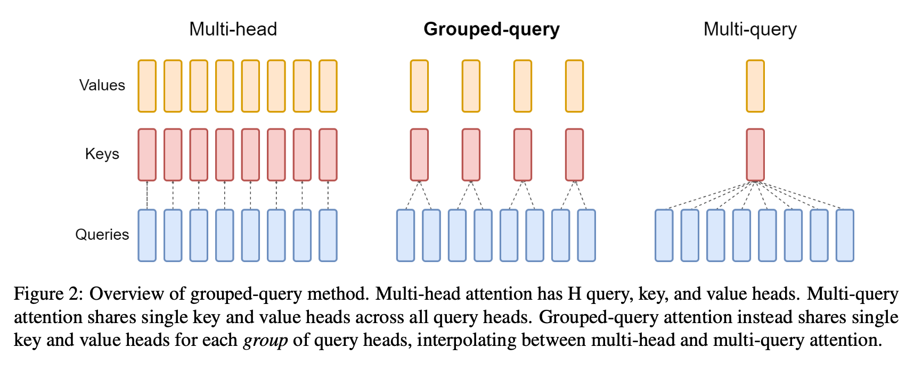
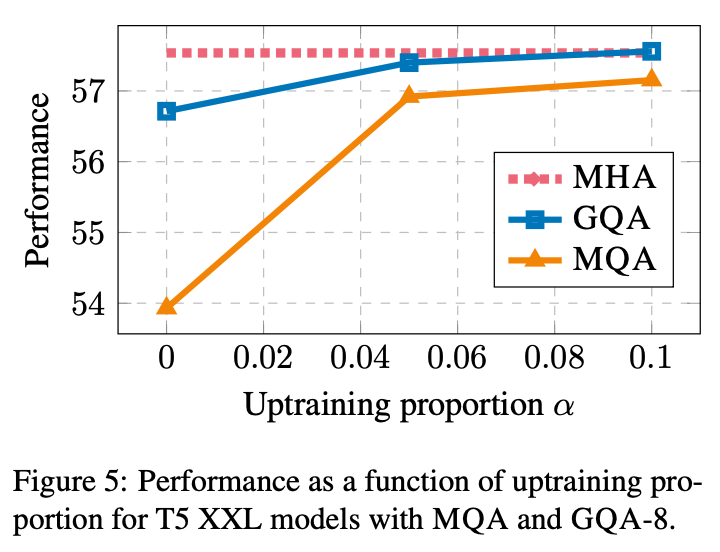
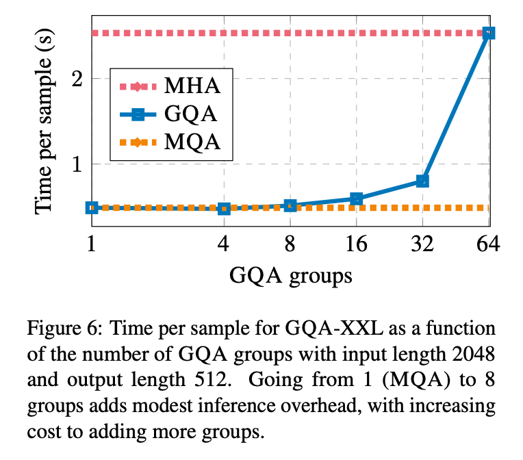

# 3 LINE SUMMARY

- MHA에서 메모리를 많이 사용하여 병목현상이 발생. 이러한 문제를 해결하기 위해 MQA이 도입되었지만, 품질 저하와 훈련 불안정성을 초래할 수 있음.
- GQA는 MQA와 MHA의 중간 형태로 파라미터를 조절하여 MHA 또는 MQA와 동일하게 만들 수 있음
- GQA는 MQA의 속도 이점과 MHA의 품질 이점을 결합하여, 더 적은 메모리와 연산 량으로 거의 동일한 품질을 달성.

원문링크

[GQA: Training Generalized Multi-Query Transformer Models from...](https://arxiv.org/abs/2305.13245)

---

# **Abstract**

> 디코더 추론 속도를 향상시키기 위해 Multi-Head 언어 모델 체크포인트를 Multi-Query Attention(MQA) 모델로 업트레이닝하는 방법과, MQA의 한계를 극복하기 위해 개발된 새로운 기법인 Grouped Query Attention(GQA)을 소개함.
> 
- GQA는 쿼리 헤드를 그룹화하여 각 그룹에 대해 하나의 키-값 헤드를 공유
- MQA보다 품질이 우수하면서도 거의 동등한 속도를 제공.

# **Introduction**

> 트랜스포머 모델에서 Autoregressive decoder 추론이 주요 병목 현상으로 지목되며, 이는 디코더의 메모리 대역폭 사용이 모든 디코딩 단계에서 key와 value의 로딩으로 인해 심각하게 제한된다는 점을 설명. 이러한 문제를 해결하기 위해 멀티-쿼리 어텐션(MQA)이 도입되었지만, MQA는 품질 저하와 훈련 불안정성을 초래할 수 있음. 이 논문에는 LLM에서 더 빠른 추론을 위한 두 가지 방법을 소개함
> 
1. MHA가 있는 언어 모델 체크포인트를 업트레이닝하여 원래 학습 연산량의 일부만으로 MQA를 사용할 수 있음.
    1. 빠른 multi-query와 고품질 MHA 체크포인트를 얻을 수 있는 비용 효율적인 방법을 제시.
2. 쿼리 헤드의 하위 그룹당 단일 키와 값 헤드를 사용하여 다중 헤드와 MQA 사이의 보간인 Grouped Query Attention(GQA)를 제안.
    1. 업트레이닝된 GQA는 MQA만큼 빠르면서 MHA에 가까운 품질을 달성한다는 것을 보여줌.

# **Methods**

> MHA 모델을 MQA 모델로 업트레이닝하는 두 단계 프로세스를 설명.
> 

## **Uptraining**

- 첫 번째 단계는 Multi-Head 체크포인트를 MQA 체크포인트로 변환하는 과정
- Key와 Value 헤드의 Projection Matrix를 Mean Pooling하여 Single Projection Matrix로 변환하는 것을 포함.
- 변환된 체크포인트는 원래 훈련 단계의 소수 비율만큼 추가적으로 사전 훈련됨.
- 아래 그림은 MH에서 MQA로 전환하는 프로세스 개요

## **Grouped-query attention**

- GQA는 쿼리 헤드를 그룹으로 나누고, 각 그룹이 단일 키 헤드와 값 헤드를 공유
- 이 구조는 MQA와 MHA의 중간 형태로, 품질은 MQA보다 높고 속도는 MHA에 근접함.
    - GQA-G는 G그룹이 있는 Grouped Query를 말함.
    - GQA-1은 Single Key와 Value Head를 가지는 경우 MQA와 동일하며
    - GQA-H는 그룹이 헤드 수와 동일하므로 MHA와 동일함
- 각 그룹의 Key와 Value Head는 해당 그룹 내의 모든 오리지널 Head를 평균 풀링하여 구성.
- 이 방법은 큰 모델에서 메모리 대역폭과 용량을 절약하면서도 모델의 품질을 유지하려는 균형을 찾는 것을 목표로 함.
    - MQA는 키와 값 헤드의 수를 감소시킴으로써 모델의 용량과 처리 능력도 함께 감소시키는 문제가 있음.
    - 복잡하거나 다양한 언어 처리 작업을 수행할 때(큰 모델일 때 영향을 미칠 수 있음)
- 인코더의 Self Attention Layer에는 GQA가 적용되지 않으며 인코더 표현은 병렬로 계산되므로 일반적으로 주요 병목 현상이 아님.

# **Experiments**

## **Experimental Setup**

**Configuration**

- T5.1.1 아키텍처를 기반으로 하는 모델들을 사용.
- MHA, MQA, GQA 세 가지 버전으로 구현되었음.
- 인코의 Self Attention에는 적용하지 않음

**Data**

- 요약 데이터 세트
- arXiv 및 PubMed
- MediaSum
- Multi-News
- 번역 데이터 세트 WMT 2014 English-to-German,
- TriviaQA
- 자동 회귀 추론은 이러한 작업에 적용하기 어렵기 때문에 GLUE(Wang et al., 2019)와 같이 널리 사용되는 분류 벤치마크에서는 평가하지 않음.

## **Main Results**

- 메인 결과에서는 T5-Large와 T5-XXL 모델, 그리고 이들 모델의 MQA 및 GQA로 업트레인된 버전을 비교 분석함.
- 업트레인된 모델들은 원래 모델의 훈련 단계의 5%에 해당하는 추가 훈련 진행.
- MQA 모델은 MHA-Large보다 높은 품질과 더 빠른 추론 속도를 제공했고, GQA 모델은 MHA-XXL과 비슷한 품질을 유지하면서 MQA에 근접한 속도를 보여주었음.
- 이는 GQA가 품질과 속도 사이에서 좋은 균형을 제공한다는 것을 시사함.

## **Ablations**

- 다양한 모델링 선택이 결과에 미치는 영향을 조사하기 위한 추가 실험들을 설명
- 체크포인트 변환 방법과 업트레이닝 비율의 변화가 모델 성능에 미치는 영향을 분석
- 업트레이닝 비율이 증가함에 따라 성능이 향상되었지만, 10% 이상에서는 감소(그림5)
- MQA에서 그룹 수를 늘리면 초기에는 약간 의 속도 저하만 발생하며, MHA에 가까워질수록 코스트가 증가(그림6)

# **Conclusion**

> GQA는 MQA의 속도 이점과 MHA의 품질 이점을 결합하여, 더 적은 메모리 대역폭과 연산 비용으로 거의 동일한 품질을 달성할 수 있음.
> 
- GQA는 MQA의 속도를 유지하면서 MHA에 근접한 품질을 제공하지만 모든 사용 사례에 최적인지에 대한 확신을 가지기는 어려움
- 메모리 대역폭 오버헤드는 주로 긴 시퀀스를 생성할 때 중요한 문제이며, 이에 대한 평가는 복잡함.
- 업트레인된 GQA 모델과 처음부터 훈련된 모델과의 상대적 성능을 비교하는 연구가 부족.
- GQA가 인코더-디코더 모델에만 적용되었으며, Decoder-Only 모델에의 적용 가능성도 탐색해야 함.