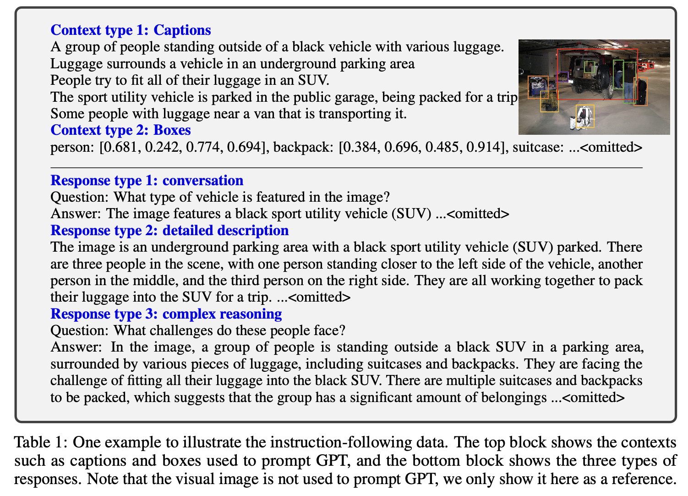
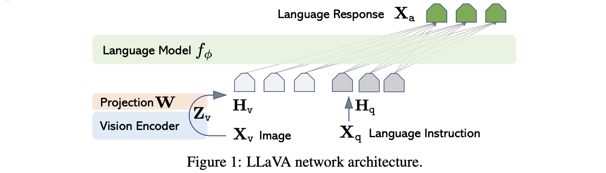
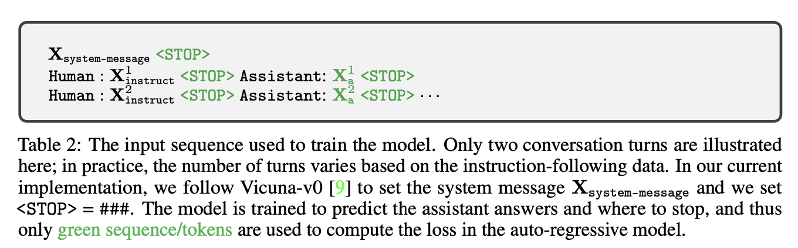
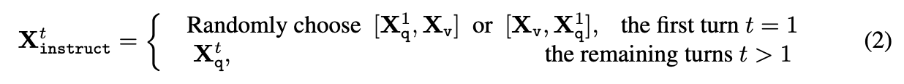
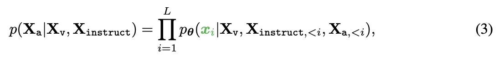
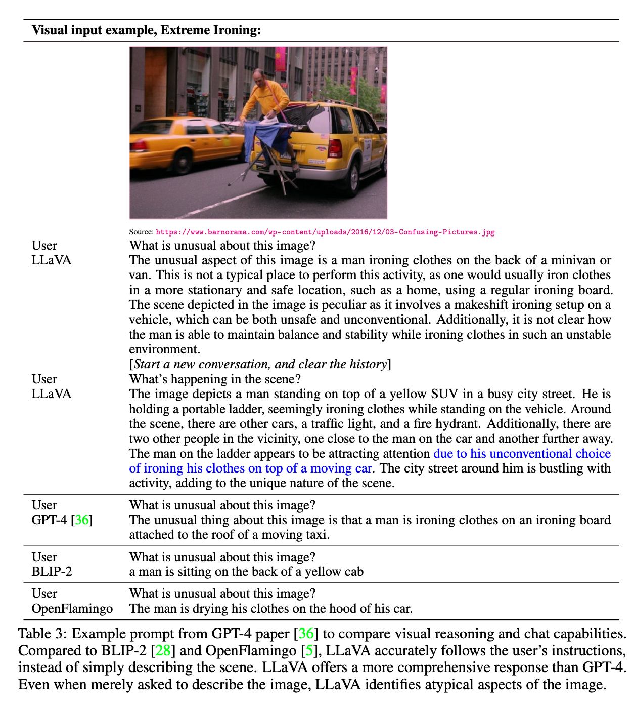
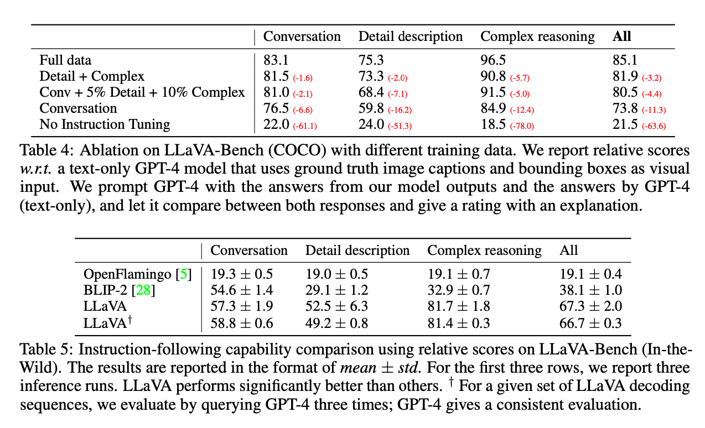
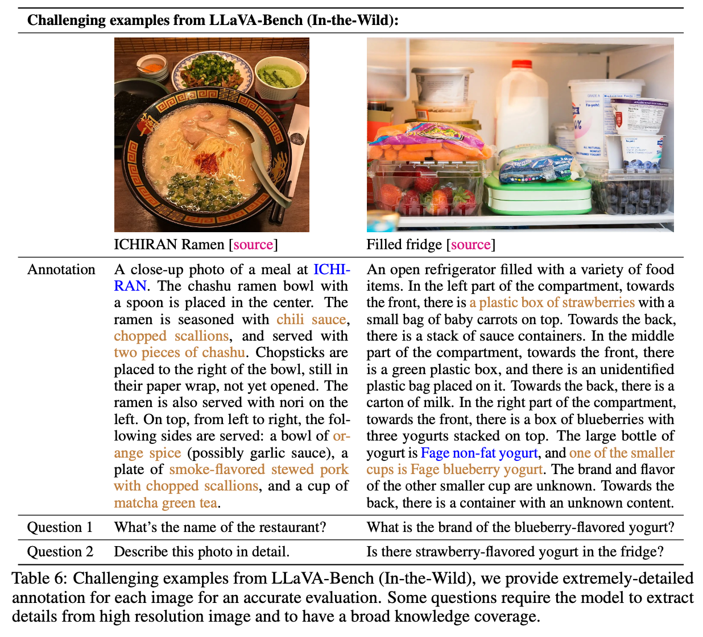

[Visual Instruction Tuning](https://arxiv.org/abs/2304.08485)

# 3 LINE SUMMARY

- 기존의 모델은 언어모델 따로, 비전 모델 따로 있어서 각 모델은 Downstream Task에 단일 모델로서 과제를 해결하지만, 사용자 지시에 대한 상호작용성이 제한됨
- LLaVA라는 Multimodal 모델 개발. GPT-4를 이용해 COCO dataset에 대해서 대화, 세부 특징, 추론 등의 영역을 포함하는 Instruction Following Data를 생성하고, 평가 벤치마크를 구축
- 실험 결과 LLaVA는 GPT-4와 비슷한 수준의 멀티모달 대화 성능을 보여줌

# **Abstract**

> LLaVA는 GPT-4를 이용하여 멀티모달 언어-이미지 데이터에 대한 Instruction Following 데이터를 생성하는 첫 번째 시도. 이 데이터를 사용하여 훈련된 LLaVA는 일반적인 시각 및 언어 이해를 위한 비전 인코더와 대형 언어 모델(LLM)을 연결하는 대규모 멀티모달 모델. Visual Instruction Following 연구를 촉진하기 위해 다양한 도전 과제를 포함한 두 개의 평가 벤치마크를 구축.
> 
- 실험 결과, LLaVA는 GPT-4와 비슷한 멀티모달 대화 능력
- Science QA에서 LLaVA와 GPT-4의 시너지가 새로운 최고 정확도 92.53%를 달성.

# **Introduction**

> 인간은 시각과 언어 같은 여러 채널을 통해 세상과 상호작용하며, 각 채널은 특정 개념을 표현하고 전달하는 역할을 함. 인공지능의 핵심 목표 중 하나는 이러한 멀티모달(다중 양식) 비전-언어 지시를 효과적으로 따르고, 인간의 의도에 맞춰 다양한 실제 과제를 완수할 수 있는 범용 보조 도구를 개발하는 것.
> 
- 이 목표를 달성하기 위해, 최근에는 언어로 강화된 비전 모델에 대한 관심이 높아짐.
- 이러한 모델들은 분류, 감지, 세분화, 캡션 작성 등 개방형 시각 이해 능력을 가지고 있음.
- 하지만 이러한 모델들은 주로 단일 비전 모델로 독립적으로 각 과제를 해결하며, 언어는 이미지 콘텐츠를 설명하는 데만 사용됨.
- 이는 언어가 시각 신호를 언어 의미로 매핑하는 데 중요한 역할을 하지만, 사용자 지시에 대한 상호작용성과 적응성이 제한되는 모델을 초래.
- 반면, 대형 언어 모델(LLM)은 언어가 더 넓은 역할을 할 수 있음.
    - ChatGPT와 GPT-4는 인간 지시를 따르는 데 강력한 성능을 보임
- 이를 활용한 주요 기여는 다음과 같음
    - *Multimodal instruction-following data* 생성
    - *Large multimodal models* 개발
    - *Multimodal instruction-following benchmark 제*시
    - *Open-source*

# **Related Work**

> LLaVA 논문은 멀티모달 지시 따르기 에이전트와 지시 튜닝에 관한 이전 연구를 다음과 같이 분류합니다
> 

**Multimodal Instruction-followingAgents**

- 특정 연구 주제별로 개별적으로 살펴보는 엔드투엔드 훈련 모델.
    - 예를 들어, vision-language navigation과 Habitat에서는 구현된 AI 에이전트가 자연어 지시를 따르고 시각 환경에서 목표를 완료하기 위해 일련의 작업을 수행.
    - 이미지 편집 영역에서는 입력 이미지와 에이전트에게 수행해야 할 작업을 알려주는 텍스트 지침이 주어지면, 사람의 지시를 따라 이미지를 편집하는 InstructPix2Pix가 있음.
- Visual ChatGPT [53], X-GPT [63], MM-REACT [55], VisProg [18], ViperGPT [46] 등 LangChain [1] / LLM [35]을 통해 다양한 모델을 조율하는 시스템입니다.
    - 지시를 따르는 에이전트를 구축한다는 동일한 목표를 공유하면서 여러 작업을 위한 엔드투엔드 훈련된 언어-시각 복합 모델 개발에 중점을 두고 있습니다

**Instruction Tuning**

- 자연어 처리(NLP) 커뮤니티에서는 GPT-3, T5, PaLM, OPT와 같은 대형 언어 모델(LLMs)을 자연어 지시를 따르고 실제 과제를 수행하도록 지시 튜닝하는 방법을 탐구해옴.
    - InstructGPT/ChatGPT, FLAN-T5, FLAN-PaLM, OPT-IML 등.
    - 이러한 접근 방식은 LLM의 제로샷 및 퓨샷 일반화 능력을 효과적으로 향상시킬 수 있음.
- NLP에서 영감을 받아, 이러한 접근 방식을 컴퓨터 비전으로 확장하려 함.

# **GPT-assisted Visual Instruction Data Generation**

> LLaVA 논문에서는 GPT-4를 활용하여 멀티모달 image-text Instruction Following 데이터를 생성하는 방법을 제안.
> 

1. **기본 아이디어**
    - 이미지를 설명하는 캡션과 함께 이미지를 제공하고, GPT-4를 이용해 해당 이미지에 대한 질문을 생성.
        - 이 질문들은 이미지를 설명하거나, 세부적으로 묘사하거나, 복잡한 추론을 요구하는 형태로 다양하게 구성됨.
    - GPT-4를 사용하여 이미지-텍스트 쌍을 Instruction Following 형식으로 확장.
2. **심볼릭 표현 사용**
    - 이미지의 시각적 특징을 인코딩하기 위해 캡션과 바운딩 박스라는 두 가지 심볼릭 표현을 사용.
    - 캡션은 시각 장면을 다양한 관점에서 설명하고, 바운딩 박스는 장면 내의 객체의 위치를 나타냄.
3. **COCO 이미지를 사용한 세 가지 유형의 데이터 생성**
    - **Conversation**
        - 이미지에 대한 질문과 답변 형식으로 대화를 구성하여, 시각적 콘텐츠에 대한 다양한 질문을 포함.
        - 58,000개 생성
    - **Detailed description**
        - 이미지를 자세하게 묘사하는 질문을 생성하고, 이를 GPT-4에게 요청하여 상세한 설명을 생성.
        - 23,000개 생성
    - **Complex Reasoning**
        - 이미지의 시각적 콘텐츠를 기반으로 복잡한 논리적 추론을 요구하는 질문을 생성.
        - 77,000개 생성
    - ChatGPT와 GPT-4를 비교하여, GPT-4가 더 높은 품질의 Instruction Following Data를 생성하는것을 확인.

# **Visual Instruction Tuning**

> 시각적 지시 튜닝(Visual Instruction Tuning)을 통해 멀티모달 Text-Image 모델의 성능을 향상시키는 방법을 제안
> 

**Architecture**

- 사전 학습된 LLM과 시각적 모델의 기능을 모두 효과적으로 활용하는 것이 목표.
- $\phi$로 매개변수화된 LLM $f_\phi(\cdot)$로 Vicuna를 선택한 이유는 공개적으로 사용 가능한 체크포인트 중 언어 작업에서 instruction following이 가장 우수했기 때문
- 입력 이미지 $X_v$의 경우, 시각적 특징 $Z_v=g(X_v)$를 제공하는 사전 훈련된 CLIP Vision Encoder  ViT-L/14 사용
- 이미지 특징을 단어 임베딩 공간에 연결하기 위해 간단한 선형 레이어를 고려합니다.
- 구체적으로, 훈련 가능한 Projection Matrix $W$를 적용하여 언어 모델에서 단어 임베딩 공간과 동일한 차원을 갖는 언어 임베딩 토큰 $H_v$로 $Z_v$를 변환
    
    $H_v = W \cdot Z_v, with Z_v = g(X_v)$
    
- Projection은 단순한 방법이기에 빠르고 데이터 중심적으로 여러 번 테스트가 가는ㅇ함
- 이미지와 언어 표현을 연결하는 더 정교한 방식(Flamingo의 gated cross-attention과 BLIP-2의 Q-former 등)도 고려할 수 있음.

**Train**

- 각 이미지 $X_v$ 에 대해 다중 턴 대화 데이터$(X_q^1, X_a^1, \cdots, X_q^T, X_a^T)$를 생성($T$는 총 턴 수)
- 모든 답변을 어시스턴트의 응답으로 간주하고, t번째 턴의 명령어 $X_{instruct}^t$를 시퀀스로 구성

- Multimodal Instruction-Following 시퀀스의 형식. 원래의 Auto Regressive 학습 목표를 사용하여 예측 토큰에 대한 LLM의 Instruction Tuning을 수행.
- 길이 $L$의 시퀀스에 대해 목표 답변 $X_a$의 확률을 다음과 같이 계산합니다

- $\theta$는 훈련 가능한 파라미터이고, $X_{instruct<i}$와 $X_{a<i}$는 각각 현재 예측 토큰 $x_i$ 이전의 모든 턴의 지시 토큰과 답 토큰.
- 위 수식의 조건부에서는 모든 답변에 대해 근거가 있다는 사실을 강조하기 위해 명시적으로 $X_v$를 추가했으며, 가독성을 높이기 위해 $X_{system-message}$와 그 이전의 모든 <STOP>은 생략.
- LLaVA 모델 학습의 경우 2 Stage Instruction Tuning 절차로 진행.

**Stage 1: Pre-training for Feature Alignment**

- 개념 범위와 훈련 효율성 간의 균형을 맞추기 위해 CC3M 데이터셋을 595K 이미지-텍스트 쌍으로 필터링.
- 이러한 쌍은 섹션 3에서 설명한 Naive Expansion 방법을 사용하여 Instruction-Following 데이터로 변환됨. 각 샘플은 단일 턴 대화로 취급할 수 있음.
- (2)에서 입력 $X_{instruct}$를 구성하기 위해 이미지 $X_v$에 대해 어시스턴트에게 이미지를 간략하게 설명하도록 요청하는 언어 명령어인 질문 $X_q$를 무작위 샘플링.
- Ground Truth Prediction Answer $X_a$는 원본 캡션. 훈련에서는 시각 인코더와 LLM 가중치를 모두 고정하고 훈련 가능한 파라미터 $\theta=W$(투영 행렬)로만 (3)의 Likelihood를 최대화.
- 이러한 방식으로 이미지 특징 Hv를 사전 학습된 LLM 단어 임베딩과 정렬할 수 있습니다. 이 단계는 고정된 LLM에 대해 호환 가능한 시각적 토큰화기를 훈련하는 것으로 이해할 수 있습니다.

**Stage 2: Fine-tuning End-to-End.**

- Visual Encoder의 가중치는 항상 고정된 상태로 유지하며 Projection Layer의 사전 학습된 가중치와 LLaVA의 LLM을 계속 업데이트(Trainable Parameter는 (3)의 $\theta=\{W, \phi\}$)
- *Multimodal Chatbot*
    - 섹션 3의 158K Text-Image Instruction-Following 데이터를 미세 조정하여 챗봇을 개발. 세 가지 유형의 응답 중 대화는 멀티턴이고 나머지 두 유형은 싱글턴. 훈련에서 균일하게 샘플링됨.
- *Science QA*
    - 상세한 강의와 설명으로 답변에 주석을 다는 대규모 멀티모달 과학 질문 데이터 세트인 ScienceQA 벤치마크 사용.
    - 각 질문에는 자연어 또는 이미지 형태의 컨텍스트가 제공됨. 어시스턴트는 추론 과정을 자연어로 제공하고 객관식 중에서 답을 선택.
    - (2)의 훈련에서는 데이터를 한 차례의 대화로, 질문과 문맥은 $X_{instruct}$로, 추론과 답변은 $X_a$Xa로 구성합니다.

# Experiment

> Multimodal 챗봇과 ScienceQA 데이터세트라는 두 가지 주요 실험 환경에서 각각 명령어 추종 및 시각적 추론 기능에서 LLaVA의 성능을 평가. 모든 모델은 Vicuna의 하이퍼파라미터[9]에 따라 8× A100으로 훈련됨.
> 
- 학습률 2e-3, 배치 크기 128로 필터링된 CC-595K 하위 집합에서 1회에 걸쳐 모델을 사전 학습하고, 학습률 2e-5, 배치 크기 32로 제안된 LLaVA-Instruct-158K 데이터 세트에서 3회에 걸쳐 미세 조정.

### **Multimodal Chatbot**

- 시각적 입력을 소화하고 지시를 따르는 능력을 연구하기 위해 챗봇 데모 개발.
- GPT-4 논문에 제시된 예시를 사용하여 심층적인 이미지 이해가 필요한 질문에 답변하였으며, BLIP-2 및 OpenFlamingo 모델과 비교.

- Table 3에서, LLaVA는 남자가 미니밴이나 밴의 뒷부분에서 옷을 다리고 있는 비정상적인 상황을 설명했음. 이는 일반적인 다림질 장소가 아니며 안전하지도 않다고 지적.
    - GPT-4는 택시의 지붕에서 다림질을 하고 있다고 대답
    - BLIP-2는 남자가 노란색 택시의 뒷부분에 앉아 있다고 대답
    - OpenFlamingo는 남자가 차의 후드에서 옷을 말리고 있다고 대답
    
- LLaVA는 사용자의 지시를 정확하게 따르며, 단순히 장면을 설명하는 것보다 더 포괄적인 응답을 제공. 심지어 이미지를 설명하라는 요청만 받았을 때도, LLaVA는 이미지의 비정상적인 측면을 식별.
- BLIP-2와 OpenFlamingo는 이미지를 설명하는 데 중점을 두었으며, 사용자의 지시를 적절히 따르는 응답을 제공하지 못함.

- LLaVA는 약 80,000개의 고유한 이미지-텍스트 쌍으로 훈련되었음에도 불구하고, GPT-4와 유사한 추론 결과를 보여줌. 이는 LLaVA가 도메인 외부의 이미지도 이해하고 질문 지시를 따라 합리적인 응답을 제공할 수 있음을 의미.
- GPT-4 기반 평가를 통해 생성된 응답의 품질을 측정하고, 응답의 유용성, 관련성, 정확성, 세부 수준을 평가하여 점수를 부여.

**Quantitative Evaluation.**

- LLaVA의 성능을 체계적으로 이해하기 위해 멀티모달 데이터에 대한 모델의 Instruction-Following 능력을 측정하는 정량적 지표를 제안
    1. Image, Ground-Truth Textual Description, Question)으로 구성된 데이터를 생성.
    2. LLaVA는 질문과 이미지를 기반으로 답변을 예측.
    3. 텍스트 전용 GPT-4를 사용하여 Question과 Ground-Truth Textual Description을 기반으로 참조 예측을 생성(Approximate theoretical upper bound).
        1. 사진의 캡션은 인간의 글로 설명되어있기 때문에, GPT-4를 통해서 예측을 생성
    4. 두 모델에서 응답을 얻은 후 질문, 시각 정보(텍스트 설명 형식), 두 Assistant에서 생성된 응답을 판사에게 제공합니다(즉, Text Only GPT-4).
    5. 이 평가는 Assistant 답변의 유용성, 관련성, 정확성 및 세부 수준을 평가하여 1~10점 척도로 종합 점수를 부여하며, 점수가 높을수록 전반적인 수행 능력이 우수함을 나타냄(평가에 대한 포괄적인 설명 제공)
    6. 시각적 입력으로 텍스트 기반 실측 자료 설명을 사용하는 텍스트 전용 GPT-4 모델에 대한 상대적인 점수를 보고. 모델의 성능을 평가하기 위해 두 가지 벤치마크를 만듭니다.
    

**LLaVA-Bench (COCO)**

- COCO-Val-2014에서 30개의 이미지를 무작위로 선택하고 각 이미지에 대해 섹션 3에서 제안한 데이터 생성 파이프라인을 사용하여 세 가지 유형의 질문(Conversation, Detailed description, Complex reasoning)을 생성하여 총 90개의 질문을 생성.
- 이 벤치마크는 일관된 시각적 입력을 통해 모델의 정렬 동작과 기능을 연구합니다.
- 다양한 유형의 인스트럭션 팔로잉 데이터의 효과를 연구하기 위해 훈련 데이터 세트를 변경한 결과(표 4)
    1. Instruction Tuning을 통해 모델의 사용자 Instruction-Following 능력이 50점 이상 크게 향상됨
    2. 소량의 상세한 설명과 복잡한 추론 질문을 추가하면 모델의 전반적인 능력이 7점 정도 향상.
    3. 대화형 질문에 대한 모델의 성능도 향상되어 추론 능력의 향상이 대화 능력을 보완한다는 것을 시사.
    4. 마지막으로, 세 가지 유형의 데이터를 모두 보유할 경우 85.1%로 가장 좋은 성능을 보이는 것으로 나타남.

**LLaVA-Bench (In-the-Wild)**

- 보다 까다로운 작업에서 모델의 능력과 새로운 영역으로의 일반화 가능성을 평가하기 위해 실내 및 실외 장면, 밈, 그림, 스케치 등 총 60개의 질문이 포함된 24개의 다양한 이미지 세트를 수집하고 각 이미지를 매우 상세하고 수동으로 선별한 설명과 적절한 질문과 연결.
- LLaVA, BLIP, OpenFlamingo를 비교(표 5)
    1. 시각적 인스트럭션 튜닝 덕분에 LLaVA는 BLIP-2(+29%) 및 OpenFlamingo(+48%)에 비해 훨씬 더 나은 성능을 달성.
    2. 사실 기반 레이블에 액세스할 수 있는 텍스트 전용 GPT-4와 비교했을 때, LLaVA는 복잡한 추론 문제에서 81.7%의 인상적인 성능을 달성하고 전체 점수는 67.3%를 기록.

**Limitations**

- 이 LLaVA 벤치(In-the-Wild)는 도전적이고 모델의 약점을 드러낼 수 있도록 고안됨(표 6)
- 라면 예시(왼쪽)의 경우, 식당 이름을 정답으로 맞추려면 모델에 광범위한 지식 범위와 다국어 이해 능력이 필요하고, 반찬을 정확하게 설명하려면 인터넷에서 관련 복합 정보를 검색해야 할 수 있음.
- 냉장고 예시(오른쪽)의 경우, 요구르트의 브랜드를 정확하게 인식하려면 모델이 고해상도 이미지를 처리하고 광범위한 지식 커버리지를 보유해야 함.
- 또한 냉장고에 요구르트와 딸기만 들어 있는데도 딸기 맛 요구르트가 있는지 물었을 때 '예'라고 응답하는 실패 사례도 존재.
- 때때로 LLaVA가 이미지를 'bag of patches'로 인식하여 이미지에 담긴 복잡한 의미를 파악하지 못한다는 것을 나타냄.

### **ScienceQA**

- ScienceQA 에는 3개 주제, 26개 주제, 127개 범주, 379개 스킬에 걸쳐 풍부한 도메인 다양성을 갖춘 21,000개의 객관식 문제가 포함되어 있음.
- 벤치마크 데이터 세트는 각각 12726개, 4241개, 4241개의 예제로 훈련, 검증, 테스트 스플릿으로 나뉘어져 있습니다.
- 이 데이터 세트의 현재 SoTA 방법인 다중 모드 생각 체인(MM-CoT)뿐만 아니라 생각 체인(CoT)이 있든 없든 GPT-3.5 모델(text-davinci-002), LLaMA-Adapter [59] 등 두 가지 대표적인 방법을 고려.
- LLaVA의 경우, 마지막 레이어 이전의 시각적 특징을 사용하고 모델에 먼저 이유를 예측한 다음 답을 예측하도록 요청하고 12개의 에포크에 대해 훈련합니다(표 7)

- 그 결과 90.92%의 정확도를 얻었으며, 이는 SoTA 91.68%에 상당히 근접한 수치.
- 또한 LLM의 한계를 탐색하기 위해 2-Shot In-Context Learning을 사용하여 GPT-4에 질문을 던져 82.69%의 정확도를 달성했는데, 이는 GPT-3.5의 75.17%에 비해 7.52% 절대적으로 향상된 수치임.

- 모델과 GPT-4의 결과를 결합하기 위해 두 가지 방식을 고려
- GPT-4 Complement.
    - GPT-4가 답을 제공하지 못할 때마다 저희 방법의 예측을 사용.
    - 이 방식은 90.97%의 정확도를 제공하며, 이는 우리 방식만 적용하는 것과 거의 같습니다.
- GPT-4 As The Judge.
    - GPT-4와 LLaVA가 서로 다른 답변을 내놓을 때마다 질문과 두 가지 결과를 바탕으로 최종 답변을 제공하도록 GPT-4에 다시 요청.
    - CoT와 정신은 비슷하지만 다른 모델의 외부 지식을 활용한다는 점이 다름.
    - 이 방식은 모든 문제 유형에 걸쳐 일관된 개선 효과를 제공하며 92.53%의 새로운 SoTA 정확도를 달성.

- 흥미롭게도 이미지를 처리할 수 없는 텍스트 전용 GPT-4는 이미지가 문맥으로 포함된 문제에서 모델의 전반적인 성능을 향상시킴.
    - 이러한 질문 중 일부는 이미지 컨텍스트가 필요하지 않기 때문(텍스트 만으로 충분하기 때문)
- GPT-4 judge는 이러한 사례를 식별하고 LLaVA의 일부 오류를 수정할 수 있음. 모델 앙상블에 GPT-4가 사용된 것은 이번이 처음.

**Ablations**

- 표 8에서 ScienceQA의 몇 가지 디자인 선택 사항을 생략
    1. Visual Features
        - CLIP 비전 인코더의 마지막 레이어 피처를 사용해 본 결과, 89.96% 였으며 마지막 레이어 이전의 피처보다 0.96% 낮았음.
        - 이는 CLIP의 마지막 레이어 특징이 그 이전 레이어에 비해 전역적이고 추상적인 이미지 속성에 더 초점을 맞추기 때문에 특정 이미지 세부 사항 아래에서 유용한 국소화된 속성에 더 집중할 수 있기 때문이라고 추측.
    2. Chain of Thought
        - 모델 예측에서 답변과 추론 과정 사이의 순서를 결정하기 위해 두 가지 변형을 모두 실행한 결과, 답변 우선이 12개의 에포크에서 89.77%의 정확도로 가장 높은 수치
        - 추론 우선은 6개의 에포크에서 89.77%의 정확도에 빠르게 도달할 수 있지만 더 많은 훈련을 통해 더 이상 개선되지 않는 것을 관찰.
        - 24개의 에포크에 대해 모델을 훈련해도 성능이 향상되지 않았음. 결론적으로 CoT와 같은 추론 우선 전략은 수렴을 크게 개선할 수 있지만 최종 성능에는 상대적으로 기여도가 낮다는 결론.
    3. Pre-Training
        - 사전 훈련을 건너뛰고 처음부터 ScienceQA를 직접 훈련하면 성능이 85.81%의 정확도로 떨어짐.
        - 5.11%의 절대적인 성능 저하는 방대한 사전 학습 지식을 유지하면서 멀티모달 기능을 정렬하는 사전 학습 단계의 중요성을 보여줌.
    4. Model size
        - 모든 구성을 최상의 13B 모델과 동일하게 유지하고 7B 모델을 학습시킴.
        - 이는 90.92%보다 1.08% 낮은 89.84%의 정확도로, 모델 스케일의 중요성을 보여줌.