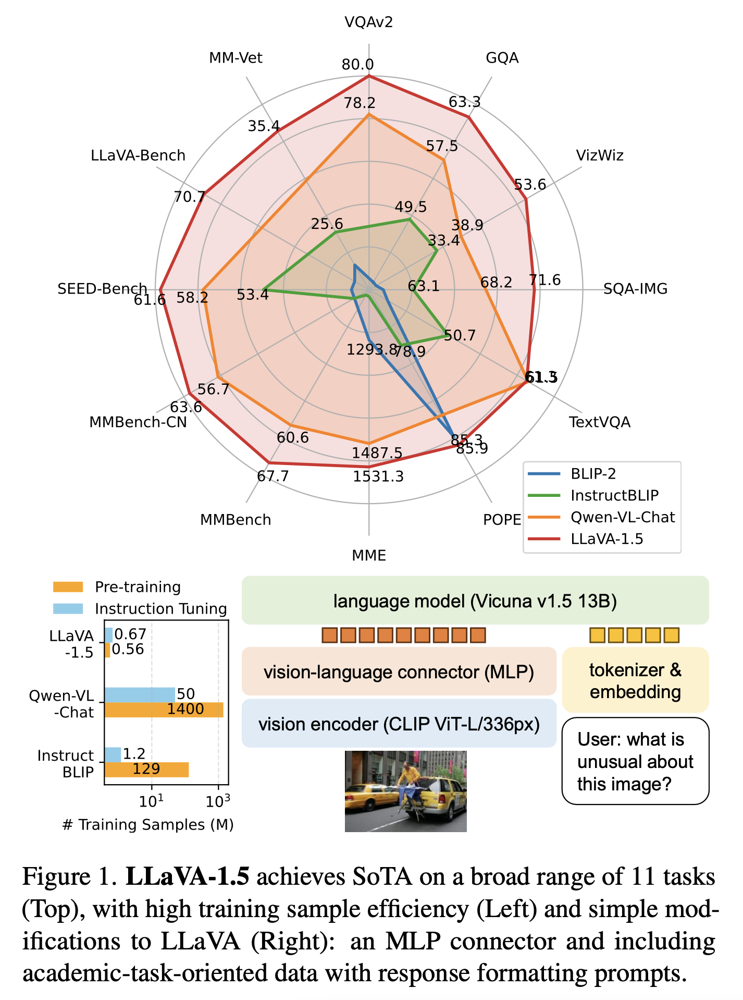

# 3 LINE SUMMARY

- LLaVA는 Visual Instruct Tuning에서 뛰어난 능력을 보이지만 짧은 형식의 답변을 필요로 하는 학술적 벤치마크에서는 다소 부족한 부분이 존재함
- LLaVA의 Vision-Language Connector를 Linear Projection에서 MLP로 바꿔서 표현력을 향상시켰으며, OCR 및 영역 수준 인식을 위한 데이터셋을 추가하였고, 입력 이미지 해상도를 높여 모델이 이미지의 세부사항을 명확히 볼 수 있도록 하였으며 LLM을 13B로 확장하는 방식으로 모델 성능을 향상시킴.
- LLaVA-1.5는 12개의 벤치마크 중 11개에서 최고 성능을 기록. 다른 방법들과 비교했을 때 훨씬 적은 사전 훈련 및 명령어 튜닝 데이터를 사용. Visual Instruction Tuning이 LMM의 성능 향상에 중요한 역할을 한다는 것을 시사하며, 대규모 사전 훈련이 필수적이라는 기존의 믿음에 의문을 제기

# **Abstract**

> 본 연구에서는 LLaVA의 완전 연결된 Vision-Language Cross-Modal Connector가 매우 강력하고 데이터 효율적이라는 것을 보여줌. LLaVA에 간단한 수정, 즉 CLIP-ViT-L-336px와 MLP projection을 사용하고 간단한 응답 형식 프롬프트로 Academic-Task-Oriented VQA 데이터를 추가하면, 11개의 벤치마크에서 최첨단 성능을 달성하는 강력한 기준점을 설정할 수 있음. 최종 13B 체크포인트는 단 120만 개의 공개 데이터만을 사용하며, 단일 8-A100 노드에서 약 하루 만에 전체 훈련을 완료함.
> 

# **Instruction**

> 최근 다중모달 모델(LMM)은 일반 목적의 어시스턴트로서 큰 관심을 받고 있으며, 시각적 지시 조정(Visual Instruction Tuning)이 주요 개념으로 부각되고 있음. LLaVA 및 MiniGPT-4 같은 모델들은 자연스러운 지시 수행과 시각적 추론 능력에서 뛰어난 성과를 보이고 있음.
> 
- LLaVA 아키텍처는 Visual Instruction Tuning에 있어 강력하고 데이터 효율적인 모델을 구축하는데 초점을 맞추고 있으며, 단순한 수정과 학문적 과제 지향 VQA(Visual Question Answering) 데이터를 포함하여 성능을 크게 향상시킴.
- 이 연구는 InstructBLIP 및 Qwen-VL과 같은 모델들과 달리, LLaVA는 간단한 아키텍처 설계를 사용하여 훨씬 적은 데이터로 훈련이 가능함을 보여줌.
- 단순히 600K개의 image-text 쌍에 대한 단순한 Fully Connected Projection Layer를 훈련하는 것만 필요로 함.
- 공개적으로 이용 가능한 데이터를 사용하여 연구가 재현 가능하고 접근 가능하도록 하는 것을 목표로 함.

# **Background**

- Instruction-following LMM은 시각적 기능을 인코딩하기 위한 사전 훈련된 visual backbone, 사용자 지시를 이해하고 응답을 생성하는 사전 훈련된 대형 언어 모델(LLM), 그리고 시각적 인코더 출력을 언어 모델에 맞추는 Vision-Language Cross-Modal Connector로 구성.
- LLaVA는 이러한 모델 중 가장 간단한 아키텍처를 가지고 있으며, Visual Patch 수를 줄이기 위해 Qformer와 같은 Visual Resampler를 사용하기도 한다.
    - Visual Patch가 많을수록 모델의 처리량이 많아지고, 연산량이 증가함. 이를 줄이면 모델의 훈련과 추론에 필요한 계산량을 줄일 수 있음
    - 대규모 이미지 데이터셋에서는 시각적 패치 수를 줄이는 것이 중요함
    - 너무 많은 시각적 패치를 사용하면 모델이 불필요한 세부 정보에 과적합되기 쉬움. 이를 줄이면 모델이 주요한 특징에 집중하도록 유도하여 일반화 성능을 향상시킬 수 있음
- Instruction-Following LMM의 훈련은 두 단계로 진행된다.
    - 첫째, Vision-Language Alignment 사전 훈련 단계에서는 image-text 쌍을 사용하여 Visual Feature을 언어 모델의 Word Embedding Space에 맞춘다.
    - 둘째, Visual Instruction Tuning 단계에서는 모델을 시각적 콘텐츠를 포함한 다양한 사용자 지시를 따를 수 있도록 조정한다.
- LLaVA는 텍스트 전용 GPT-4를 활용하여 기존 COCO 데이터셋을 다중모달 지시 수행 데이터셋으로 확장.
- InstructBLIP 같은 모델은 학문적 과제 지향 VQA 데이터셋을 추가하여 모델의 시각적 능력을 향상시켰지만 이러한 데이터 병합은 모델이 VQA 데이터셋에 과적합되어 자연스러운 대화에 참여하는 능력이 저하될 수 있음.
- LLaVA 파이프라인은 VQA 데이터셋을 대화형 스타일로 변환하여 이 문제를 해결했지만, 데이터 스케일링에 추가적인 복잡성이 생김.

# **Improved Baselines of LLaVA**

**Overview**

- LLaVA는 Visual Instruct Tuning에서 뛰어난 능력을 보이며, 간단한 수정으로 성능을 크게 향상시킬 수 있음.
- 짧은 형식의 답변을 필요로 하는 학술적 벤치마크에서는 다소 부족한 부분이 있었습니다. 이는 다른 접근 방식과 달리 LLaVA가 대규모 데이터로 사전 훈련되지 않았기 때문.
- MLP Cross Modal Connector와 학문적 과제 관련 VQA 데이터를 추가하면 LLaVA의 멀티모달 이해 능력이 향상됨(Table 1)
- 세 데이터셋을 대상으로 데이터, 모델 및 입력 이미지 해상도의 스케일링 효과를 연구(Table 1), 기존 LMM에 대한 최종 모델을 다양한 12개 벤치마크와 비교(Table 2)

**Response formatting prompts**

- LLaVA의 VQA 데이터셋이 짧은 형태의 답변을 요구하는 이유는 응답 형식 프롬프트가 모호하기 때문임.
    - Q: {질문} A: {답변}. 이러한 프롬프트는 원하는 출력 형식을 명확하게 나타내지 않으며, 자연스러운 시각적 대화에 대해서도 LLM을 짧은 형식 답변에 과적합시킬 수 있음.
- LLM의 파인튜닝을 하지 않음. 첫 번째 문제는 InstructBLIP가 명령어 튜닝을 위해 Qformer만 파인튜닝하는데 기인함. 이는 Qformer의 시각적 출력 토큰이 LLM의 출력 길이를 긴 형식 또는 짧은 형식으로 제어하기 위해 접두사 튜닝과 같이 사용되어야 하지만, Qformer는 LLM과 비교하여 제한된 용량을 가지고 있으므로 이를 제대로 수행하기 어려움.
- 이를 해결하기 위해 단일 단어 또는 구로 답변하도록 지시하는 프롬프트를 추가하여, LLaVA가 사용자 지시에 따라 출력 형식을 조정할 수 있도록 함.

**MLP vision-language connector**

- self-supervised learning에서 MLP를 사용하여 성능을 개선한 것처럼, LLaVA의 Vision-Language Connector를 Linear Projection에서 MLP로 바꿔서 Vision-Language의 표현력을 향상시키면 멀티모달 성능이 향상되는것을 발견

**Academic Task Oriented Data**

- VQA, OCR 및 영역 수준 인식을 위한 추가적인 학술 과제 지향 VQA 데이터셋을 포함하여 모델의 기능을 다양한 방법으로 강화함.
- InstructBLIP에서 사용하는 네 개의 추가 데이터셋을 먼저 포함(표 1)
    - 오픈 지식 VQA(OKVQA, A-OKVQA) 및 OCR(OCRVQA, TextCaps).
    - A-OKVQA는 객관식 문제로 변환되며 특정 응답 포맷팅 프롬프트가 사용됨: 주어진 선택지에서 옵션의 문자로 답하세요.
- InstructBLIP가 사용하는 데이터셋의 일부만 사용하더라도, LLaVA는 세 작업에서 모두 InstructBLIP를 능가하며 이는 LLaVA의 효과적인 디자인을 시사함(표 1)
- 지역 수준 VQA 데이터셋(Visual Genome, RefCOCO)을 추가로 추가함으로써 모델의 미세한 시각적 세부 사항을 지역화하는 능력을 향상시킴.

**Additional Scaling**

- 입력 이미지 해상도를 높여 모델이 이미지의 세부사항을 명확히 볼 수 있도록 했고, GQA 데이터셋을 추가하여 시각적 지식을 보강함.
- ShareGPT 데이터를 통합하고 LLM을 13B로 확장했다.
- 최종 모델 LLaVA-1.5는 모든 수정 사항을 적용하여 성능을 크게 향상시켰다.
- MM-Vet의 결과는 LLM을 13B로 확장했을 때 가장 큰 향상을 보여주며, 시각적 대화를 위한 기본 LLM의 능력의 중요성을 시사함.
- 이러한 수정 사항을 모두 적용한 최종 모델을 LLaVA-1.5(테이블 1의 마지막 두 행)라고 표기하며, 이 모델은 원래의 LLaVA [28]를 크게 앞서는 인상적인 성능을 달성함.

# **Discussion**

**Comparision with SoTA**

- LLaVA-1.5는 12개의 벤치마크에서 테스트되었으며, 11개에서 최고 성능을 기록하고 나머지 하나에서도 2위를 차지함.
- 다른 방법들과 비교했을 때 훨씬 적은 사전 훈련 및 명령어 튜닝 데이터를 사용하면서도 12개 벤치마크 중 11개에서 최상의 성능을 달성하는 것을 보여줌.
- 이 연구는 시각적 지시 조정이 LMM의 성능 향상에 중요한 역할을 한다는 것을 시사하며, 대규모 사전 훈련이 필수적이라는 기존의 믿음에 의문을 제기함.

**Zero-shot format instruction generalization**

- LLaVA-1.5는 제한된 형식 지시만으로도 다른 형식 지시를 일반화할 수 있다.
- VizWiz 데이터셋에서는 주어진 콘텐츠로 답변할 수 없을 때 "답변할 수 없음"를 출력하는 형식을 효과적으로 수행(답변할 수 없음 질문에 대한 11.1% → 67.8% 증가, 표 3)
- Json 형식으로 답변 예시(표 4)

**Zero-shot multilingual capability**

- LLaVA-1.5는 다국어 멀티모달 지시 수행을 위한 추가적인 미세 조정을 하지 않았음에도 불구하고 다국어 지시를 따를 수 있음.
    - ShareGPT의 multilingual instruction 때문
- MMBench-CN에서 Qwen-VL-Chat보다 우수한 성능을 보였음.

**Computational cost**

- LLaVA-1.5는 LLaVA와 동일한 사전 훈련 데이터셋을 사용하고, 훈련 반복과 배치 크기를 비슷하게 유지한다.
- 이미지 입력 해상도가 증가함에 따라 훈련 시간은 약 두 배가 되며, 8개의 A100을 사용하여 사전 훈련에 약 6시간, Visual Instruction Tuning에 약 20시간이 소요된다.

**Limitation**

- LLaVA는 전체 이미지 패치를 사용하여 각 훈련 반복이 길어질 수 있다.
- Context length의 제한, 여러개가 있는 Instruction-Following Data 데이터의 제한으로 여러 이미지를 동시에 처리할 수 없음
- LLaVA-1.5는 환각(hallucination)을 줄였지만 여전히 발생할 수 있으므로 중요한 특정 분야에서 주의가 필요하다.