https://github.com/microsoft/LoRA.
https://arxiv.org/abs/2106.09685

# 3 LINE SUMMARY

- 파인 튜닝을 위해선 모든 매개변수를 업데이트 하였으나 모델이 커질수록 많은 리소스를 요구하기에 매우 비실용적이고, 이를 해결하기 위해 LoRA라는 방법을 제안
- 이 방법은 Transformer 계층에 Low Rank Matrix를 주입함으로서 사전 훈련된 가중치는 고정하고, 변경될 가중치만을 학습하여 매개변수 수를 현저히 줄일 수 있음.
- Fine Tuning(Last 2 Layer), BiFit, Prefix-layer tuning, Prefix-embedding tuning, Adapter tuning등 다양한 방법과 비교했을 때 적은 파라미터를 학습하고도 성능은 유지되거나, 좋은 것을 확인

# Abstract

> Low-Rank Adaptation(LoRA)은 전통적인 파인튜닝 방법에서 요구되는 모든 매개변수를 재학습하는 필요성을 크게 줄임. 사전 훈련된 모델의 가중치를 freeze 하고 Transformer 계층에 학습 가능한 Low Rank Matrix를 주입함으로써, LoRA는 파인튜닝된 GPT-3 모델과 비교할 때 학습 가능한 매개변수의 수를 최대 10,000배, GPU 메모리 요구 사항을 세 배 감소시킴. 학습 가능한 매개변수가 적음에도 불구하고 LoRA는 추가적인 추론 지연 없이 여러 NLP 작업 및 모델(RoBERTa, DeBERTa, GPT-2, GPT-3)에서 비교적 우수하거나 더 나은 품질을 보임.
> 

# Introduction

> 대규모 언어 모델들이 자연어 처리 분야에서 다양한 Downstream Task로의 적응이 일반적으로 파인튜닝을 통해 이루어짐. 이 과정에서 모든 매개변수를 업데이트하는 것이 주된 방법이었으나 이 방식은 모델이 커질수록 많은 리소스를 요구하고, GPT-3처럼 1750억 개의 매개변수를 가진 모델의 경우 매우 비실용적.
> 
- 연구자들은 모델의 일부 매개변수만을 조정하거나, 새로운 태스크에 맞춰 학습하는 외부 모듈을 사용하는 등의 방법을 모색함.
- 이는 배포시 필요한 저장 공간과 로드 시간을 줄이는데 도움을 줄 수 있으나, 기존 기술들은 대부분 모델의 품질을 저하시키거나 추론 지연을 야기하는 문제점.
- 학습된 over-parametrized models가 실제로는 낮은 내재적 차원에 존재한다는 것을 보여주는 Li 등(2018a)과 Aghajanyan 등(2020)에서 영감을 받음.
    - 모델 적응 중 가중치의 변화도 '내재적 순위'가 낮다는 가설을 세우고, 이에 따라 저순위 적응(LoRA) 접근법을 제안했습니다.
    - 내재적 순위가 낮다는 것은 신경망의 특정 부분이나 레이어에서 발생하는 변화가 비교적 적다는 의미
    - 신경망 전체의 복잡도나 크기에 비해 해당 부분의 변화에 필요한 정보의 양이 적다는 것을 나타냄
- 이에 저자들은 Low-Rank Adaptation, 즉 LoRA 방법을 제안. 이는 트랜스포머 아키텍처의 각 계층에 저랭크 분해 행렬을 주입하는 방식으로, 사전 훈련된 가중치는 고정하고, 변경될 가중치만을 학습하여 매개변수 수를 현저히 줄일 수 있음.
- LoRA를 사용하면 그림 1과 같이 미리 학습된 가중치를 고정된 상태로 유지하면서 대신 Adaptation 중 고밀도 계층의 변화에 대한 rank decomposition matrix를 최적화하여 신경망의 일부 고밀도 계층을 간접적으로 학습할 수 있음.
- GPT-3 175B를 예로 들면, 전체 랭크(즉, d)가 12,288에 달하는 경우에도 매우 낮은 랭크(그림 1의 r은 1~2개일 수 있음)로도 충분하므로 LoRA는 저장 및 컴퓨팅 효율이 모두 높음.
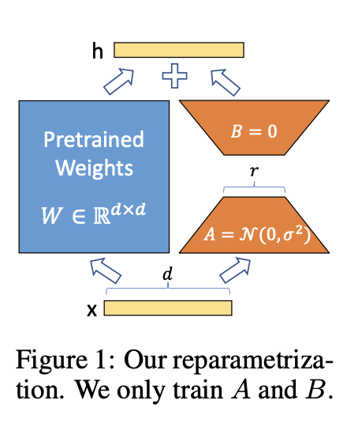

# Problem Statement

> 주된 문제는 대규모 사전 훈련된 언어 모델, 특히 GPT-3와 같은 모델을 다양한 다운스트림 텍스트 생성 작업에 적응시킬 때, 각 작업에 대해 별도의 모델을 학습하고 배포하는 것은 저장 공간과 연산 리소스 면에서 비효율적임.
> 
- 전체 미세 조정 중에 모델은 사전 학습된 가중치 $\Phi_0$으로 초기화되고 조건부 언어 모델링 목표를 최대화하기 위해 기울기를 따라 반복적으로 $\Phi_0 + \Delta \Phi$로 업데이트

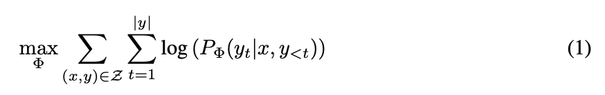

- Full Fine Tuning의 주요 단점 중 하나는 각 다운스트림 작업마다 $|\Delta\Phi|$ 차원이 $|\Phi_0|$인 다른 파라미터 세트 $\Delta\Phi$를 학습한다는 점.
- 따라서 사전 학습된 모델이 큰 경우(예: $|\Phi_0| \approx 175B$인 GPT-3), 미세 조정된 모델의 많은 독립적인 인스턴스를 저장하고 배포하는 것이 어려울 수 있음
- 작업별 파라미터 증분 $\Delta\Phi = \Delta\Phi(\Theta)$를 $|\Theta| \ll |\Phi_0|$인 훨씬 더 작은 크기의 파라미터 $\Theta$ 집합으로 인코딩하는 보다 파라미터 효율적인 접근 방식을 채택.
- 따라서 $\Delta\Phi$를 찾는 작업은 $\Theta$에 대한 최적화:

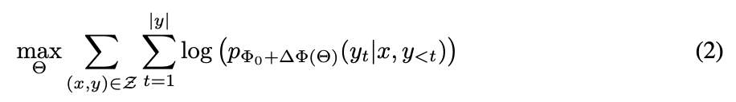

# AREN’T EXISTING SOLUTIONS GOOD ENOUGH?

> 대규모 언어 모델을 다양한 작업에 적응시키기 위해 기존에 존재하는 여러 접근 방법들이 갖는 한계점. 특히, 언어 모델링과 같은 작업에서 사용되는 기존 방식들인 어댑터 레이어 추가와 입력 계층 활성화 최적화는 큰 규모와 지연 시간에 민감한 생산 환경에서 여러 문제가 있음.
> 
- 기존의 어댑터 레이어는 Transformer block마다 두 개씩 존재함.
- 이 구성은 모델의 복잡도를 증가시키며, 순차적으로 처리되어야 하므로 병렬 처리 능력을 충분히 활용할 수 없음.
- 온라인 추론 상황에서는 일반적으로 배치 크기가 매우 작게 설정되며, 어댑터 레이어가 추가된 Transformer 모델은 작은 병목 차원에도 불구하고 순차적인 연산처리 때문에 느려지는 것을 확인할 수 있음(Table 1)

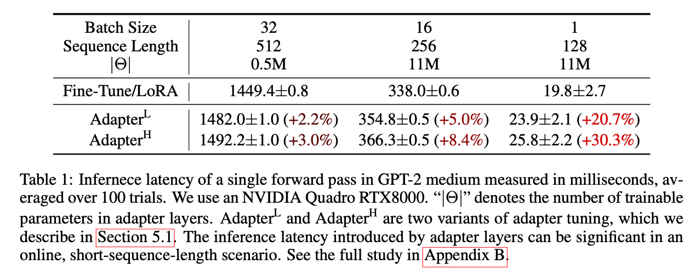

- 입력 프롬프트를 직접 최적화하는 접근법은 최적화가 어렵고, 성능이 매개변수에 따라 비모노토닉하게 변동한다는 점을 확인.
- 이는 작업에 사용할 수 있는 시퀀스 길이를 줄임으로써, 프롬프트 튜닝이 기타 방법들보다 성능이 떨어질 가능성이 있다는 우려를 제기합니다.
- 이러한 점들을 감안할 때, 기존 솔루션들은 대규모 언어 모델을 효율적으로 적응시키는 데에 여러 문제를 지니고 있음

# OUR METHOD

> LoRA(Low-Rank Adaptation) 기법의 구체적인 설계 및 이점에 대해 설명. 이 방법은 심층 학습 모델의 dense layer에 대한 새로운 Low Rank Parametrized Update Matrix 를 도입함으로써, 모델 적응을 효율적으로 수행.
> 

### LOW-RANK-PARAMETRIZED UPDATE MATRICES

- Aghajanyan et al. (2020)는 Specific Task에 적응할 때 사전 학습된 언어 모델이 '내재적 차원'이 낮아 더 작은 하위 공간에 무작위로 투영하더라도 여전히 효율적으로 학습할 수 있음을 보여줌.
    - 이에 영감을 받아 가중치 업데이트의 크기 역시 적응 과정에서 '내재적 순위'가 낮다고 가정.
- 사전 훈련된 Weghted Matrix $W_0 \in \R^{d\times k}$ 의 경우, Low Rank Decomposition
    
    $W_0 + \Delta W = W_0 + BA$$(B \in \R^{d \times r}, A \in \R^{r \times k}, rank \ll min(d, k))$ 로 표현
    
- 훈련 중에 $W_0$는 고정되어 기울기 업데이트를 받지 않는 반면, $A$와 $B$는 훈련 가능한 파라미터를 포함.
- $W_0$과 $\Delta W = BA$는 모두 동일한 입력으로 곱해지며, 각각의 출력 벡터는 좌표 방향으로 합산. $h = W_0x$의 경우 수정된 포워드 패스가 산출

$$
h = W_0x + \Delta Wx = W_0x + BAx
$$

- $A$에는 Random Gaussian initialization를, $B$에는 0을 사용하므로 훈련 시작 시 $\Delta W=BA = 0$(그림 1)
- 그런 다음 $\Delta Wx$를 $\alpha \over r$로 조정. 여기서 $\alpha$는 $r$의 상수입니다.
    - $\Delta Wx$는 미세 조정된 모델의 출력에 추가되는 변화량을 나타내며, 이 변화량의 크기를 조절하는 데 사용되는 $\alpha$와 $r$에 초점.
- Adam으로 최적화할 때 초기화를 적절히 조정하면 $\alpha$를 조정하는 것은 학습 속도를 조정하는 것과 거의 동일합니다. 따라서 $\alpha$를 처음 시도하는 $r$로 설정하고 튜닝하지 않음.
    - $\Delta Wx=BAx$는 모델의 출력에 추가되는 변화량입니다. 이 변화량을 $\alpha \over r$로 스케일링하는 것은 $\Delta Wx$의 영향을 조절하여 모델이 미세 조정 과정에서 불안정해지지 않도록 하기 위함.
    - $r$은 업데이트 행렬 $B$와 $A$의 순위(rank)를 나타내고, $\alpha$는 이 스케일링 팩터의 크기를 조절하는 상수. $\alpha$를 $r$로 설정하면, $\Delta Wx$의 크기는 원래의 크기에서 $r$에 의해 조절됨.
    - $\alpha$를 조정하는 것은 Adam 최적화 알고리즘을 사용할 때 학습 속도(learning rate)를 조정하는 것과 유사한 효과를 가짐. 즉, $\alpha$의 값에 따라 모델이 새로운 데이터에 얼마나 빠르게 적응할지 결정됨.
- 이러한 스케일링은 $r$을 변경할 때 하이퍼파라미터를 다시 조정할 필요성을 줄이는 데 도움(Yang & Hu, 2021).
    - LoRA는 $\Delta Wx = BAx$ 형식의 스케일링을 통해, $r$ (Low-Rank 행렬의 순위)의 값을 변경해도 전체적인 학습 프로세스에 큰 영향을 주지 않도록 설계되어 있습니다. 이는 $r$을 변경할 때마다 하이퍼파라미터를 조정할 필요가 줄어든다는 것을 의미하며, 모델 튜닝 과정을 간소화할 수 있습니다.
- LoRA는 사전 학습된 파라미터의 하위 집합만을 학습함으로써, 미세 조정 과정에서 모델의 전체적인 일반화 능력을 유지. 이는 특정 작업에 대한 과적합을 줄이고, 모델의 범용성을 향상시킬 수 있음.
- LoRA는 가중 행렬에 대한 누적 기울기 업데이트가 full parameter의 rank를 갖지 않아도 됨.
    - 모든 가중 행렬과 편향에 LoRA를 적용하고, 이를 통해 전체 미세 조정의 표현력을 근사적으로 회복할 수 있음을 의미.
- LoRA를 사용한 훈련은 훈련 가능한 파라미터의 수를 늘릴수록 원래의 전체 모델 훈련에 수렴합니다. 이는 어댑터 기반 방법이 MLP에, 접두사 기반 방법이 긴 입력 시퀀스를 사용할 수 없는 모델에 수렴하는 것과 대비됩니다.
- 사전 훈련된 가중치 $W_0$는 고정되며, 변화는 $B$와 $A$를 통해 이루어짐. 이로 인해 모델은 필요한 매개변수의 수를 줄이면서도 효과적인 학습이 가능함.
- LoRA를 적용한 모델은 추론 시 $W_0+BA$를 미리 계산하고 저장함으로써, 추론 시 빠름.
    - 다른 작업으로 전환할 때는 $W_0$에서 $BA$를 빼고 다른 $B'A'$를 더함으로써 빠르게 전환할 수 있음.

### APPLYING LORA TO TRANSFORMER

- 원칙적으로 신경망의 모든 가중치 행렬 하위 집합에 LoRA를 적용하여 학습 가능한 파라미터의 수를 줄일 수 있음.
- 단순성과 매개변수 효율성을 위해 Downstream Task에 대한 Attention Weight만 조정하고 MLP 모듈을 동결(다운스트림 작업에서 훈련되지 않도록)하는 것으로 연구를 제한함.
- 가장 큰 이점은 메모리 및 스토리지 사용량 감소.
    - Adam으로 훈련된 대형 트랜스포머의 경우, 고정된 파라미터에 대한 최적화 상태를 저장할 필요가 없기 때문에 $r \ll d_{model}$의 경우 VRAM 사용량을 최대 2/3까지 줄일 수 있었음(GPT-3 175B에서는 훈련 중 VRAM 소비량 1.2TB → 350GB)
    - $r=4$이고, Query와 Value Projection Matrix만 적용하면 체크포인트 크기가 약 10,000배(350GB에서 35MB로)감소함.
    - 훨씬 적은 수의 GPU로 훈련할 수 있고 I/O 병목 현상을 피할 수 있음
- 다른 이점은 모든 파라미터가 아닌 LoRA 가중치만 교체함으로써 훨씬 저렴한 비용으로 배포하면서 작업 간에 전환할 수 있음.
- 대부분의 파라미터에 대한 기울기를 계산할 필요가 없기 때문에 전체 미세 조정5에 비해 GPT-3 175B에서 훈련하는 동안 25%의 속도 향상을 관찰할 수 있었음.
- LoRA (Low-Rank Adaptation)의 한계는 하나의 포워드 패스에서 서로 다른 작업(task)들에 대해 다른 A와 B 매트릭스를 사용하여 입력을 배치 처리하는 것이 복잡하다는 것.
    - 하나의 포워드 패스에서 다양한 작업에 대해 입력을 배치 처리하려면, 각 작업에 맞는 A와 B를 선택하고 적용하는 동적 메커니즘이 필요함. 예를 들어, 한 배치 내에서 문서 요약을 위한 샘플과 감성 분석을 위한 샘플이 혼합되어 있을 수 있음.

# EMPIRICAL EXPERIMENTS

> LoRA(Low-Rank Adaptation)의 효과를 다양한 언어 모델과 벤치마크 작업을 통해 평가. RoBERTa, DeBERTa, GPT-2, 그리고 GPT-3 모델을 사용하여 다양한 자연어 이해(NLU) 및 생성(NLG) 작업에 대한 LoRA의 성능을 측정.
> 

## Fine Tuning

- adaptation을 위한 일반적인 접근 방식입니다.
- 미세 조정 중에 모델은 사전 학습된 가중치와 편향으로 초기화되고 모든 모델 매개변수는 그라데이션 업데이트를 거치게 되는데, 일부 레이어만 업데이트하고 다른 레이어는 동결.
- GPT-2에 대한 이전 연구(Li & Liang, 2021)에서 보고된 이러한 baseline 중 하나는 마지막 두 개의 레이어($FT^{Top2}$)만 조정하는 것.

## Bias-only or BitFit

- 바이어스 벡터만 훈련하고 다른 모든 것은 동결하는 baseline입니다.
- 최근 이 baseline은 BitFit에서도 연구되고 있습니다(Zaken et al., 2021).

## Prefix-embedding tuning(PreEmbed)

- 입력 토큰 사이에 특수 토큰을 삽입.
- 이러한 특수 토큰은 학습 가능한 단어 임베딩을 가지며 일반적으로 모델의 어휘에 포함되지 않습니다. 이러한 토큰을 어디에 배치하느냐에 따라 성능에 영향을 미칠 수 있음.
- 이러한 토큰을 프롬프트 앞에 붙이는 "접두사"와 프롬프트에 추가하는 "접미사"에 초점을 맞추고 있으며, 이 두 가지 모두 Li & Liang(2021)에서 참고.

## Prefix-layer tuning

- Prefix embedding tuning의 확장.
- 일부 특수 토큰에 대한 임베딩만 학습하는 대신, 모든 트랜스포머 레이어 이후의 활성화를 학습.
    - 각 트랜스포머 레이어는 입력에 대한 연산을 수행하고, 그 결과로 활성화(activation)를 생성. 일반적으로 이러한 활성화는 이후의 레이어로 전달되며, 모델이 학습하는 동안에는 이러한 활성화 값도 조정.
    - 이러한 활성화 값들을 학습 가능한 파라미터로 취급. 이는 이전에 계산된 활성화 값들을 사용하는 대신에, 학습 과정에서 이러한 값을 조정할 수 있다는 것을 의미.
    - 모델이 입력을 처리하는 과정에서 생성되는 모든 중간 활성화 값을 학습 가능한 파라미터로 만든다는 것을 의미.

## Adapter tuning

- $Adapter^H$ : Self Attention 모듈(및 MLP 모듈)과 후속 Residual Connection 사이에 어댑터 레이어를 삽입함. 두 개의 Fully connected layer 사이에 비선형성을 가진 Adapter Layer에 Bias가 있습니다.
- $Adapter^L$ : 최근 Lin 등(2020)은 어댑터 레이어가 MLP 모듈과 레이어노름 뒤에만 적용되는 보다 효율적인 설계를 제안했습니다.
- $Adapter^P$ : 파이퍼 등(2021)에서 제안한 또 다른 설계와 매우 유사.
- $Adapter^D$ : 효율성을 높이기 위해 일부 어댑터 레이어를 삭제하는 또 다른 baseline인 AdapterDrop(Ru ̈ckle ́ et al., 2020)도 포함시킴.

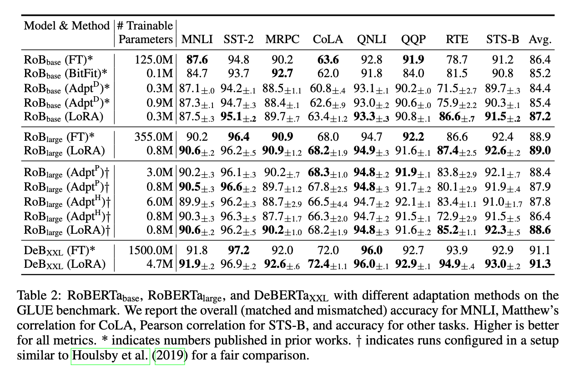

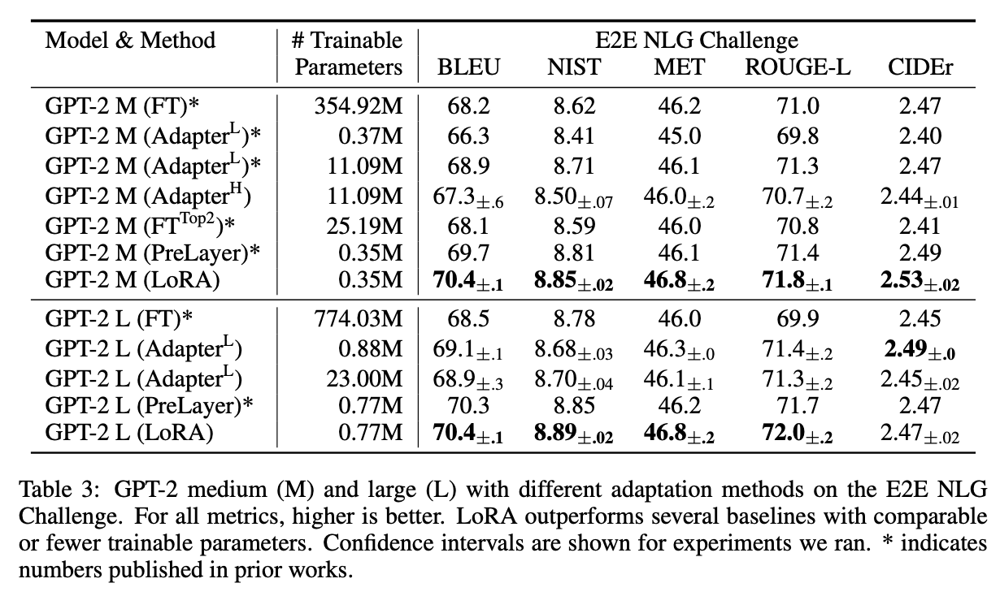

**ROBERTA BASE/LARGE**

- RoBERTa(Liu et al., 2019)는 원래 BERT(Devlin et al., 2019a)에서 제안된 사전 훈련 레시피를 최적화하여 더 많은 훈련 가능한 파라미터를 도입하지 않고도 성능을 향상시킴

**DEBERTA XL**

- DeBERTa(He et al., 2021)는 훨씬 더 큰 규모로 훈련된 BERT의 최신 변형으로, GLUE(Wang et al., 2019) 및 SuperGLUE(Wang et al., 2020)와 같은 벤치마크에서 매우 경쟁력 있는 성능.

**GPT-2 MEDIUM/LARGE**

- LoRA가 NLU에서 완전한 미세 조정에 대한 경쟁력 있는 대안이 될 수 있음을 보여 주었으므로, GPT-2 중형 및 대형(Radford et al., b)과 같은 NLG 모델에서도 LoRA가 여전히 우세한지 확인.

**SCALING UP TO GPT-3 175B**

- LoRA의 최종 스트레스 테스트로서 1,750억 개의 파라미터를 사용하여 GPT-3까지 확장.
- LoRA는 세 데이터 세트 모두에서 미세 조정 기준선과 일치하거나 이를 초과(표 4)
- 모든 방법이 훈련 가능한 파라미터가 많다고 해서 단조롭게 이점을 얻는 것은 아님(그림 2)

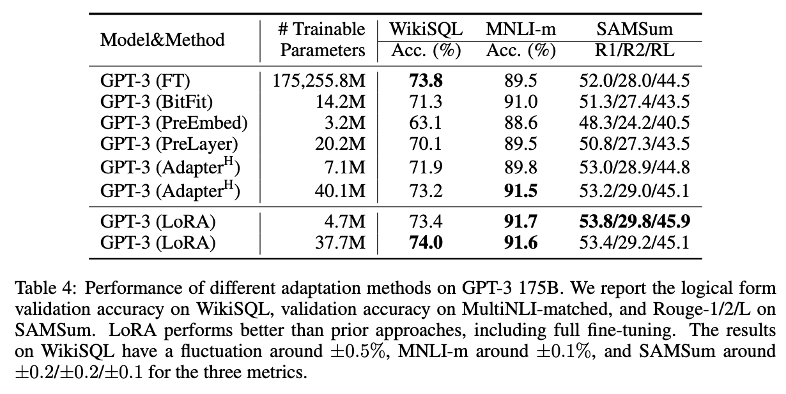

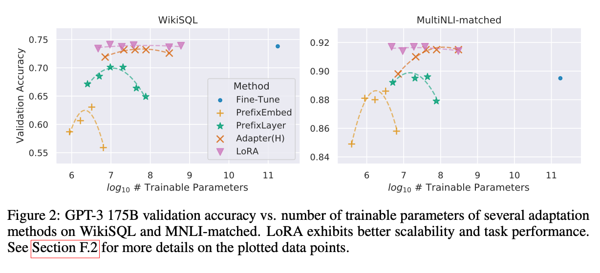

# RELATED WORKS

> LoRA(Low-Rank Adaptation) 방법론과 관련된 여러 연구들을 소개하고, LoRA의 개발에 영향을 준 기존 기술과 방법론들을 설명. 이 섹션은 어댑터 레이어, 프롬프트 튜닝, 및 기타 매개변수 효율적 접근법과 관련된 다양한 연구들을 포함.
> 

**Transformer Language Models**

- Self-Attention을 사용하는 Sequence to Sequence 아키텍처로, 이후 다양한 언어 모델에 채택됨.
- Radford et al.의 GPT 시리즈와 BERT는 이 아키텍처를 기반으로 사전 훈련 후 특정 작업에 대해 파인튜닝을 통해 상당한 성능 향상을 보였음.

**Prompt Engineering and Fine-Tuning**

- BERT와 GPT-3와 같은 모델들은 사전 훈련 후 파인튜닝을 통해 특정 작업에 적응.
- GPT-3는 몇 가지 추가 훈련 예시만으로도 입력 프롬프트에 따라 행동을 조정할 수 있으며, 이는 '프롬프트 엔지니어링'이라는 기술을 필요로 함.

**Parameter-Efficient Adaptation**

- Transformer 블록 사이에 어댑터 레이어를 삽입하여 전이 학습을 위한 매개변수 효율적인 방법을 제안함
- 이와 유사하게, 다양한 연구에서는 모델의 기존 레이어 사이에 추가적인 어댑터 레이어를 삽입하여 새로운 작업을 학습할 수 있는 방법을 탐색.
- **Prompt Optimization**: 최근 연구들은 입력 단어 임베딩을 최적화하거나 조정하여, 파인튜닝 없이 모델의 성능을 개선하는 방법을 제안함
- 이는 프롬프트 기반 접근 방식의 연속적이고 미분 가능한 일반화로 볼 수 있습니다.

**Low-Rank Structures in Deep Learning**

- 많은 기계 학습 및 딥러닝 문제에서 Low Rank Structure의 이점이 연구되어 왔음.
- Over-Parametrized Neural Network이 훈련 후 저랭크 속성을 가진다는 사실을 발견한 것에서 기인함.
    - 학습 할 때는 세부적인 토큰 하나하나를 신경쓰면서, 이미지라면 픽셀 하나하나를 신경쓰면서 학습해야 하지만, 인퍼런스 할 때에는 보다 큰 특징을 식별하는 것이 중요함
- LoRA는 이러한 저랭크 구조를 활용하여 효율적으로 매개변수를 적응시키는 새로운 방법을 제시.

# UNDERSTANDING THE LOW-RANK UPDATES

> LoRA가 실제로 언어 모델의 Adaptation에서 어떤 역할을 하는지, 그리고 왜 이러한 방식이 효과적인지를 이해하기 위한 여러 실험적 연구를 포함.
> 

## WHICH WEIGHT MATRICES IN TRANSFORMER SHOULD WE APPLY LORA TO?

LoRA(Low-Rank Adaptation) 기법을 활용해 제한된 파라미터 내에서 최적의 다운스트림 성능을 얻기 위해 어떤 유형의 가중치를 적응시켜야 하는지 실험. 여기서 제시된 연구는 특히 GPT-3 175B 모델의 자기 주의(self-attention) 모듈에 있는 가중치 행렬을 고려.

1. **파라미터 제한** : 1800만 개(약 35MB, FP16으로 저장 시)로 설정.
    1. 이는 GPT-3 175B 모델의 96개 레이어 각각에 대해 한 종류의 주의 가중치를 적응시킬 때 *r*=8에 해, 두 종류의 가중치를 적응시킬 때는 *r*=4.
2. **결과 요약**:
    - 가중치 행렬 $W_q$ 또는 $W_k$에 모든 파라미터를 할당하면 성능이 크게 저하됨.
    - 반면, $W_q$와 $W_v$에 같이 할당시키면 가장 좋은 성능을 보입니다.
    - 이는 rank가 4인 경우에도 $\Delta W$에 충분한 정보를 담을 수 있으므로 순위가 큰 단일 유형의 가중치를 적용하는 것보다 더 많은 가중치 행렬을 적용하는 것이 바람직하다는 것을 의미.
    

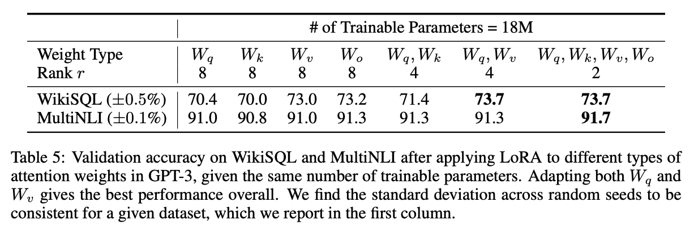

## 7.2 WHAT IS THE OPTIMAL RANK r FOR LORA?

- 여러 가중치 행렬을 적응시키면서 $r$값의 변화에 따른 성능을 비교.

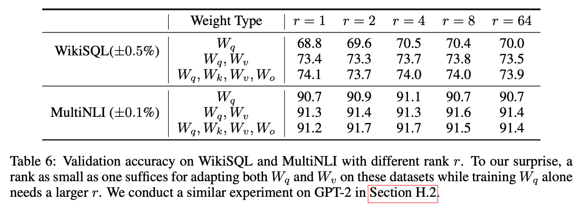

- **Table 6**에 따르면, 매우 작은 $r$값에서도 LoRA는 경쟁력 있는 성능을 보임.
- $W_q, W_v$를 적응시켰을 때 $W_q$ 단독보다 더 좋은 성능을 보입니다.
- 따라서, 더 큰 *r* 값이 항상 더 좋은 성능을 보장하지 않으며, 효율적인 파라미터 사용을 위해 낮은 랭크가 적절할 수 있음.
- $\Delta W$가 본질적으로 낮은 랭크에서 대부분의 필요한 정보를 포착할 수 있음.
- 큰 이는 업데이트 행렬 $\Delta W$ 가 매우 작은 “내재적인 랭크(intrinsic rank)”를 가질 수 있음을 시사.

**Subspace similarity between different** r

- **특이값 분해(SVD)**:
    - $*A_r=8*$과 $A_r=64$의 특이값 분해를 통해, 각각의 우측 특이 유니터리 행렬 $U_{A_r=8}$과 $U_{A_r=64}$ 계산.
    - $U_{A_r=8}$의 상위 *i*개의 특이벡터가 형성하는 부분공간과 $U_{A_r=64}$의 상위 *j*개의 특이벡터가 형성하는 부분공간의 유사성을 분석.

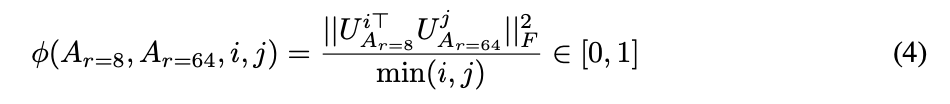

- **Grassmann 거리 기반의 정규화된 부분공간 유사성**:
    - $*\phi(\cdot)*$ 함수는 [0, 1] 범위를 가지며, 1은 완전한 부분공간의 중첩, 0은 완전한 분리를 나타냅니다.
    - *i*와 *j*의 값을 변화시키면서 $\phi$의 변화를 관찰(그림 3)
    - $*A_r=8*$과 $A_r=64$의 상위 특이벡터 방향은 상당히 중첩되어 있으며, 특히 $*A_r=8*$과 $A_r=64$의 $\Delta W_v$와 $\Delta W_q$는 부분공간 차원 1을 공유하며, 그 유사도는 0.5 이상.
    - 이는 *r*=1이 GPT-3의 다운스트림 작업에서 좋은 성능을 보이는 이유를 설명해줍니다.

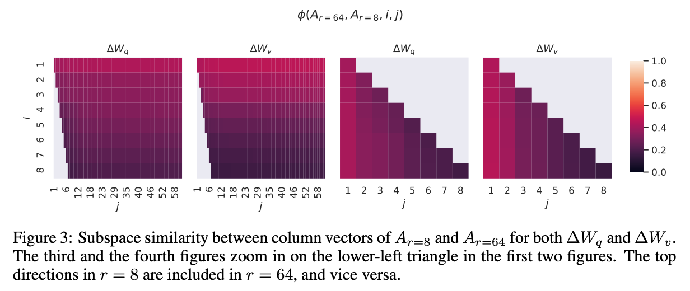

**Subspace similarity between different random seeds.**

- $**\Delta W_q$의 높은 내재적 랭크**
    - $**\Delta W_q**$는 $**\Delta W_v**$보다 더 많은 공통된 특이값 방향을 학습함.
    - 이는 $**\Delta W_q**$가 더 중요한 정보들을 포착할 수 있음을 의미.
- **랜덤 가우시안 행렬과의 비교**
    - 랜덤 가우시안 행렬들은 서로 공통된 특이값 방향을 공유하지 않기 때문에, 부분공간 유사성이 낮음.
    - 두 랜덤 시드로 학습된 적응 행렬들이 실제로 의미 있는 정보를 학습하고 있음을 확인.

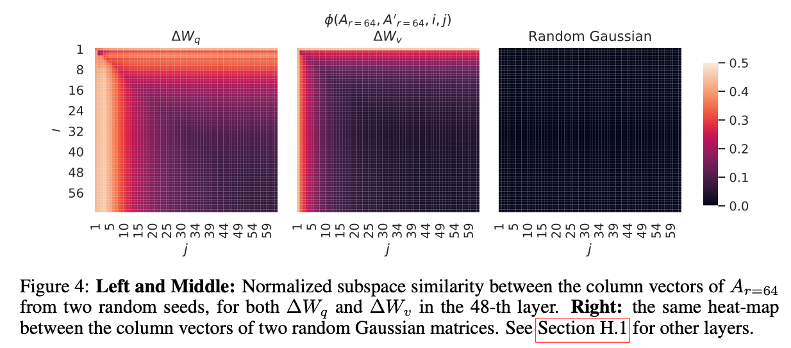

## 7.3 HOW DOES THE ADAPTATION MATRIX $**\Delta W**$ COMPARE TO W?

- $**\Delta W$가 $W$와 높은 상관관계를 가지는가?** (수학적으로, $**\Delta W**$가 $**W**$의 상위 특이벡터 방향에 주로 포함되는가?)
- $**\Delta W$는 $W$의 해당 방향에 비해 얼마나 큰가?**

- $**W**$를 $**\Delta W**$의 $r$ 차원 부분공간에 투영하기 위해 $U^TWV^T$를 계산합니다. 여기서 $**U**$와 $**V**$는 $**\Delta W**$의 좌/우 특이벡터 행렬.
- $||U^TWV^T||_F$와 $||W||_F$의 프로베니우스 노름을 비교.
- 비교를 위해, $U$와 $V$를 $**W**$의 상위 *r* 특이벡터나 랜덤 행렬로 대체하여 $||U^TWV^T||_F$를 계산.

- $**\Delta W**$는 랜덤 행렬과 비교했을 때 $**W**$와 더 강한 상관관계를 가짐. 이는 $**\Delta W**$가 $**W**$에 이미 존재하는 일부 특징을 증폭시킨다는 것을 나타냄.
- $**\Delta W**$는 $**W**$의 상위 특이벡터 방향을 반복하지 않고, $**W**$에서 강조되지 않은 방향만 증폭시킴.

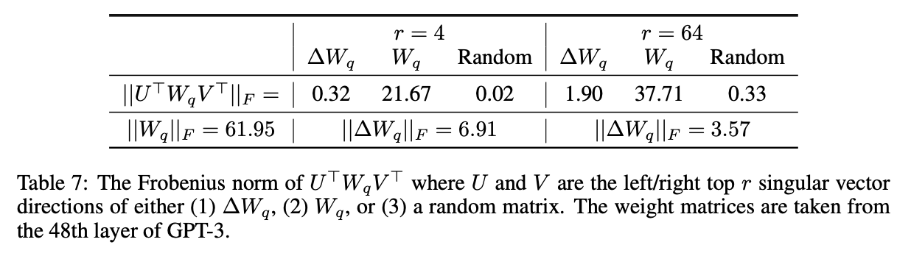