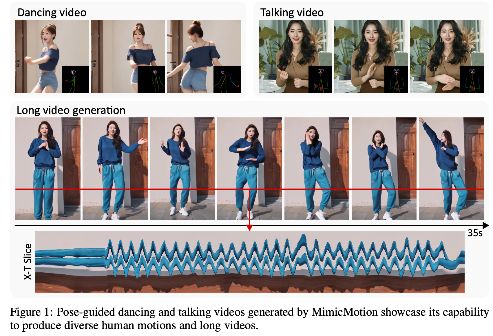
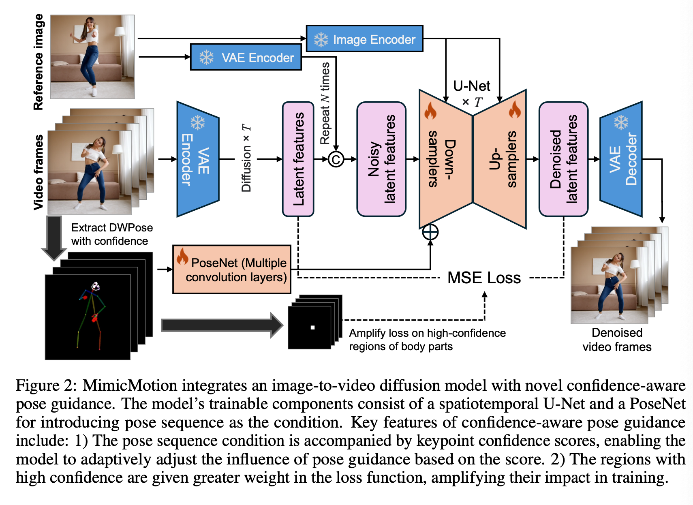
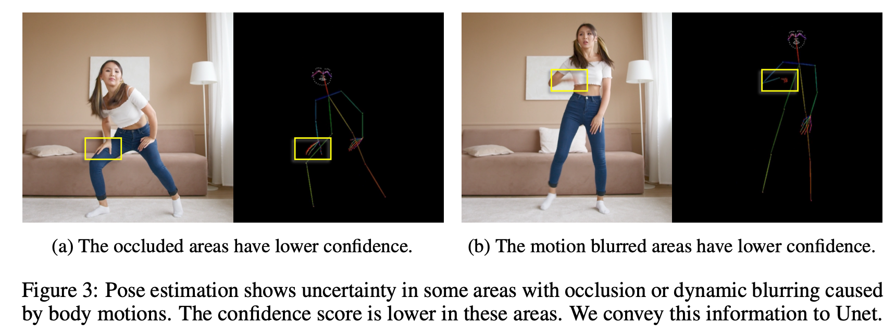
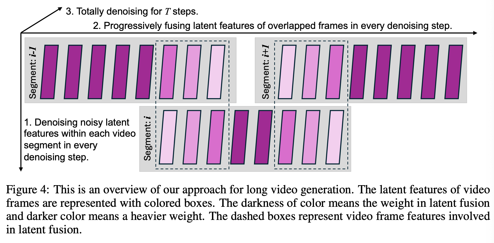
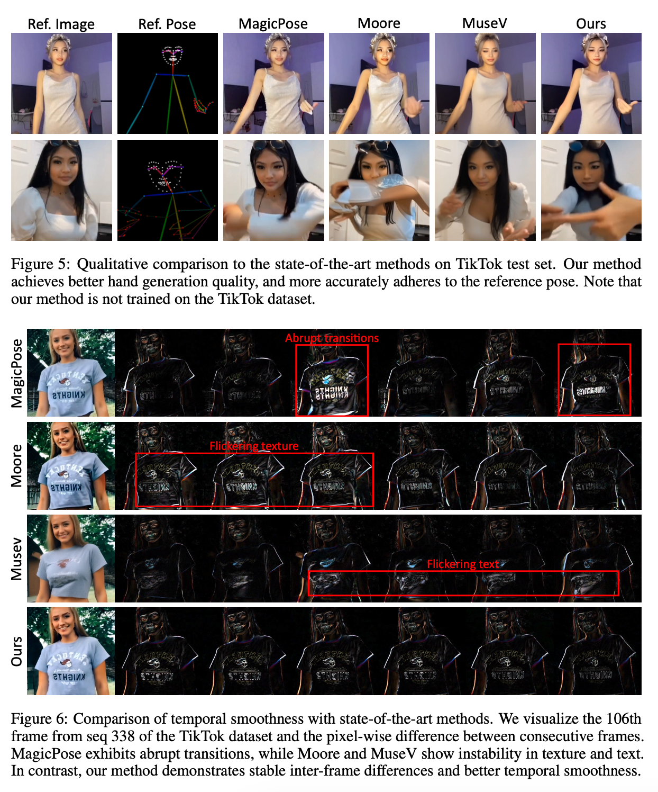
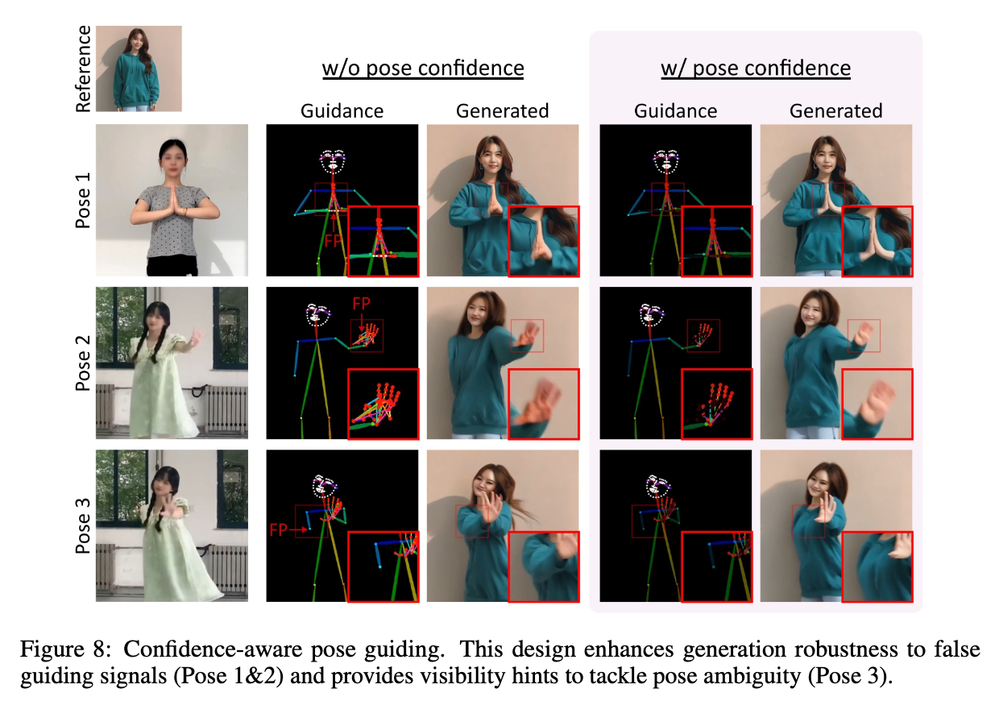
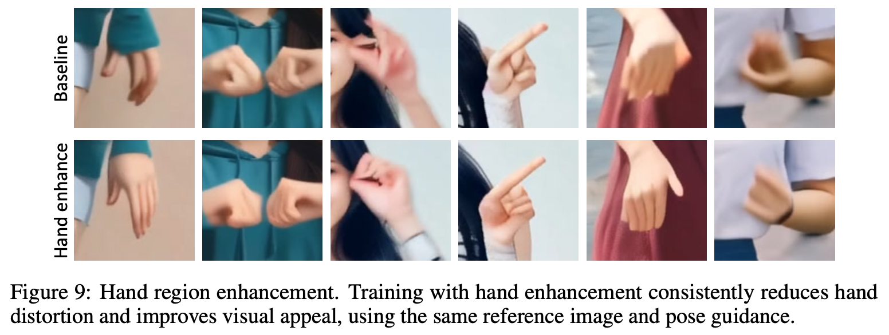
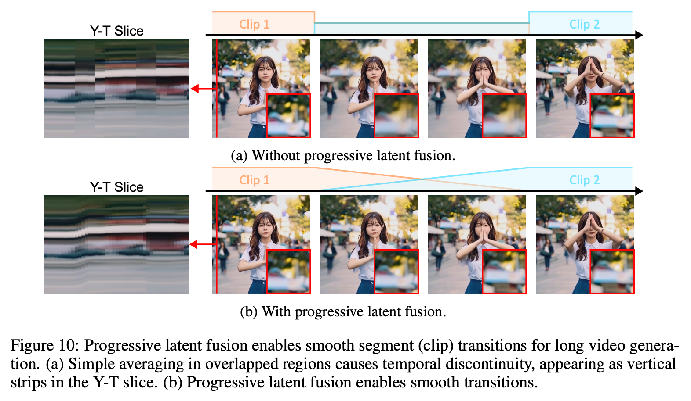

# 3 LINE SUMMARY

- 비디오 생성은 비디오 길이, 디테일의 풍부함 등 여러 측면에서 챌린지 포인트가 존재. 특히 사람의 손과 같은 영역에서 이미지 왜곡이 발생하는 것이 일반적. 이를 해결하기 위해 신뢰도 기반의 포즈 가이던스 접근 방식을 제안.
- PoseNet 이라는 모듈을 설계하고 포즈 시퀀스의 특징을 추출해 U-Net의 첫 번째 컨볼루션 레이어의 출력에 더해줌으로서 디노이징 과정의 초기부터 포즈 가이던스의 영향을 받을 수 있음
- MimicMotion은 신뢰도 점수를 포즈 표현에 통합함으로써 가려짐이나 모션 블러로 인한 부정확한 키포인트에 대해서 덜 중요하게 취급할 수 있고, Loss Function에서 손 영역에 더 높은 가중치를 부여함으로서 손 생성 품질을 개선함. 또

# Abstract

> 비디오 생성은 비디오 길이, 디테일 등에서 상당한 도전에 직면해 있음. 이 연구에서는 "MimicMotion"이라는 이름의 비디오 생성 프레임워크를 제안. 이 프레임워크는 특정 모션 가이던스를 모방하여 고품질의 비디오를 임의의 길이로 생성할 수 있음.
> 
- 신뢰도 기반 포즈 가이던스를 도입하여 프레임의 품질과 시간적 매끄러움을 보장
- 포즈 신뢰도를 기반으로 한 영역별 손실 증폭을 통해 이미지 왜곡을 크게 줄임
- 점진적 잠재 융합 전략을 통해 자원 소비를 적정 수준으로 유지하면서 길고 부드러운 비디오를 생성할 수 있음

# Introduction

> 비디오 생성은 여전히 제어 가능성, 비디오 길이, 디테일의 풍부함 등 여러 측면에서 챌린지 포인트가 존재함. 이 연구에서는 `포즈 가이던스를 기반으로 한 비디오 생성에 중점`을 두고 있으며, 참조 이미지와 일치하는 동시에 풍부한 디테일을 포함하는 비디오를 생성하는 것을 목표로 함. 기존의 이미지 기반 포즈 가이던스 비디오 생성 방법들은 여러 기술적 한계를 가지고 있음.
> 
- 현재, 이미지 기반 포즈 가이던스 비디오 생성에 관한 많은 연구들이 진행되고 있으며, Follow Your Pose, DreamPose, DisCo, MagicDance, AnimateAnyone, MagicAnimate, DreaMoving, Champ 등의 모델들이 존재.
    - 특히 `사람의 손과 같은 영역에서 이미지 왜곡이 발생하는 것이 일반적`이며, 큰 움직임이 포함된 비디오에서 이 문제가 더욱 두드러짐.
    - 시간적 매끄러움을 달성하기 위해 이미지 디테일이 희생되어 흐릿한 프레임이 생성되는 경우가 있음.
    - 계산 자원과 모델의 능력 제한으로 인해 다수의 프레임을 포함하는 고품질의 긴 비디오를 생성하는 것 역시 여전히 큰 도전 과제임.
- 부정확한 포즈 추정의 부정적인 영향을 줄이기 위해, 우리는 신뢰도 기반의 포즈 가이던스 접근 방식을 제안.
- 포즈 시퀀스 표현에 `신뢰도 개념을 도입`함으로써 더 나은 시간적 매끄러움이 달성되고 이미지 왜곡도 완화될 수 있음.
- 신뢰도 기반의 영역 손실 증폭은 `손 영역을 더욱 정확하고 선명하게 만들어줌.` 또한, 제안된 프로그레시브 잠재 융합 방법을 통해 길고도 매끄러운 비디오 생성을 달성할 수 있음.
- 중첩된 프레임을 가진 비디오 세그먼트를 생성하고, 이러한 세그먼트를 병합하여 최종적으로 크로스-프레임 매끄러움과 이미지 풍부함을 모두 갖춘 긴 비디오를 생성할 수 있음.
- 모델 훈련에서는 훈련 비용을 적정 수준으로 유지하기 위해 일반적으로 사전 학습된 비디오 생성 모델을 기반으로 하며, 많은 양의 훈련 데이터가 필요하지 않고 특별한 수동 주석도 요구되지 않음.

1. Confidence-Aware전략을 통해 포즈 가이던스를 개선하여 부정확한 포즈 추정의 부정적인 영향을 완화. 이 접근 방식은 훈련 중 노이즈가 많은 샘플의 영향을 줄일 뿐만 아니라 추론 중 잘못된 포즈 가이던스를 교정.
2. Confidence-Aware전략을 바탕으로 손 영역 강화 방식을 제안하여, 높은 포즈 신뢰도를 가진 손 영역의 손실 가중치를 강화함으로써 손 왜곡을 완화합니다.
3. Cross-Frame Overlapped Diffusion은 긴 비디오 생성의 표준 기법이지만, 우리는 세그먼트 경계에서 시간적 매끄러움을 개선하는 Position-Aware Progressive Latent Fusion Approach를 제안합니다. 광범위한 실험 결과는 제안된 접근 방식의 효과를 입증하였음.

# Relative Work

**Diffusion models for image/video generation**

- Diffusion 모델은 이미지와 비디오 생성에서 뛰어난 성능을 보여주었으며, Latent Diffusion Models (LDM)을 통해 고해상도 이미지를 효율적으로 생성할 수 있음.
- 이 방법은 저차원 잠재 공간에서 확산 과정을 수행함으로써 계산 비용을 절감하고 생성 품질을 향상시킴.
- 비디오 생성의 경우, 시간적 계층을 추가하거나 트랜스포머 구조를 활용하여 생성 능력을 증대시키는 연구들이 진행되고 있음.

**Pose-guided human motion transfer**

- Pose-to-apperance 매핑은 원본 이미지의 모션을 타겟 이미지로 전이하는 것을 목표로 함.
- 이 과정에서 로컬 아핀 변환이나 Thin-Plate Spline 변환을 사용하여 왜곡을 최소화하고, 생성된 이미지가 주어진 포즈를 최대한 닮도록 함.
- 이 연구에서는 기존 기법들과 달리 신뢰도 기반의 포즈 가이던스를 도입하여 부정확한 포즈 추정의 영향을 줄이고, 손 영역과 같은 세밀한 부분의 품질을 향상시켰음.

**Long video generation**

- 기존의 diffusion 기반 비디오 생성 알고리즘은 짧은 길이의 비디오 생성에 제한되었음.
- 이를 극복하기 위한 방법으로 MultiDiffusion을 사용하여 비디오를 여러 세그먼트로 나누고 각 세그먼트를 독립적으로 디노이징한 후, 최적화 알고리즘을 통해 이들을 결합하는 방법이 있음.
- 본 연구에서는 이러한 기존 접근법을 발전시켜 세그먼트 경계에서 시간적 부드러움을 향상시키는 위치 인식 기반의 점진적 잠재 융합 전략을 제안.

# Methods

## 3.1 Preliminaries

- Diffusion 모델은 주어진 데이터셋에 대한 확률 분포를 생성하는 과정으로, 노이즈가 추가된 데이터를 점진적으로 복구하여 새로운 데이터를 생성하는 방법
    - Diffusion Process는 데이터에 가우시안 노이즈를 점진적으로 추가하는 Fixed Markov Chain으로 정의됨.
    - 정규 분포를 이용해 Markov Chain 기반의 확률변화를 설명하려고 하기 때문임.
    - $\beta_t$가 1에 가까워질수록 $x_{t-1}$을 따른다. 이전 상태가 현재 상태에 더 크게 영향을 줌. 반대의 경우, 이전 상태는 현재 상태에 영향을 주지 않음
        - 이 선형 결합은 시스템이 이전 상태에서 새로운 상태로 어떻게 전환되는지를 나타내는 간단한 방법입니다. 즉, 이 모델은 이전 상태에서 현재 상태로의 변화가 선형적인 관계에 있다고 가정함.
    - 공분산 $\beta_tI$는 현재 상태의 불확실성, 즉 $x_t$가 얼마나 분산되어 있는지를 나타냄.
        - $\beta_t$가 클수록 분산이 커져 $x_t$의 값이 넓은 범위에 걸쳐 있을 가능성이 커짐.
        - $I$는 단위 행렬이기 때문에, 공분산 행렬이 대각선 행렬(diagonal matrix)이라는 뜻.
        - 이는 변수들 사이에 상관관계가 없음을 의미. 즉, 각 변수는 독립적으로 분포하며, 서로 간섭하지 않는다는 가정을 반영.
        - $\beta_t$는 시간에 따라 달라질 수 있으며, 이는 시간이 지남에 따라 상태의 불확실성이 변화할 수 있음을 나타냄. 예를 들어, 초기 단계에서는 불확실성이 크지만 시간이 지남에 따라 줄어들 수 있음.
    
    $$
    q(x_t|x_{t-1})=\mathcal{N}(x_t;\sqrt{1-\beta_t}x_{t-1}, \beta_tI)
    $$
    
    - 다수의 노이즈 추가 과정을 통해 $x_t$를 계산하는 대신, 한 번의 연산으로 $x_t$를 계산할 수 있는 식을 얻을 수 있음
        
        $$
        q(x_t|x_0)=\mathcal{N}(x_t;\sqrt{\bar{\alpha_t}}x_0, (1-\bar{\alpha}_t)I)
        $$
        
    - $\bar{\alpha_t}$는 노이즈가 추가된 정도를 나타내는 누적 노이즈 스케줄 파라미터
    - $\alpha_t = 1-\beta_t$이고 $\bar{\alpha_t} = \Pi_{i=1}^{t}\alpha_i$로 정의.
    - $\epsilon$은 평균이 0이고 분산이 1인 표준 정규분포로부터의 노이즈.
    - 노이즈가 포함된 데이터를 역순으로 복구하는 함수($\epsilon_\theta$)를 신경망을 통해 학습하여, 이 신경망을 사용해 무작위 노이즈로부터 새로운 데이터를 생성.
    - $\bar{a}_t$는 시간이 지남에 따라 줄어들기 때문에 $x_0$의 영향력도 점점 감소하게 됨.
    
    $$
    \mathbb{E}_{\epsilon\sim\mathcal{N}(0, I), x_t, c, t}[||\epsilon - \epsilon_{\theta}(x_t;c, t)||_2^2]
    $$
    
- 여기서 $c$는 선택적 조건이고, $x_t$는 실제 데이터 $x_0\sim p_{data}$에 $t$-step 노이즈를 추가하여 변형된 버전.
- 이와 같은 방식으로, option condition $c$와 함께 실제 데이터 분포에서 $x_0$를 샘플링하고 시간 단계 $t$를 사용하여, $\epsilon_{\theta}$는 수렴할 때까지 훈련될 수 있음.

## 3.2 Data preparation

- 포즈 가이던스 기반의 비디오 확산 모델을 훈련하기 위해 다양한 인간 동작을 포함하는 비디오 데이터셋을 수집.
- 이 데이터셋은 사전 학습된 이미지-비디오 모델의 강력한 성능을 활용하여 비교적 작은 규모로 구성됨.
- 각 비디오 샘플은 참조 이미지($I_{ref}$), 원시 비디오 프레임 시퀀스, 그리고 해당하는 포즈로 구성됨.
- 비디오 프레임은 고정된 종횡비를 가지도록 크기 조정과 자르기 등의 전처리 작업을 거치며, 참조 이미지는 동일한 비디오에서 무작위로 선택되어 비디오 프레임과 동일한 방식으로 전처리됨.
- 또한, 포즈 시퀀스는 DWPose를 사용하여 비디오 프레임으로부터 프레임별로 추출됨.

## 3.3 Pose-guided Video Diffusion Model

- `이 모델의 목표는 단일 참조 이미지와 포즈 시퀀스를 기반으로 고품질의 인간 비디오를 생성하는 것.`
- 사전 학습된 비디오 확산 모델을 활용하여 데이터 요구 사항과 계산 비용을 줄임.
- MimicMotion은 사전 학습된 Stable Video Diffusion(SVD) 모델을 기반으로 하며, 이미지에서 비디오로의 생성 능력을 활용.
- 이 모델은 Latent Diffusion Model(LDM)을 사용하여 픽셀 공간에서 고비용으로 진행되는 확산 과정을 저차원 잠재 공간에서 수행함으로써 효율성을 높임.
- `VAE 인코더와 디코더는 입력 비디오 프레임과 참조 이미지에 독립적으로 적용되며,` 시간적 또는 크로스 프레임 상호작용을 고려하지 않음.

- VAE 인코더는 입력 비디오의 각 프레임과 조건부 참조 이미지에 독립적으로 적용되며, 시간적 또는 프레임 간 상호작용을 고려하지 않고 프레임 단위로 작동.
- 반면 VAE 디코더는 U-Net으로부터 시공간적 상호작용을 거친 잠재 특징을 처리함.
- 부드러운 비디오 생성을 보장하기 위해 VAE 디코더는 공간 레이어와 함께 시간적 레이어도 포함하여 VAE 인코더의 아키텍처를 반영함.
- Reference Image가 확산 모델에 입력되는 두 가지 경로
    1. 이미지가 U-Net의 각 블록에 입력되는 것으로, 인코더(ex, CLIP)를 통해 이미지 특징을 추출하고, U-Net 블록의 크로스-어텐션에 전달하여 최종 출력 결과를 제어.
    2. 입력됨 Latent Features를 대상으로 함. 원시 비디오 프레임과 마찬가지로, 입력 참조 이미지는 동일한 고정된 VAE 인코더를 사용하여 잠재 공간에서 표현을 얻습니다.
    - 단일 참조 이미지의 잠재 특징은 시간 차원에서 복제되어 입력 비디오 프레임의 특징과 정렬됩니다.
    - 복제된 잠재 참조 이미지는 채널 차원에서 잠재 비디오 프레임과 연결된 후 확산을 위해 U-Net에 함께 입력됩니다.
- 포즈 가이던스를 도입하기 위해 PoseNet이라는 모듈을 설계.
    - 여러 개의 컨볼루션 레이어로 구현되며, 입력된 포즈 시퀀스의 특징을 추출하는 학습 가능한 모듈.
    - VAE 인코더를 사용하지 않은 이유는 포즈 시퀀스의 픽셀 값 분포가 일반적인 이미지와 다르기 때문.
    - `PoseNet을 통해 추출된 포즈 특징은 U-Net의 첫 번째 컨볼루션 레이어의 출력에 요소 단위로 추가.`
    - 이렇게 함으로써 디노이징 과정의 초기부터 포즈 가이던스의 영향을 받을 수 있음.
- 포즈 가이던스를 U-Net의 모든 블록에 추가하지 않은 이유는 다음과 같음
    - `포즈 시퀀스가 프레임별로 추출되어 시간적 상호작용이 없기 때문에, 이러한 특징이 U-Net의 시공간 레이어에 직접적으로 영향을 미치면 혼란을 초래할 수 있음.`
    - `포즈 시퀀스의 과도한 사용은 사전 학습된 이미지-비디오 모델의 성능을 저하시킬 수 있음.`

## 3.4 Confidence-aware pose guidance

- 비디오 생성 모델에서 부정확한 포즈 추정이 미치는 부정적인 영향을 완화하기 위한 방법을 제안.
    - 이 방법은 포즈 추정 모델로부터 얻은 각 키포인트의 신뢰도 점수를 활용.
    - 높은 신뢰도 점수는 정확한 감지 가능성을 나타내며, 낮은 신뢰도는 가려짐이나 움직임으로 인한 블러를 의미.
    - 이러한 신뢰도 점수를 이용해 모델이 더 신뢰할 수 있는 포즈 정보를 우선적으로 사용할 수 있게 하여, 생성되는 비디오의 정확도를 향상시킴. 이 접근 방식은 특히 움직임이 많은 영역에서 시각적 왜곡을 줄이는 데 효과적.
- 그림 3은 신뢰도 기반 포즈 프레임이 가려짐과 움직임 블러 상황을 어떻게 반영하는지 보여줌.

- 손 왜곡과 같은 특정 영역의 시각적 아티팩트를 완화하기 위해 `신뢰도 기반의 영역 손실 증폭 방법`도 도입.
    - 손 영역의 키포인트의 신뢰도 점수에 따라 영역을 마스킹하고, 신뢰도가 높은 영역은 손실 계산 시 더 큰 가중치를 부여하여 훈련 중 이들 영역이 더 큰 영향을 미치도록 함.
    - 이로 인해 모델이 손과 같은 세밀한 부분에서 왜곡을 줄이고 더 현실적인 비디오 콘텐츠를 생성할 수 있음.

## 3.5 Progressive latent fusion for long video generation

- 긴 비디오를 생성하는 데 있어서 계산 자원의 제한으로 인해 발생하는 문제를 해결하기 위한 방법을 제안.
- MultiDiffusion과 같은 기존의 접근 방식을 확장하여, 시간적으로 오버랩되는 비디오 세그먼트를 생성하고, 이러한 세그먼트들을 결합하여 매끄러운 비디오를 생성하는 방법이 존재.
    - 이러한 방법에서는 세그먼트 경계에서 갑작스러운 전환이 발생할 수 있음.
    - Progressive Latent Fusion Strategy전략을 제안.
    - 이미지 타일 간의 공간적 불연속성과 비교했을 때, 시청자는 시간적 불연속성에 더 민감함.
    - 이는 화면 깜빡임이나 콘텐츠의 갑작스러운 변화를 초래할 수 있기 때문. 이러한 문제를 해결하기 위해, 우리는 `높은 시간적 연속성을 갖는 긴 비디오를 생성하기 위한 점진적 접근 방식을 제안함.`
- 이 전략은 세그먼트 경계에서의 매끄러운 전환을 보장하기 위해, 시간적 위치에 따라 융합 가중치를 점진적으로 조정.

**Progressive latent fusion**

- 훈련이 필요하지 않으며, 추론 중에 잠재 확산 모델의 디노이징 과정에 통합됨. 이 방법에서 디노이징 과정은 잠재 공간에서 수행됨.
- 일반적으로 $T$-step의 디노이징 단계가 있으며, 각 단계 내에서 fusing latent features가 적용됨.
- 긴 포즈 시퀀스에 대해서는, 전체 시퀀스를 세그먼트로 분할하는 사전 정의된 전략을 사용함.
    - 각 세그먼트는 고정된 수의 프레임(N)으로 구성되며, 인접한 두 세그먼트 사이에는 일정 수(C)의 중첩된 프레임이 있음.
    - 생성 효율성을 위해 일반적으로 C≪N(N이 C보다 훨씬 작음, 중첩된 프레임이 전체 프레임 수보다 훨씬 작음)로 가정.
- 각 디노이징 단계 동안, 비디오 세그먼트는 동일한 참조 이미지와 해당 포즈 하위 시퀀스를 조건으로 하여 먼저 훈련된 모델로 각각 디노이징됨.
- 입력으로, 참조 이미지는 $I_{ref}$로 표시되며, $i$번째 비디오 세그먼트의 $j$번째 프레임에 해당하는 포즈 프레임은 $P_i^j$로 표시됩니다. $j$번째 프레임의 잠재 특징은 $z_i^j$로 나타냄.
- 디노이징 과정은 최대 시간 단계 $T$에서 시작하며, 잠재 특징은 정규 분포 $\mathcal{N}(0, I)$로 초기화됨.
- 시간 단계 $t$에서 각 비디오 세그먼트에 대해 훈련된 모델(DM)로 정의된 역 확산 과정이 개별적으로 적용됩니다. 잠재 융합 단계에서는 인접한 두 비디오 세그먼트의 관련 비디오 프레임이 융합됨.
- 잠재 융합 후 비디오 세그먼트 경계 근처에서 시간적 매끄러움이 손상되는 것을 방지하기 위해, 우리는 점진적 잠재 융합을 제안합니다.
    - 잠재 융합에 포함된 비디오 프레임의 융합 가중치는 해당 프레임이 속한 비디오 세그먼트 내의 상대적인 위치에 따라 결정됨.
    - 구체적으로, 프레임이 속한 세그먼트에 가까울수록 더 큰 가중치가 할당됩니다. 구현을 위해 융합 스케일 $\lambda_{fusion} = 1/(C + 1)$이 사전 정의되어 잠재 융합의 수준을 제어함.
- T개의 반복적인 디노이징 단계를 적용한 후, "Merge"로 표시된 병합 전략이 사용되어 잠재 공간에서 디노이징된 중첩된 비디오 세그먼트에 기반하여 최종 긴 시퀀스를 얻음. Merge 함수는 여러 세그먼트의 잠재 벡터를 결합.

# 4. Experiments

## 4.1 Implementation Details

- 인터넷에서 수집한 4,436개의 댄스 비디오를 사용하여 훈련되었으며, 평균 비디오 길이는 20.1s
- 사전 학습된 Stable Video Diffusion 1.1 이미지-비디오 모델의 가중치를 사용하며, PoseNet은 처음부터 학습됨.
- 8개의 NVIDIA A100 GPU(40GB)에서 20 에포크 동안 훈련되었으며, 각 GPU당 배치 크기는 1.
- 학습률은 10^-5로 설정되었으며, 첫 500회 반복 동안 Linear Warmup이 적용되었음.
- U-Net과 PoseNet의 모든 파라미터가 조정됨.

## 4.2 Comparison to State-of-the-Art Methods

- MimicMotion은 MagicPose, Moore-AnymateAnyone, MuseV와 같은 최신 방법들과 비교됨.
    - TikTok 데이터셋의 335~340까지의 시퀀스를 테스트에 사용함.
- 정성적, 정량적 비교를 제공하며, 사용자 연구로 보완합니다. 각 방법마다 다른 입력 종횡비를 가지고 있습니다. 공정한 비교를 위해, 우리는 비디오의 중앙 정사각형 영역만을 고려.
    - 구체적으로, 각 방법의 고유한 입력 종횡비에 맞추기 위해, 우리는 참조 이미지와 포즈 시퀀스에 개별적으로 중앙 자르기를 적용.
    - 생성된 비디오에서 중앙 정사각형을 추출하여 다양한 방법 간의 공정한 비교를 수행.
- 정성적 평가에서는 손과 같은 세부 사항의 생성 품질이 더 우수하며, 시간적 매끄러움이 뛰어나다는 점이 강조되었음.
    - MimicMotion이 생성한 개별 프레임의 우수한 품질을 강조하기 위해 샘플 프레임을 보여줌(그림 5)
        - 첫 번째 행은 우수한 손 품질, 두 번째 행은 포즈 가이던스에 대한 개선된 준수를 보여줌.
        - 이러한 개선은 우리의 신뢰도 기반 포즈 가이던스와 손 영역 개선 설계의 직접적인 결과.
    - 기존 방법들에 비해 우리 접근법의 향상된 시간적 부드러움을 증명(그림 6)
- 정량적 평가에서는 FID-VID와 FVD 지표를 사용하여 비교했을 때, MimicMotion이 다른 방법들보다 더 나은 성능을 보였음.
- 사용자 연구 결과에서도 MimicMotion이 다른 방법들보다 선호되었으며, 특히 MagicPose와 Moore와 비교했을 때 대부분의 사용자가 MimicMotion의 결과를 더 선호하는 것으로 나타남.

## 4.3 Ablation Study

- MimicMotion 모델의 주요 구성 요소들이 실제 성능에 어떻게 기여하는지를 평가하기 위해 다양한 요소를 제거하거나 수정한 실험이 진행됨
- 이 연구에서는 세 가지 주요 요소인 신뢰도 기반 포즈 가이던스, 손 영역 강화, 그리고 점진적 잠재 융합이 모델 성능에 미치는 영향을 분석함.
    1. **신뢰도 기반 포즈 가이던스**: 이 방법이 적용된 경우, 부정확한 포즈 추정이 비디오 생성 과정에 미치는 부정적인 영향이 줄어들고, 시각적 왜곡이 크게 감소함을 확인했습니다.
    2. **손 영역 강화**: 손 영역에 대한 손실 가중치를 높이는 접근법을 사용하여 손 왜곡 문제를 크게 줄였으며, 손의 디테일이 보다 선명하고 정확하게 생성되었습니다.
    3. **점진적 잠재 융합**: 이 방법은 비디오 세그먼트 간의 경계에서 발생할 수 있는 시간적 불연속성을 해결하며, 결과적으로 전체 비디오의 시간적 매끄러움이 크게 향상되었습니다.

**Confidence-aware pose guiding** 

- 그림 8은 신뢰도 기반 포즈 가이딩의 효과를 보여줌.
- 왼쪽에는 포즈를 추출하는 데 사용된 세 개의 이미지를, 오른쪽에는 신뢰도 기반 포즈 가이딩을 적용한 경우와 적용하지 않은 경우의 포즈 추정에 해당하는 가이딩 신호를 표시.
- 가이딩 신호를 보면 DWPose로 추정한 포즈에 오류가 있음을 알 수 있습니다. 그럼에도 불구하고, 우리의 신뢰도 기반 설계는 가이딩 신호에서 부정확한 포즈 추정의 영향을 최소화함.
    - Pose 1의 경우 중복 감지 문제가 있어 중복된 키포인트가 포함됨.
    - Pose 2의 경우 한 손이 가려져 있고, 이 손의 키포인트가 다른 손에 잘못 추정됨.
    - Pose 3의 경우 오른쪽 팔꿈치가 가려져 있지만, 여전히 임계값 이상의 신뢰도로 감지되어 가이딩 신호에 잘못 남아있음.
    - `잘못된 손 가이딩 신호 → 생성된 프레임에서 변형된 손 같은 왜곡 초래`
- `MimicMotion은 신뢰도 점수를 포즈 표현에 통합함으로써 이러한 문제들을 효과적으로 완화.`
- 신뢰도 점수는 각 키포인트의 신뢰성을 측정하여 시스템이 가이딩 신호의 가중치를 적절히 조정할 수 있게 함.
- 특히 가려짐이나 모션 블러로 인해 부정확한 키포인트에 해당하는 낮은 신뢰도의 키포인트는 덜 중요하게 취급됨.
    - 잠재적으로 오류가 있는 키포인트의 영향을 줄임으로써 더 명확하고 풍부한 포즈 가이딩을 제공.
    - 해당 생성 결과는 잘못된 가이딩 신호(Pose 1과 Pose 2)에 대한 생성의 견고성을 향상시키고 2D 포즈 추정의 전후 모호성을 해결하기 위한 가시성 힌트를 제공(Pose 3).

**Hand region enhancement**

- `Loss Function에서 손 영역에 더 높은 가중치를 부여`함으로써 손 생성의 품질을 더욱 개선.
- 그림 9는 동일한 참조 이미지와 포즈 가이딩을 사용하여 손 영역 개선을 적용한 경우와 적용하지 않은 경우의 생성 결과를 비교함.
- 모든 실험에는 신뢰도 기반 포즈 가이딩이 포함되어 있음.
    - 첫 번째 행의 손은 손 영역 개선 없이 훈련된 모델의 생성된 비디오 프레임에서 잘라낸 것으로, 불규칙하고 잘못 배치된 손가락과 같은 눈에 띄는 왜곡을 보임.
    - 두 번째 행은 손 영역 개선으로 훈련된 모델의 결과로, 손 생성 품질의 일관된 개선과 손 왜곡의 감소를 보여줌.
- 이 결과는 제안된 손 영역 개선 설계의 효과를 보여주며, 이는 확산 기반 모델에서 흔한 과제인 손 왜곡을 상당히 완화.
    - 손 영역 개선은 생성된 콘텐츠의 시각적 매력을 향상시킴.
    - 손 영역은 인간 관찰자가 집중하는 관심 영역.
    - 손 영역을 강조함으로써, 훈련 과정의 지역적 선호도를 인간의 선호도와 일치시켜 생성 결과의 시각적 매력을 향상시킴.

**Progressive latent fusion**

- 비디오 세그먼트 간의 매끄러운 전환을 달성하기 위해, 우리는 연속된 비디오 세그먼트의 중첩 영역에서 프레임을 점진적으로 혼합하는 기술인 점진적 잠재 융합을 도입.
- `기존의 MultiDiffusion 접근법은 중첩 영역 내의 프레임을 단순히 평균화함.`
    - 그림 10a, 시간적 위치(이전 세그먼트에 가까운지 또는 다음 세그먼트에 가까운지)에 관계없이 중첩 영역의 모든 프레임에 동일한 가중치를 할당.
    - 한 세그먼트에서 다른 세그먼트로의 영향력의 점진적 전환이 없어 비디오에서 갑작스러운 전환과 눈에 띄는 깜빡임을 유발할 수 있음.
    - 이는 왼쪽에 보이는 y-t 슬라이스에서 분명하게 나타나며, 세그먼트 경계에서의 전환이 갑작스러움.
    - 그림의 우측은 세그먼트 경계에서의 네 개의 프레임을 보여줌.
        - 세그먼트 1에서 초기에 선명했던 좌상단 모서리의 배경(확대됨)이 중첩 영역에서 갑자기 흐려지고 세그먼트 2의 주요 부분에서 다시 갑자기 선명해짐. → 이 아티팩트는 점진적 잠재 융합을 적용할 때는 관찰되지 않음.
- 제안된 점진적 잠재 융합 접근법(그림 10b 참조)은 이러한 문제들을 효과적으로 완화함.
    - 왼쪽의 y-t 슬라이스는 이 방법이 세그먼트 경계에서 매끄러운 전환을 가능하게 하여 원래 접근법에서 보이는 갑작스러운 변화를 제거함을 보여줌.
    - 이 전략은 깜빡임 아티팩트를 크게 완화하여 긴 비디오 생성에서 전반적인 시각적 시간 일관성을 개선함.

# 5. Conclusion

> 이 연구에서는 신뢰도 기반 포즈 가이던스와 점진적 잠재 융합을 활용하여 포즈에 따라 인간 비디오를 생성하는 모델을 제안. 다양한 실험과 연구를 통해, 이 모델은 기존 방법들에 비해 노이즈가 있는 포즈 추정에 대한 적응력, 손의 품질 향상, 그리고 시간적 매끄러움 보장 측면에서 우수한 성능을 보였음. 고품질의 장시간 비디오 생성에서의 발전을 이루었음.
>