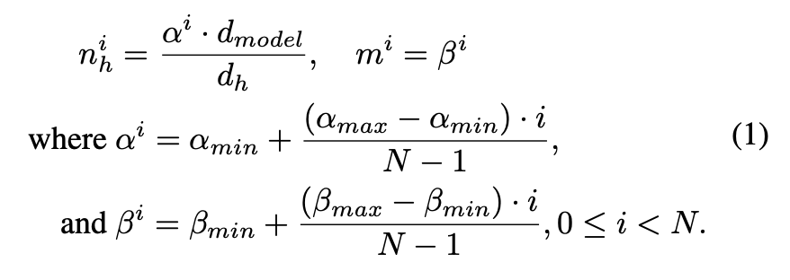
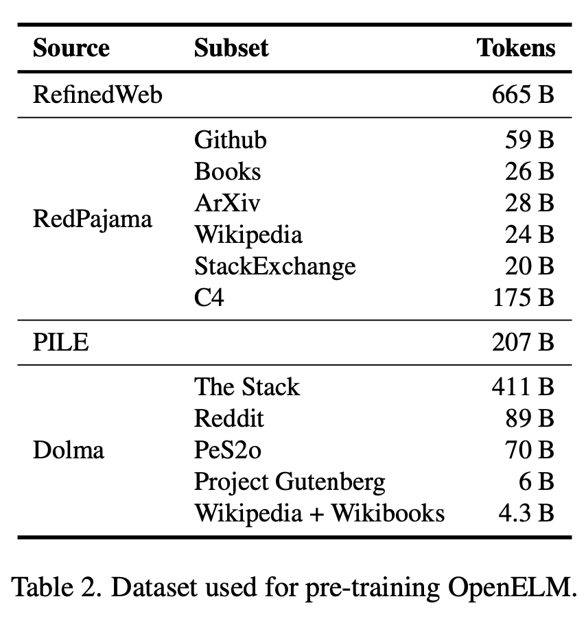
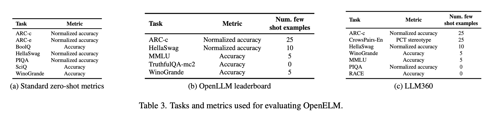
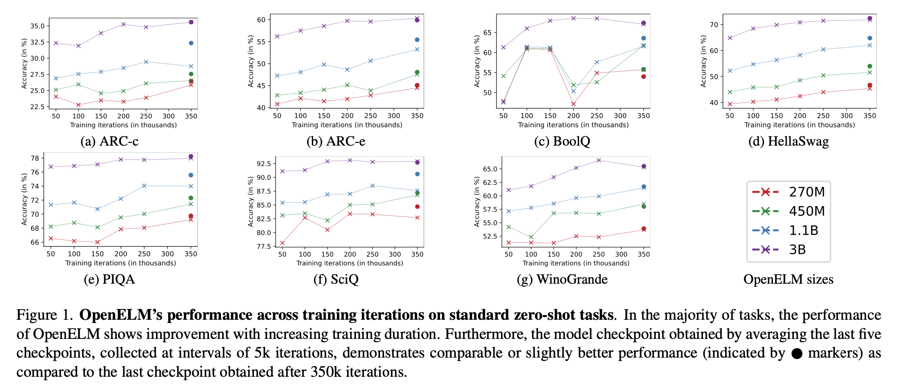
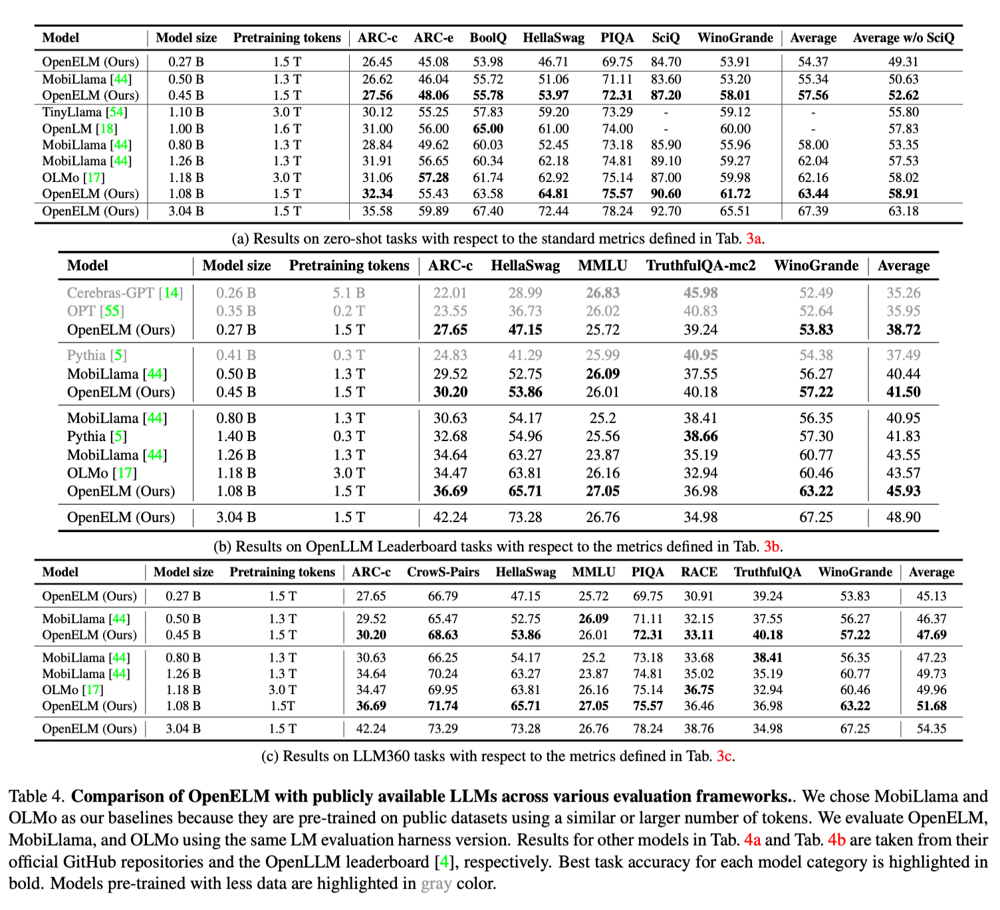
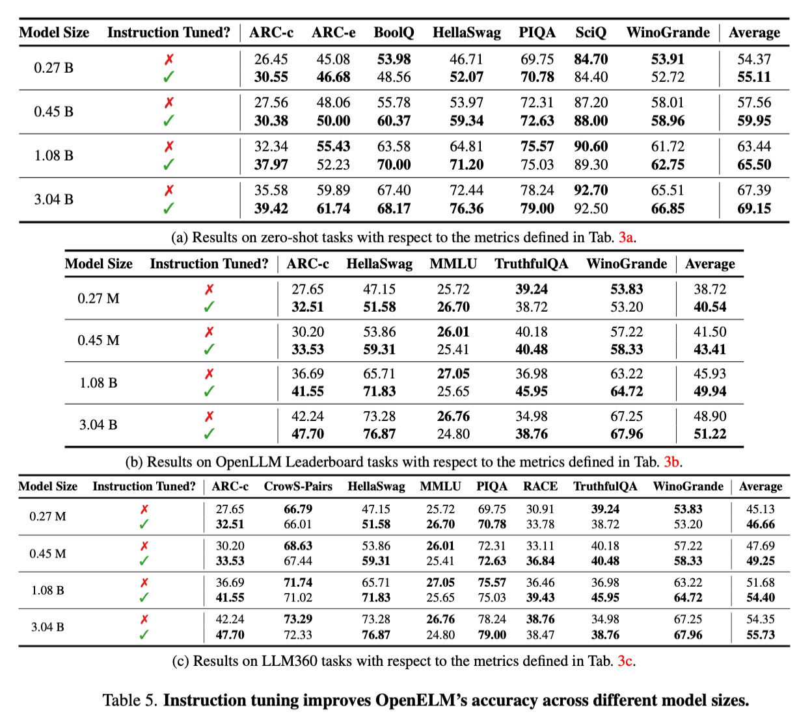
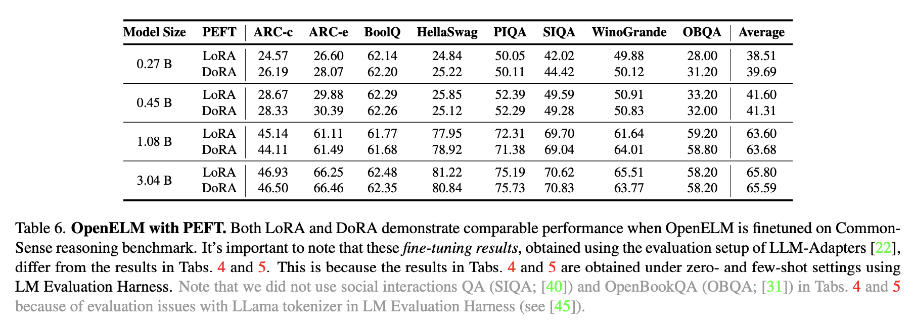
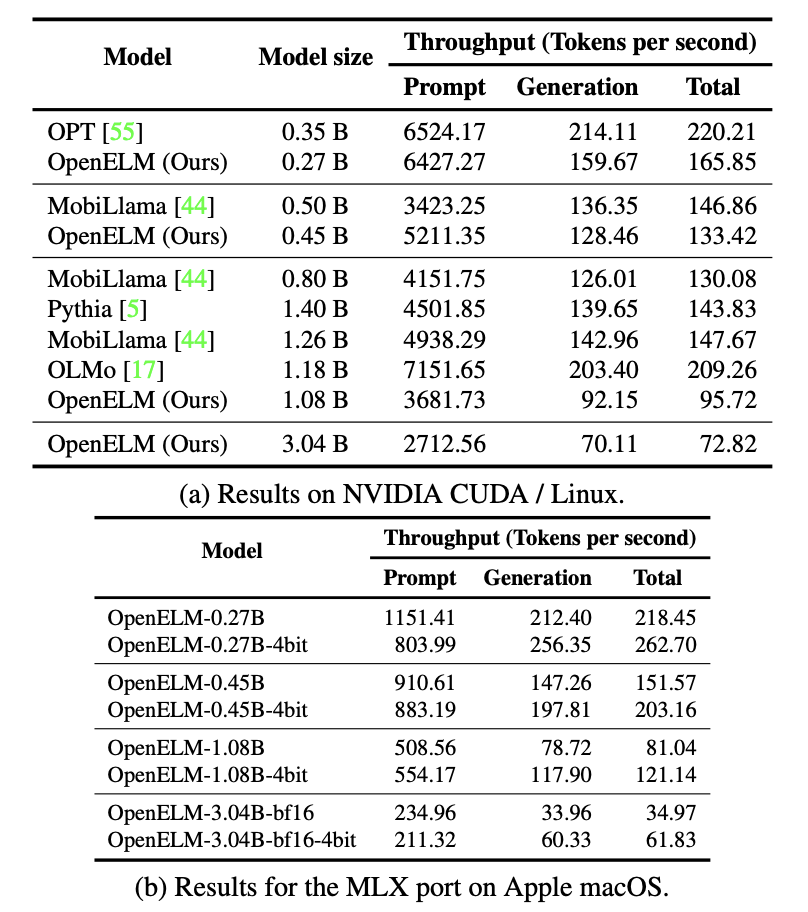
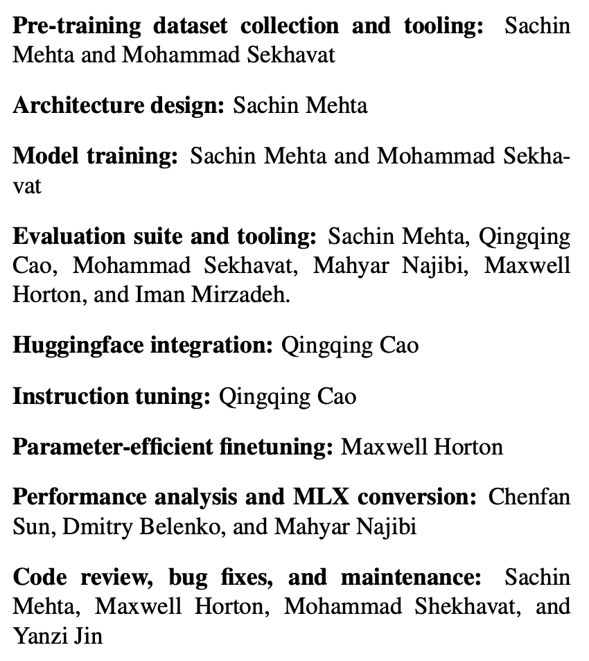

# 3 LINE SUMMARY

- OpenELM은 0.27B, 0.45B, 1.08B, 3.04B 모델을 오픈으로 공개
- Transformer 모델 내에서 파라미터가 균일하게 할당되어 비효율이 발생하는데, 이를 Layer-wise scaling 을 사용하여 파라미터를 효율적으로 할당함으로써 기존 모델보다 향상된 정확도를 달성.
- 사전학습 데이터를 절반 사용하면서도 OLMo에 비해 더 높은 정확도를 달성하였지만 토큰 생성 속도는 LayerNorm을 사용하는 OLMo 모델에 비하여 RMSNorm 을 사용하는 OpenELM가 느림.

원문링크
[OpenELM: An Efficient Language Model Family with Open-source...](https://arxiv.org/abs/2404.14619)

# Abstract

> 이 연구에서는 투명하고 재현 가능한 대규모 언어 모델의 중요성을 강조하며, OpenELM이라는 최신 오픈 언어 모델을 발표함. OpenELM은 각 변압기 레이어 내에서 파라미터를 효율적으로 할당하기 위해 계층적 스케일링 전략을 사용.
> 
- 계층적 스케일링 전략을 사용하여 약 10억 개의 파라미터를 가진 OpenELM은 OLMo보다 2.36% 높은 정확도를 보이면서도 사전 훈련 토큰이 2배 적게 필요함.
- 모델 가중치와 추론 코드만 제공하는 것이 아니라, 공개 데이터셋에서의 언어 모델 훈련과 평가를 위한 전체 프레임워크를 공개.

# **1. introduction**

> OpenELM은 변혁적인 대규모 언어 모델로 자연어 처리 분야에서 혁신을 일으키고 있음. 기존의 대규모 언어 모델들은 각 변압기 레이어가 동일한 설정(예: number of heads, feed-forward network dimensions)을 가지고 있어, 모델 내에서 파라미터가 균일하게 할당됨. 이러한 구조는 단순하지만, 파라미터를 효율적으로 할당하는 데는 한계가 있음.
> 
- OpenELM은 공개 데이터셋에서 사전 훈련된 모델로, 각 레이어별로 파라미터를 효율적으로 할당할 수 있는 layer-wise scaling 방식을 채택.
- 이 접근 방식은 입력에 가까운 transformer 레이어에서는 작은 잠재 차원을 사용하고, 출력에 가까워질수록 레이어를 점차 확장.
- 이 연구의 목표는 전체 훈련 및 평가 프레임워크를 포함하여 데이터 준비, 훈련, 미세 조정, 평가 절차 등을 공개함으로써 오픈 리서치를 촉진.
- 또한, OpenELM은 기존의 공개 LLMs보다 우수한 성능을 보임. 1.1억 파라미터를 가진 OpenELM은 1.2억 파라미터를 가진 OLMo보다 2.36% 높은 정확도를 보임.

# 2. Pre-Training

> 이 섹션은 OpenELM의 모델 아키텍처, 사전 훈련 데이터, 훈련 하이퍼파라미터, 평가 방법에 대해 설명.
> 

## **2.1 OpenELM architecture**

- OpenELM은 Transforemr의 디코더 부분 아키텍처를 채택.
- 이 모델은 Fully Connected Layer에서 학습 가능한 bias parameter를 사용하지 않으며, RMSNorm을 통한 사전 정규화와 위치 정보 인코딩을 위한 Rotationary Positional Embedding(ROPE)을 사용.
- Multi Head Attention(MHA) 대신 Qrouped Query Attention(GQA)을 사용하고, Feed-Forward Network(FFN)는 SwiGLU FFN으로 대체.
- 기존 Transformer 레이어와 달리 각 레이어는 Configuration(헤드 수, FFN 차원 등)이 다르며, Layer-wise scaling을 통해 파라미터를 비균일하게 할당.
    
    **Layer-wise scaling**
    
    - $d_{model}$ : 인풋 레이어의 차원
    - $n_h$ Multi Head Attention
    - $d_{FFN} = m \cdot d_{model}$
    - $m$ : FFN의 multiplier
- 매개변수 $\alpha$와 $\beta$를 도입하여 레이어당 Attention Head의 수 $n_h$와 FFN multiplier $m$을 각각 조정함. $i$번째 레이어의 경우 $n_h$와 $m$은 아래와 같이 계산됨

- $\alpha_{min}, \alpha_{max}$ 은 Attention Head의 크기를 조절하는 하이퍼 파라미터
- $\beta_{min}, \beta_{max}$ 는 FFN 레이어의 폭을 변경할 수 있게 해줌
- 따라서 $\alpha$와 $\beta$를 사용하여 Standard Transformer의 레이어의 Configuration을 변경하면 모델에서 파라미터가 균일하지 않게 할당됨
- $\alpha_{min} = \alpha_{max} = 1.0, m_i = m$으로 설정하면 Standard Uniform Transformer가 됨

## **2.2 Pre-Training Data**

- 공개 데이터셋을 사용하여 사전 훈련을 진행, 주요 데이터셋으로
    - RefinedWeb
    - PILE
    - RedPajama
    - Dolma v1.6 등
- 총 토큰 수는 약 1.8조.
- 데이터 필터링과 토큰화는 실시간으로 수행되며, 낮은 길이의 시퀀스는 필터링됨.

**On-the-fly tokenization and data filtering**

- 텍스트 데이터를 즉석에서 필터링하고 토큰화(다양한 토큰화 기법을 실험할 수 있음)
- Llama에서 사용된 것과 동일한 토큰화 도구 사용
- 길이가 짧은 시퀀스를 필터링 하기 위하여
    - 문자 수준에서 threshold 미만인지 확인
    - 토큰 수준에서 threshold 미만인지 확인
    - 실험에서는 200자의 문자, 256개의 토큰을 사용함

## **2.3 Training Details**

- AdamW, Cosine Scedular 사용
    - 5,000회 반복의 워밍업을 하고 최종 학습률을 최대 학습률의 10%까지 감소시킴.
    - 0.1의 weight decay와 1.0의 gradient clipping을 사용.
- CVNets(CoreNet) 을 사용하여 350k iteration(training step) 훈련

## **2.4 Evaluation details**

- LM Evaluation Harness를 사용하여 성능을 평가하며, 다양한 공통 감각 추론 작업과 OpenLLM 리더보드 작업에서 평가됩니다.
- 프레임워크간에 일부 중복되는 작업이 있을 수 있지만 몇개의 shot을 고려하는지에 따라 차이가 있을 수 있음.

**Standard zero-shot tasks**

- 7가지 표준 common-sense reasoning과제
    - ARC easy and challenge
    - BoolQ
    - HellaSwag
    - PIQA
    - SciQ
    - WinoGrande

**OpenLLM leaderboard tasks**

- OpenLLM leaderboard의 5가지 task 사용
    - ARC challenge
    - HellaSwag
    - MMLU
    - TruthfulQAWinoGrande.

**LLM360 leaderboard tasks**

- LLM360 leaderboard 의 7가지 task 사용
    - ARC challenge
    - CrowS-Pairs (English version)
    - HellaSwag
    - WinoGrande
    - MMLU
    - PIQA
    - RACE

# 3. Experiment

**Pre-training results**

- OpenELM은 공개 데이터셋을 사용하여 다양한 크기의 모델 버전으로 사전 훈련됨
- 훈련 시간이 길어질수록 일반적으로 정확도가 향상됨.
- 5000회 반복 간격으로 수집된 마지막 5개의 체크포인트를 평균하여 얻은 체크포인트는 최종 체크포인트보다 약간 높은 성능을 보여주었으며, 이는 가중치 평균을 통한 노이즈 감소 때문일 가능성이 높음.
    - 모델의 평가에는 평균화된 체크포인트 사용
- 기존 방법보다 OpenELM의 효율성을 강조. 사전학습 데이터를 절반 사용하면서도 OLMo에 비해 1.28%, 2.36%, 1.72% 더 높은 정확도를 달성(4a, 4b, 4c).

**Instruction Tuning Task**

- 6만개의 프롬프트로 구성된 UltraFeedback 데이터세트의 변형 사용
- Alignment Handbook 라이브러리 사용하여 인스트럭션 튜닝 수행
- 최적화를 위해 statistical rejection sampling, direct preference optimization method 사용
- 인스트럭션 튜닝이 다양한 평가 프레임워크에서 평균 정확도를 1~2% 향상시킨다는 것을 보여줌

**PEFT results**

- CommonSense 추론 훈련 및 평가 설정
- LoRA, DoRA 등 다양한 방법을 사용하는 8개의 객관식 데이터 세트에 걸쳐 170만 개의 훈련 샘플에서 테스트
- LoRA와 DoRA는 주어진 상식 추론 데이터 세트에서 평균적으로 비슷한 정확도.

# 4. Benchmark

> 이 섹션에서는 OpenELM 모델의 벤치마킹 성능을 다룹니다. 주로 하드웨어 환경 및 토큰 처리량에 초점을 맞춰 설명.
> 

**Hardware**

- OpenELM의 벤치마킹은 현대적인 소비자 등급 하드웨어에서 수행됨.
- NVIDIA RTX 4090 GPU를 장착한 워크스테이션에서 CUDA 벤치마크가 수행됨
- Apple M2 Max 칩을 사용하는 MacBook Pro에서는 Apple MLX로 코드와 가중치를 이식하여 평가
- 

**Evaluation**

- 벤치마킹은 토큰 처리량(초당 처리 토큰 수)을 측정하여 수행되었습니다. 이는 프롬프트 처리(사전 채우기) 및 토큰 생성을 포함.
- 모델마다 개별적으로 측정이 이루어지며, 각 모델은 단일 전달 테스트를 거쳐 최적화를 완료.
- 첫 번째 모델에 대해 1024개의 토큰을 생성하는 전체 "dry run"을 한 번 실행하면 후속 모델의 생성 처리량이 크 게 증가하는 것을 확인

**Results**

- OpenELM은 비슷한 파라미터 수를 가진 OLMo 모델보다 느린 처리 속도.
    - OpenELM의 주요 초점이 재현성에 있기 때문으로, naive RMSNorm의 구현 때문에 성능 저하가 발생
    - naive RMSNorm 구현은 LayerNorm과 같이 하나의 통합된 커널을 실행하는 것이 아니라 작은 입력을 처리하는 여러 개의 개별 커널을 실행하는 결과를 초래함
    - naive RMSNorm을 Apex의 RMSNorm으로 교체하면 OpenELM의 처리량이 눈에 띄게 개선되었지만, 여전히 최적화된 LayerNorm을 사용하는 모델에 비해 성능 격차가 남아 있음.
        - OLMo의 33개 LayerNorm 레이어에 비해 OpenELM의 RMSNorm 레이어가 113개
        - Apex의 RMSNorm이 작은 입력에 최적화되어 있지 않음
        - OLMo의 LayerNorm 을 RMSNorm으로 대체한 결과, 생성 처리량이 크게 감소하였음.

작성자들이 어떤 역할을 했는지 적어뒀다는 점이 특히하였음.

