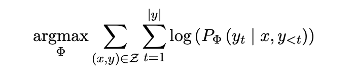
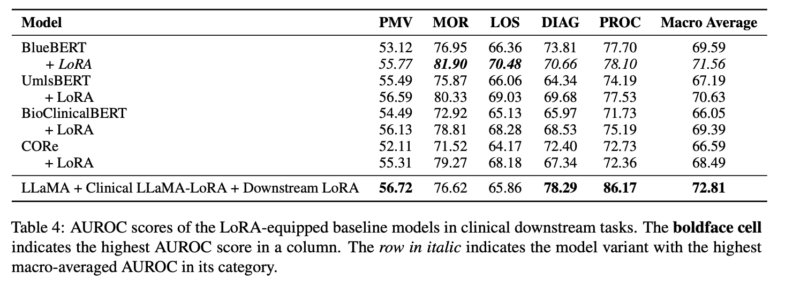

[arxiv.org](https://arxiv.org/pdf/2307.03042)

# Abstract

> LLaMA 모델을 임상 의료 분야에 맞추어 효율적으로 파인튜닝하는 기법을 제안. 전통적인 방법은 많은 계산 요구 사항 때문에 실용적이지 못하지만, 저자들은 Parameter-Efficient Fine-Tuning(PEFT) 기법을 사용하여 작은 하위 파라미터 집합만을 선택적으로 파인튜닝함으로써 이러한 문제를 해결함. 임상 LLaMA-LoRA 어댑터와 Downstream LLaMA-LoRA 어댑터를 결합하여 임상 결과 예측 데이터셋에서 최고의 AUROC 점수를 달성.
> 

# Introduction

> LLM은 임상 의료와 같은 특수한 분야에서는 성능이 떨어지는 경향이 있음. 이는 일반적인 지식 외에도 특정 분야의 지식이 필요하기 때문
> 
- 임상 노트에는 의학 용어의 복잡성과 불완전한 문장이 포함되어 있어 이러한 문제가 발생.
- 기존의 LLM들이 바이오메디컬 문헌을 포함한 데이터셋으로 사전 훈련되어 있음에도 불구하고, 이러한 모델들은 임상 응용 프로그램에서 최적의 성능을 발휘하지 못함.
- 이러한 관찰은 LLM이 임상 데이터셋을 사용하여 사전 훈련을 거쳐야만 임상 맥락의 미묘한 차이를 효과적으로 포착할 수 있다는 것을 시사함.
- 이러한 문제를 해결하기 위해 PEFT 기법을 도입하여 계산 요구 사항을 줄이면서도 기존의 전체 파라미터 파인튜닝과 비슷한 성능을 달성할 수 있는 방법을 제안.
- 아래 그림과 같은 두 단계의 PEFT를 제안함

# Methods

> 제안하는 PEFT 프레임워크는 두 단계로 구성됨. 첫 번째 단계에서는 LLaMA 기반으로 하며 임상 도메인에 특화된 Clinical LLaMA-LoRA라는 LoRA 어댑터를 사용하고, 두 번째 단계에서는 Clinical LLaMA-LoRA를 기반으로 하여 임상 Downstram task에 특화된 Downstream LLaMA-LoRA를 소개함.
> 

**Fine Tuning**

- 사전 학습된 LLM $P_\Phi(y|x)$에 대해서 미세 조정 목표를 최적화하여 가장 적절한 파라미터 변경 $\Delta\Phi$를 찾는 것으로 효과적으로 정의할 수 있음.
- Full Fine Tuning은 모델이 사전 학습된 LLM $|\Delta\Phi|$ =  $|\Phi_0|$의 전체 파라미터와 동일한 차원의 $\Delta\Phi$를 학습해야 한다는 것을 의미하며 계산 비용이 많이 듦.
- PEFT 기법은 미세 조정 과정에서 추가로 학습 가능한 파라미터의 극히 일부에 해당하는 $\Delta\Phi$를 조정하여 계산 비용 문제 해결
    
    **Adapter Tuning**
    
    - Adapter tuning(Houlsby et al., 2019)은 사전 훈련된 모델의 각 계층에 어댑터라는 작은 파라미터를 추가하고, 추가한 파라미터 세트를 엄격하게 미세 조정하는 초기 PEFT 방법.
    
    **Low Rank Adaptation(LoRA)**
    
    - LoRA(Hu et al., 2022)는 트랜스포머 기반 모델의 주의 가중치 업데이트를 나타내기 위해 낮은 순위의 매트릭스를 훈련하는 방식.
    
    **Prefix Tuning**
    
    - Prefix Tuning(Li and Liang, 2021)은 실제 토큰과 일치하지 않는 학습 가능한 파라미터인 Prefix라고 하는 일련의 연속적인 작업별 벡터를 최적화.
    
    **P-Tuning**
    
    - P-Tuning(Liu et al., 2021b)은 생성 작업이 아닌 텍스트 이해 작업에 중점을 두고 접두사 튜닝과 유사한 전략을 사용합니다.
    
    **Prompt Tuning**
    
    - Prompt Tuning(Lester et al., 2021)은 각 다운스트림 작업에 대해 소프트 프롬프트라고 하는 훈련 가능한 토큰을 도입하여 사전 수정 튜닝을 간소화.

**Domain-adaptive Pretraining**

- 사전 학습된 LLM $P_\Phi(y|x)$에 대해서 파라미터 $\Phi$는 데이터셋 Z에 대해서 훈련됨. 도메인에 적응하기 위해서 모델은 사전 훈련된 상태 $\Phi_0$에서 $\Phi_0+\Delta\Phi$ 까지 가중치를 반복적으로 업데이트 해야하는데 이 과정은 로그 우도를 최대화하는 파라미터를 찾는 과정을 나타냄.
    
    
    
- 현재의 패러다임에서 전체 미세 조정 과정은 모델이 전체 사전 훈련된 파라미터에 해당하는 크기의 $\Delta\Phi$를 학습해야 한다는 것을 의미. 즉, $|\Delta\Phi|$ =  $|\Phi_0|$인 것이며, 이는 계산 비용이 많이 듬.
- 제안된 패러다임에서 추가적인 작은 파라미터 θ만을 조정하여  $\Phi = \Phi_0+\Delta\Phi(\theta)$ 를 얻으며, 이때의 차원은 원래 파라미터에 비해 매우 작음.
    
    
    

**Downstream Fine-tuning**

- 현재의 패러다임에서는 사전 훈련된 임상 LLM이 후속 작업(예: 문서 분류 작업)으로 미세 조정됨.
- 이를 위해 사전 훈련된 임상 LLM $P_{\Phi,\Theta}$와 해당 도메인에 적응된 파라미터 $\Phi$, 그리고 새롭게 초기화된 분류기 층 $\Theta$이 주어진다고 가정해봅시다.
- 또한 훈련 데이터셋 $Z = \{(x_i, y_i)\}_{i=1,...,N}$ 이 있습니다. 우리는 특정한 손실 함수를 최대화하고자 합니다. 이러한 손실 함수는 예를 들어 교차 엔트로피 손실일 수 있습니다.
    
    
    
- 반면에, 제안된 패러다임에서는 미세 조정 과정은 작은 추가적인 파라미터 $\Delta\Phi(\theta)$와 분류기 층 $\theta$만을 업데이트.
    
    
    
- 미세 조정을 추가적인 "델타 업데이팅" 과정으로도 분해할 수 있습니다
    
    
    

## Clinical LLaMA-LoRA

- Clinical LLaMA-LoRA는 LLaMA (Touvron et al., 2023) 위에 구축된 LoRA 어댑터로, 임상 도메인에 적응되고, 제안된 절차를 따라 후속 작업에 대해 미세 조정됨(figure 2)
- 이 연구에서는 두 가지 LLaMA 모델을 평가합니다.
    - LLaMA 7B : English CommonCrawl, Wikipedia, ArXiv 및 C4(Raffel 등, 2020)
    - PMC-LLaMA 7B : PubMed Central의 480만 건의 생물의학 학술 논문을 기반으로 도메인에 적응된 LLaMA 모델.

**Domain-adaptive Pretraining**

- Clinical LLaMA-LoRA는 MIMIC-IV에서 추출된 비식별화된 퇴원 요약문 (331,794 건)과 방사선학 보고서 (2,321,355 건)를 결합하여, 총 2,653,149개의 개별 임상 노트로 구성된 데이터셋을 사용하여 훈련.
    - LoRA, Adaptation Prompt, Prefix Tuning, Prompt Tuning 및 P-tuning과 같은 다섯 가지 다른 PEFT 기법을 평가
    

**Downstream Fine-tuning**

- 임상 문서 분류 작업에 맞게 Clinical LLaMA-LoRA와 다운스트림 LLaMA- LoRA를 미세 조정
- Prolonged mechanical ventilation(PMV): 인공호흡이 7일 이상 필요한지 여부를 예측하기 위한 이진 분류 작업(Huang et al., 2020).
- In-hospotal mortality(MOR): 환자가 입원 기간 동안 생존할지 여부를 예측하기 위한 이진 분류 작업(van Aken et al., 2021).
- Length of stay(LOS): 환자의 입원 기간을 예측하기 위한 다중 분류 작업으로, 3일 미만, 3~7일, 1~2주, 2주 이상의 네 가지 시간 구간으로 분류(van Aken et al., 2021).
Diganoses(DIAG): 환자와 관련된 감별 진단을 예측하기 위한 대규모 다중 레이블 분류 작업, 단순화된 ICD-9 진단 코드로 표시됨(van Aken et al., 2021).
- Procedure(PROC): 환자에게 시행되는 진단 또는 치료를 예측하기 위한 대규모 다중 레이블 분류 작업으로, 간소화된 ICD-9 절차 코드로 표현됨(van Aken et al., 2021).

# Results

> Clinical LLaMA-LoRA와 Downstream LLaMA-LoRA를 활용하여 다양한 임상 결과 예측 데이터셋에서의 성능을 평가하였음. 아래의 결과들은 제안된 PEFT 프레임워크가 임상 의료 분야에서 언어 모델의 적응과 성능 향상에 효과적임을 보여줌
> 

## 4.1 Pretraining

- 사전 훈련 결과는 표 2에서 확인할 수 있습니다. 모든 PEFT 기술은 원래 모델 파라미터의 0.001%에서 0.24%에 해당하는 훨씬 적은 수의 파라미터를 훈련시키며, 이는 필요한 계산 자원을 크게 줄이고 훈련 시간을 단축시킴.
- PEFT 기술은 평균적으로 단일 NVIDIA A100-80GB GPU를 사용하여 에포크당 24시간 미만이 소요.
- LoRA가 임상 도메인 적응 사전 훈련에서 LLaMA와 PMC-LLaMA 모두에서 최고의 성능을 발휘하여, 각각 2.244와 2.404의 가장 낮은 perplexity 점수를 달성했습니다. 이 사전 훈련된 LoRA는 Clinical LLaMA-LoRA로 지칭됨.
    
    
    

## **4.2 Downstream results**

**Can LoRA help fine-tune LLaMA from other domains (general and biomedical) to achieve higher AUROC scores in clinical tasks?**
(LoRA가 다른 영역(일반 및 생의학)의 LLaMA를 미세 조정하여 임상 작업에서 더 높은 AUROC 점수를 달성하는 데 도움이 될 수 있습니까?)

- 표 3에 제시된 대로 LLaMA와 LLaMA + LoRA, PMC-LLaMA와 PMC-LLaMA + LoRA로 얻은 결과를 비교.
- 얻은 결과는 모든 작업에서 LoRA를 활용할 때 AUROC 점수가 향상되었음을 일관되게 보여줌.
- LoRA가 장착된 LLaMA의 매크로 평균 AUROC 점수는 LLaMA 전용 기준선과 비교할 때 13.01% 증가한 것으로 나타남.
- 마찬가지로, LoRA가 장착된 PMC-LLaMA는 원래 PMC-LLaMA에 비해 macro average AUROC에서 12.2% 개선을 나타냄.
- LLaMA와 PMC-LLaMA 모두 LoRA가 장착된 경우 장시간 작업을 제외한 모든 작업에서 상당한 AUROC 점수 향상이 있었음
- 또한 PMC-LLaMA와 일반 도메인 LLaMA 사이의 AUROC 점수의 미미한 차이는 두 가지 요인으로 설명될 수 있음.
    1. 원래의 LLaMA는 사전 훈련 과정에서 생물 의학적 개념에 노출되어 있어, 생물 의학 도메인에 대한 도메인 적응 사전 훈련의 필요성이 감소.
    2. 임상 NLP 작업은 생물 의학적 LLM에게도 어려움.

**Can LoRA-equipped LLaMA and PMC-LLaMA perform comparably in comparison to clinically trained LMs?**

(LoRA가 장착된 LLaMA와 PMC-LLaMA가 임상적으로 훈련된 LM과 유사한 성능을 발휘할 수 있을까요?)

- 표 3에서 기준 모델과 LoRA가 장착된 LLaMA 및 PMC-LLaMA로 얻은 AUROC 점수를 비교함.
- 기준 모델 중에서 BlueBERT가 가장 높은 매크로 평균 AUROC 점수인 69.59%를 기록. BlueBERT와 비교했을 때, LLaMA 및 PMC-LLaMA는 각각 58.61%와 60.51%의 매크로 평균 AUROC 점수로 성능이 낮음. 이 결과는 임상 특정 미세 조정의 중요성을 강조.
- LoRA가 장착된 LLaMA와 PMC-LLaMA에서 상당한 향상이 관찰됨. macro average AUROC 점수는 각각 71.62%와 72.71%.
- 진단 및 절차 예측 작업에서 상당한 향상이 있음.
    - LoRA가 장착된 LLaMA는 진단 및 절차 예측 작업에서 각각 78.37%와 87.49%의 AUROC 점수를 기록
    - BlueBERT의 73.81%와 77.70%와 비교했을 때, 진단 예측에서 4.56%의 향상과 절차 예측에서 9.79%의 향상을 나타냄.
- LoRA가 장착된 PMC-LLaMA의 결과에서도 개선이 관찰됨. 진단 예측에서 BlueBERT를 5% 이상, 절차 예측에서 9.02% 이상 능가.
- 전반적으로, LoRA가 장착된 LLaMA와 PMC-LLaMA는 다양한 임상 예측 작업에서 기준 임상 LM보다 더 높은 AUROC 점수를 달성.
- 진단, 절차 및 사망 예측에서 높은 성능을 보였으며, 입원 기간 예측에서 경쟁력 있는 AUROC 점수를 유지.
- 그러나, LoRA가 장착된 LLaMA와 PMC-LLaMA는 여전히 장기적인 기계 환기 예측에서 성능이 미흡.

**Can LLaMA and PMC-LLaMA with Clinical LLaMA-LoRA achieve higher AUROC scores than the clinically trained LMs?**

(LLaMA와 PMC-LLaMA에 Clinical LLaMA-LoRA를 사용하면 임상적으로 훈련된 LM보다 더 높은 AUROC 점수를 달성할 수 있을까요?)

- 도메인 적응 사전 훈련 단계에서는 LLaMA와 PMC-LLaMA에 대해 임상적으로 훈련된 LoRA 어댑터를 생성.
- 이 어댑터는 Clinical LLaMA-LoRA로 불리며, 이를 사용하여 LLaMA와 PMC-LLaMA의 결과를 비교함. Clinical LLaMA-LoRA를 downstram fine tuning과 함께 (Trainable)와 함께 (Frozen) 평가.결과는 Clinical LLaMA-LoRA가 장착된 LLaMA와 PMC-LLaMA가 기준 모델을 능가하는 것을 보여줌.
- Trainable Clinical LLaMA-LoRA를 사용한 LLaMA는 70.85%의 AUROC 점수를 기록하여 BlueBERT의 69.59%를 넘었음.
- Trainable Clinical LLaMA-LoRA를 사용한 PMC-LLaMA는 심지어 72.23%의 더 높은 AUROC 점수를 기록.
- 이 결과는 Clinical LLaMA-LoRA가 임상적으로 훈련된 LLM보다 LLaMA와 PMC-LLaMA의 AUROC 점수를 높이는 데 기여한다는 것을 보여줌.

**Can LLaMA and PMC-LLaMA with Clinical LLaMA-LoRA achieve higher AUROC scores than the other fine-tuning variants?**

(LLaMA와 PMC-LLaMA가 Clinical LLaMA-LoRA를 사용하여 다른 미세 조정 변형보다 더 높은 AUROC 점수를 달성할 수 있을까요?)

- 도메인 적응된 LoRA의 중요성을 평가하기 위해, Clinical LLaMA-LoRA를 장착한 LLaMA와 PMC-LLaMA의 결과를 LLaMA와 PMC-LLaMA의 원본 미세 조정 결과와 비교.
- 동결된 Clinical LLaMA-LoRA를 사용한 LLaMA와 PMC-LLaMA는 원래의 미세 조정과 비교했을 때 성능이 크게 향상되지 않음.
- 도메인 적응 사전 훈련에도 불구하고, downstream 미세 조정 중에 학습 가능한 파라미터의 수가 제한되어 있어 모델이 얻을 수 있는 잠재적인 개선이 제한되는 것을 나타냄.
- 학습 가능한 Clinical LLaMA-LoRA가 있는 LLaMA와 PMC-LLaMA의 AUROC 점수가 상당히 향상된 것으로 나타남.
- Trainable Clinical LLaMA-LoRA를 사용한 LLaMA와 PMC-LLaMA는 각각 70.85%와 72.23%의 매크로 평균 AUROC 점수를 달성함.

**Can a downstream LoRA adapter improve the AUROC scores of LLaMA and PMC-LLaMA equipped with Clinical LLaMA-LoRA?**

(임상 LLaMA-LoRA를 장착한 LLaMA와 PMC-LLaMA의 AUROC 점수를 개선할 수 있는가요?)

- 도메인 적응 사전 훈련의 "델타 업데이팅" 결과로서 Clinical LLaMA-LoRA를 고려한다면, 하류 미세 조정 과정을 추가적인 "델타 업데이팅" 단계로 볼 수 있습니다.
- 이 접근 방법의 영향을 조사하기 위해, 이미 Clinical LLaMA-LoRA를 장착한 LLaMA와 PMC-LLaMA 모델에 Downstream LLaMA-LoRA를 추가하는 실험을 수행.
- Downstream LLaMA-LoRA는 동결된 Clinical LLaMA-LoRA를 사용한 LLaMA와 PMC-LLaMA의 성능을 개선하지 못함.
- Downstream LLaMA-LoRA를 trainable Clinical LLaMA-LoRA에 추가할 때 성능 향상이 관찰됨.
- 학습 가능한 Clinical LLaMA-LoRA와 Downstream LLaMA-LoRA의 조합은 가장 높은 macro average AUROC 점수인 72.81%를 달성.
- Clinical LLaMA-LoRA의 매크로 평균 AUROC 점수는 거의 PMC-LLaMA에 LoRA가 장착된 것과 유사하며, 이는 Clinical LLaMA-LoRA와 PMC-LLaMA가 겪은 완전한 미세 조정 과정 사이에 유사한 효능이 있음을 시사.
- Clinical LLaMA-LoRA는 줄어든 계산 리소스와 훈련 시간의 장점을 제공하여 임상 환경에서의 실제 구현 요구 사항과 일치함.

**Can LoRA help better fine-tune clinically trained LMs?**
(LoRA가 임상적으로 훈련된 LM을 더 잘 미세 조정하는 데 도움이 될까요?)

- 기준 모델은 LLaMA 기반 모델에 비해 상대적으로 크기가 작아서, 계산 리소스에 제한된 의료 공급자에게 더 적합할 수 있음. 기준 모델을 LoRA로 미세 조정하는 실험을 진행.
- 모든 기준 모델은 모든 작업에서 AUROC 점수가 향상되었음(표 4).
    - LoRA가 장착된 BlueBERT는 기존의 미세 조정과 비교하여 매크로 평균 AUROC 점수가 69.59%에서 개선된 71.56%를 달성.
- 이 결과는 LoRA를 사용하여 BlueBERT와 같은 임상적으로 훈련된 LM을 효율적으로 미세 조정하여 하류 사용 사례에 적용할 수 있는 가능성을 보여줌.
    
    
    

# Conclusion

> Clinical LLaMA-LoRA와 Downstream LLaMA-LoRA를 활용한 두 단계 PEFT 프레임워크를 제안하고, 이를 통해 임상 도메인에서의 언어 모델의 효과적인 적응 및 성능 향상을 실현함.
> 
1. **성능 향상**
    1. 제안된 프레임워크는 임상 NLP 하류 작업에서 최고의 성능을 달성하며, 특히 진단 및 절차 분류 작업에서 상당한 개선을 보였음.
    2. Clinical LLaMA-LoRA와 Downstream LLaMA-LoRA의 결합이 임상 의료 분야에 매우 적합하다는 것을 입증합니다.
2. **계산 효율성**
    1. PEFT 기법을 사용함으로써, 본 연구는 전체 모델 파라미터를 재훈련하는 대신 소수의 파라미터만을 튜닝하여 계산 자원의 사용을 대폭 줄였음. 
    2. 이는 자원이 제한된 설정에서도 고성능의 언어 모델을 구현할 수 있음을 보여줍니다.
3. **향후 연구 방향**
    1. 연구자들은 이 프레임워크를 기반으로 다양한 임상 환경과 작업에 적용 가능한 추가적인 어댑터를 개발할 수 있음.
    2. 또한, 다양한 언어와 지리적 위치에서의 데이터를 포함하여 모델의 일반화 능력을 향상시키는 방향으로 연구를 확장할 필요가 있음.